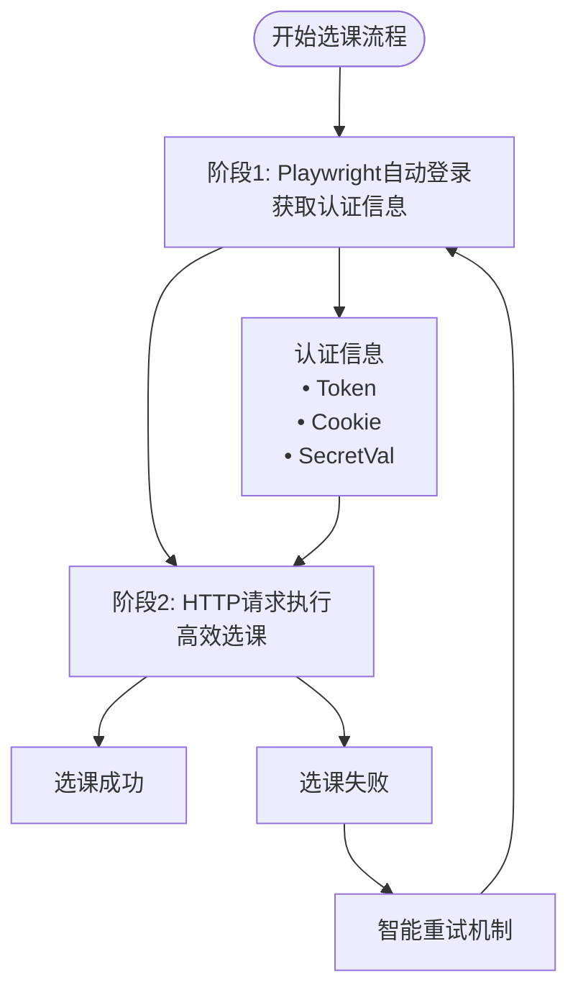
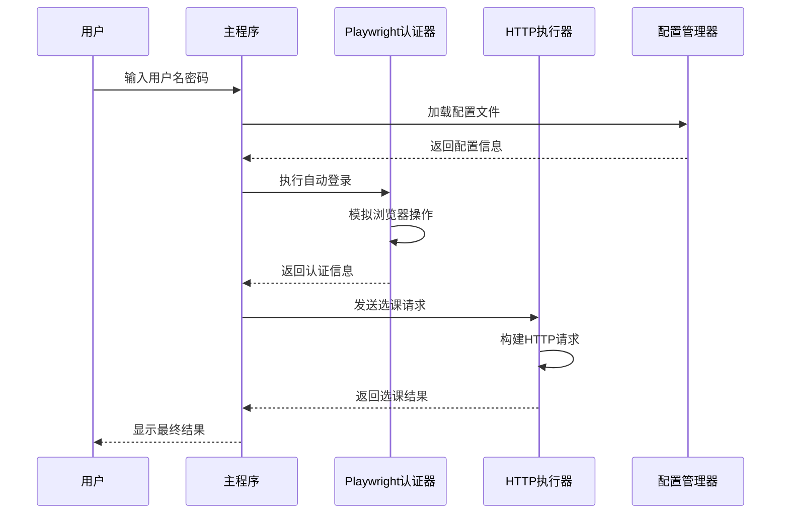
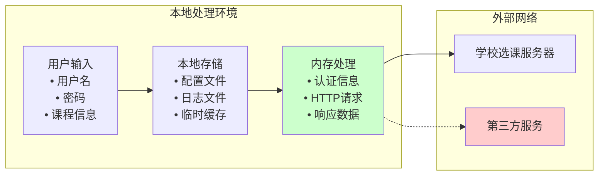
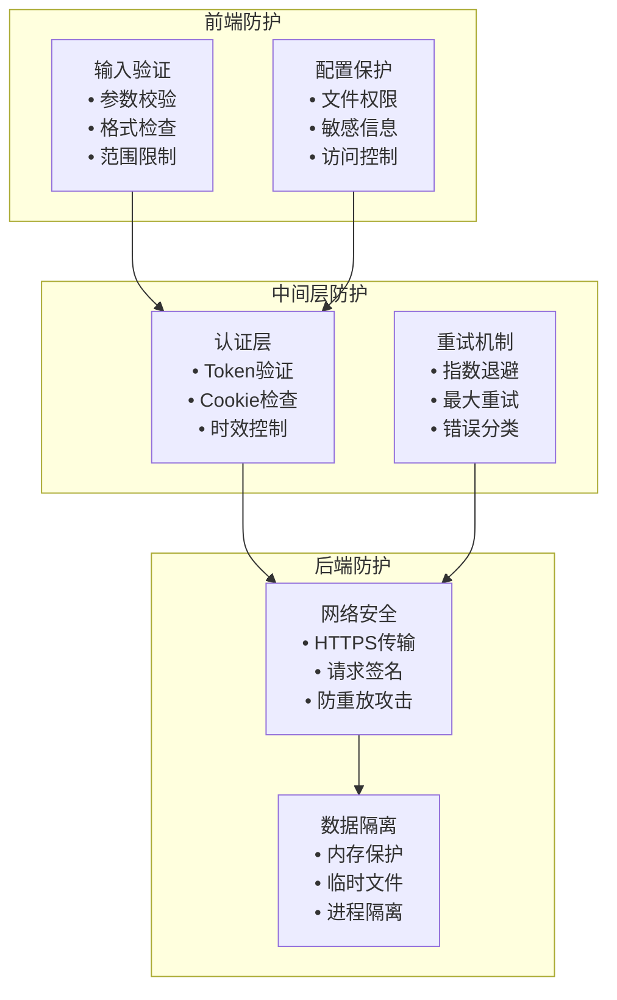
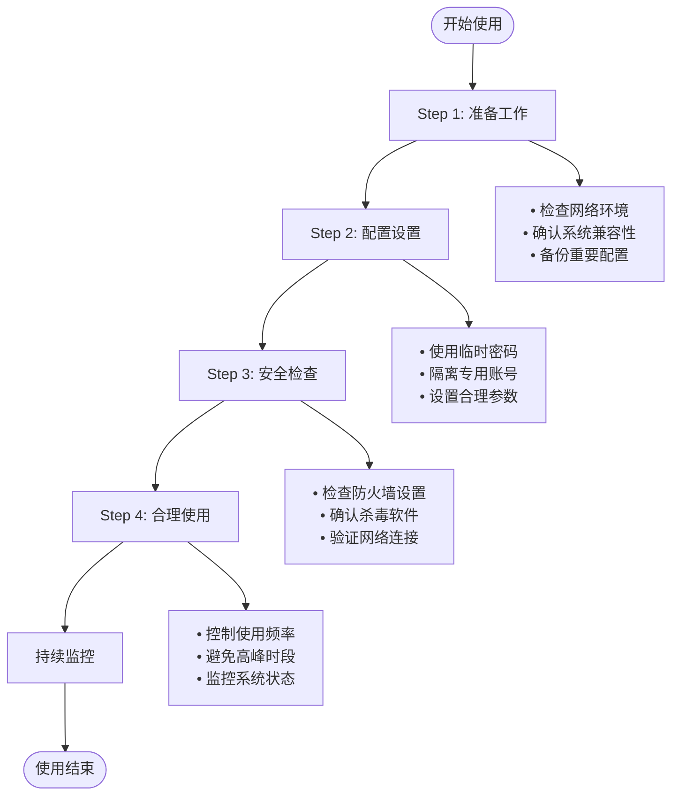

# 安全与合规声明

<cite>
**本文档引用的文件**
- [README.md](file://README.md)
- [main_v2_hybrid.py](file://main_v2_hybrid.py)
- [hybrid_course_selector.py](file://src/hybrid_course_selector.py)
- [playwright_authenticator.py](file://src/playwright_authenticator.py)
- [http_course_executor.py](file://src/http_course_executor.py)
- [simplified_config_manager.py](file://src/simplified_config_manager.py)
- [config_simple.json](file://config_simple.json)
- [quick_secret_extractor.py](file://tools/quick_secret_extractor.py)
</cite>

## 目录
1. [项目概述](#项目概述)
2. [核心功能与架构](#核心功能与架构)
3. [隐私保护措施](#隐私保护措施)
4. [使用规范与责任](#使用规范与责任)
5. [技术安全机制](#技术安全机制)
6. [法律合规性](#法律合规性)
7. [免责声明](#免责声明)
8. [最佳实践建议](#最佳实践建议)
9. [总结](#总结)

## 项目概述

本项目是一个专为北京航空航天大学学生设计的选课系统自动化工具，采用先进的混合架构设计，结合了Playwright自动登录的可靠性和HTTP直接请求的高效性。该工具旨在帮助学生更高效地完成选课操作，但其使用必须严格遵循相关法律法规和学校规章制度。

**章节来源**
- [README.md](file://README.md#L1-L50)
- [main_v2_hybrid.py](file://main_v2_hybrid.py#L1-L30)

## 核心功能与架构

### 混合架构设计

项目采用创新的混合架构，分为两个核心阶段：



**图表来源**
- [hybrid_course_selector.py](file://src/hybrid_course_selector.py#L100-L150)
- [playwright_authenticator.py](file://src/playwright_authenticator.py#L80-L120)

### 数据流架构



**图表来源**
- [hybrid_course_selector.py](file://src/hybrid_course_selector.py#L120-L200)
- [http_course_executor.py](file://src/http_course_executor.py#L80-L120)

**章节来源**
- [hybrid_course_selector.py](file://src/hybrid_course_selector.py#L1-L100)
- [playwright_authenticator.py](file://src/playwright_authenticator.py#L1-L100)
- [http_course_executor.py](file://src/http_course_executor.py#L1-L100)

## 隐私保护措施

### 本地数据处理原则

本项目严格遵循隐私保护原则，所有敏感信息均在本地环境中处理，绝不上传至任何第三方服务器：



**图表来源**
- [simplified_config_manager.py](file://src/simplified_config_manager.py#L50-L100)
- [playwright_authenticator.py](file://src/playwright_authenticator.py#L150-L200)

### 敏感信息保护机制

1. **密码加密存储**
   - 用户密码仅在内存中短暂存储
   - 不会在任何文件中明文保存
   - 支持临时密码或隔离账号使用

2. **认证信息处理**
   - Token和Cookie仅在内存中有效
   - 不会持久化存储认证凭据
   - 每次启动程序都会重新获取最新认证信息

3. **日志文件保护**
   - 日志文件包含敏感信息时会进行脱敏处理
   - 支持自定义日志级别控制信息输出
   - 提供日志轮转机制防止信息泄露

**章节来源**
- [simplified_config_manager.py](file://src/simplified_config_manager.py#L100-L200)
- [playwright_authenticator.py](file://src/playwright_authenticator.py#L200-L300)

## 使用规范与责任

### 合理使用原则

本工具的设计初衷是为了提高选课效率，而非替代人工操作。用户在使用过程中必须遵守以下原则：

```mermaid
mindmap
root((使用规范))
合法合规
遵守学校规定
符合网络安全法
尊重知识产权
技术规范
合理频率使用
避免系统过载
支持公平竞争
安全规范
保护个人账号
避免恶意行为
维护系统稳定
```

### 禁止行为清单

根据项目特性和使用场景，明确禁止以下行为：

1. **恶意刷课行为**
   - 频繁重复提交相同选课请求
   - 利用自动化工具进行批量选课
   - 影响其他学生正常选课权益

2. **资源抢占行为**
   - 在选课高峰期进行大规模并发操作
   - 占用过多系统资源
   - 影响选课系统的正常运行

3. **违规操作行为**
   - 使用被盗取的账号信息
   - 修改或伪造认证数据
   - 传播或共享敏感信息

### 用户责任声明

用户在使用本工具时应承担以下责任：

1. **账号安全责任**
   - 对自己的账号信息保密
   - 定期更换密码
   - 避免在公共设备上使用

2. **使用行为责任**
   - 合理安排使用时间
   - 避免过度依赖自动化工具
   - 尊重其他用户权益

3. **法律合规责任**
   - 遵守相关法律法规
   - 尊重学校规章制度
   - 承担使用后果

**章节来源**
- [README.md](file://README.md#L200-L250)
- [main_v2_hybrid.py](file://main_v2_hybrid.py#L200-L250)

## 技术安全机制

### 多层防护体系

项目采用多层次的安全防护机制，确保使用过程中的安全性：



**图表来源**
- [simplified_config_manager.py](file://src/simplified_config_manager.py#L150-L200)
- [hybrid_course_selector.py](file://src/hybrid_course_selector.py#L150-L200)

### 安全检测机制

1. **配置文件验证**
   ```python
   # 配置文件完整性检查
   def _validate_config(self):
       # 检查必需字段
       for section, fields in self.REQUIRED_FIELDS.items():
           if section not in config:
               raise ValidationError(f"缺少配置分区: {section}")
       
       # 验证敏感信息格式
       self._validate_user_credentials()
       self._validate_course_info()
   ```

2. **网络通信安全**
   - 使用HTTPS协议进行所有网络通信
   - 实施请求签名验证机制
   - 防止中间人攻击和数据篡改

3. **进程隔离保护**
   - 所有敏感操作在独立进程中执行
   - 内存中的敏感数据及时清理
   - 进程间通信采用安全通道

**章节来源**
- [simplified_config_manager.py](file://src/simplified_config_manager.py#L100-L200)
- [hybrid_course_selector.py](file://src/hybrid_course_selector.py#L100-L150)

## 法律合规性

### 网络安全法遵循

项目严格遵守《中华人民共和国网络安全法》的相关规定：

1. **个人信息保护**
   - 不收集、存储、传输用户的个人信息
   - 所有数据处理均在本地完成
   - 不向第三方提供用户数据

2. **网络安全义务**
   - 采取技术措施保障网络安全
   - 建立安全管理制度
   - 配合相关部门进行安全检查

3. **法律责任承担**
   - 明确使用者的法律责任
   - 提醒遵守相关法律法规
   - 承诺不从事违法活动

### 校园网络使用政策

项目特别提醒用户遵守学校网络使用政策：

1. **使用范围限制**
   - 仅限于校园网络环境下使用
   - 不得在非授权网络中使用
   - 遵守网络访问权限规定

2. **使用时间限制**
   - 合理安排使用时间
   - 避免在高峰时段过度使用
   - 支持公平的网络资源分配

3. **使用目的限制**
   - 仅用于合法的选课操作
   - 不得用于其他非法用途
   - 尊重网络资源的公共属性

**章节来源**
- [README.md](file://README.md#L250-L279)

## 免责声明

### 开发者免责条款

基于项目的性质和使用风险，开发者特别声明如下：

1. **使用风险自负**
   - 用户完全了解使用本工具可能存在的风险
   - 开发者不对任何使用后果承担责任
   - 包括但不限于账号封禁、选课失败等

2. **技术限制免责**
   - 项目可能存在技术缺陷或漏洞
   - 开发者尽力保证软件质量，但不作任何担保
   - 用户应自行评估使用风险

3. **法律后果免责**
   - 用户应自行承担违反法律法规的后果
   - 开发者不参与任何违法行为
   - 用户应遵守相关法律法规

### 使用条件限制

用户使用本工具的前提条件包括：

1. **同意免责条款**
   - 用户必须阅读并同意本免责声明
   - 未经开发者书面许可，不得修改免责声明内容

2. **遵守使用规范**
   - 用户应按照项目说明正确使用工具
   - 不得进行任何违规或恶意操作

3. **承担使用后果**
   - 用户应自行承担使用过程中产生的所有后果
   - 开发者不承担任何法律责任

**章节来源**
- [README.md](file://README.md#L270-L279)
- [main_v2_hybrid.py](file://main_v2_hybrid.py#L350-L385)

## 最佳实践建议

### 安全使用建议

为了确保安全、合规地使用本工具，建议用户遵循以下最佳实践：



### 账号安全管理

1. **密码管理**
   - 使用强密码策略
   - 定期更换密码
   - 避免在公共设备上保存密码

2. **账号隔离**
   - 使用专用账号进行选课
   - 避免使用主账号进行自动化操作
   - 定期检查账号状态

3. **访问控制**
   - 限制工具访问权限
   - 设置合理的网络访问规则
   - 监控异常访问行为

### 使用时间规划

1. **合理安排时间**
   - 在选课开始前5分钟运行程序
   - 避免在选课高峰期进行大规模操作
   - 根据实际情况调整使用频率

2. **系统负载控制**
   - 避免同时运行多个选课程序实例
   - 监控系统资源使用情况
   - 及时停止不必要的操作

3. **应急处理准备**
   - 准备备用选课方案
   - 保持手动选课能力
   - 及时处理异常情况

**章节来源**
- [README.md](file://README.md#L200-L250)
- [main_v2_hybrid.py](file://main_v2_hybrid.py#L100-L150)

## 总结

本安全与合规声明全面阐述了项目在隐私保护、使用规范、技术安全、法律合规等方面的要求和措施。项目作为一款技术辅助工具，其价值在于提高选课效率，但必须在合法合规的前提下使用。

### 核心要点回顾

1. **隐私保护**：所有敏感信息均在本地处理，绝不上传至第三方
2. **使用规范**：严禁恶意刷课、资源抢占等违规行为
3. **技术安全**：采用多层防护机制，确保使用过程安全可控
4. **法律合规**：严格遵守《网络安全法》和学校相关规定
5. **免责声明**：明确使用者责任，开发者不承担使用后果

### 使用建议总结

- **合法合规使用**：严格遵守相关法律法规和学校规定
- **安全第一**：重视账号安全和个人信息安全
- **理性使用**：避免过度依赖自动化工具，保持适度使用
- **负责任使用**：尊重其他用户权益，维护选课系统正常运行

我们鼓励用户以合理、公平的方式使用技术辅助工具，共同营造良好的选课环境。同时，我们也提醒用户充分了解使用风险，谨慎决策，对自己的使用行为承担全部责任。