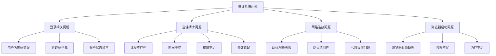
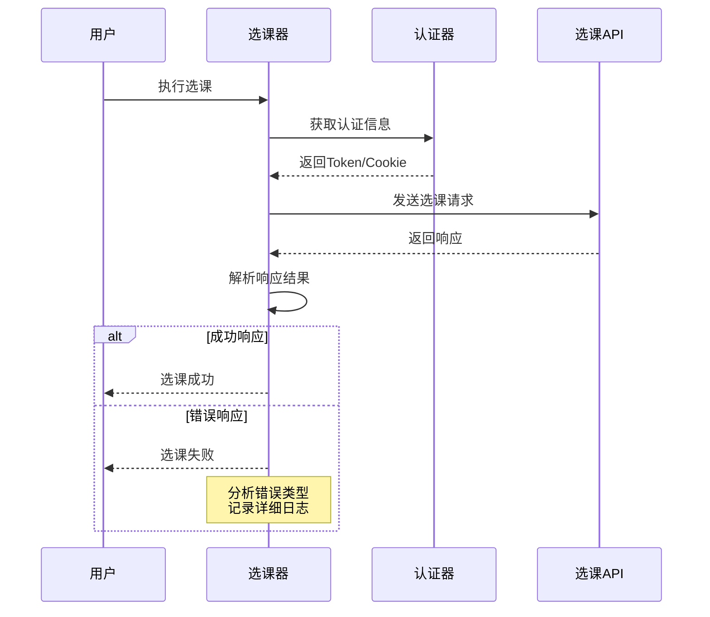
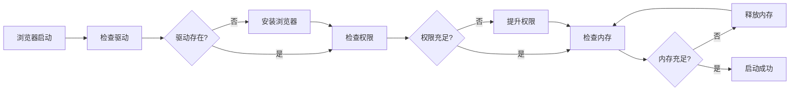
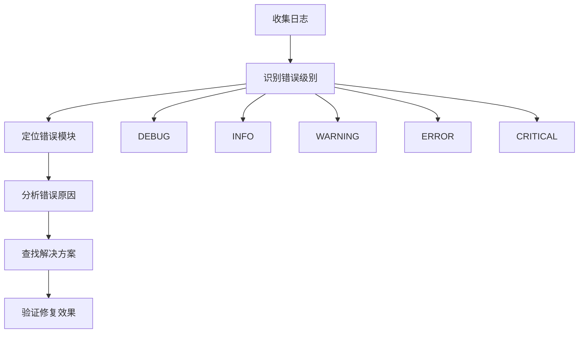
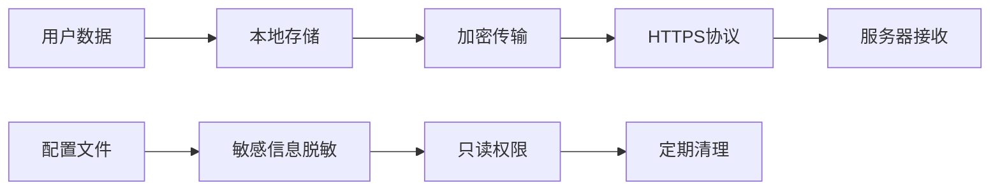
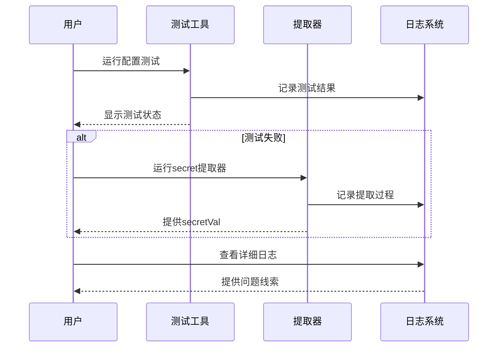

# 故障排除指南

<cite>
**本文档引用的文件**
- [README.md](file://README.md)
- [main_v2_hybrid.py](file://main_v2_hybrid.py)
- [hybrid_course_selector.py](file://src/hybrid_course_selector.py)
- [playwright_authenticator.py](file://src/playwright_authenticator.py)
- [http_course_executor.py](file://src/http_course_executor.py)
- [hybrid_retry_manager.py](file://src/hybrid_retry_manager.py)
- [quick_secret_extractor.py](file://tools/quick_secret_extractor.py)
- [config_simple.json](file://config_simple.json)
</cite>

## 目录
1. [概述](#概述)
2. [常见问题场景](#常见问题场景)
3. [登录失败问题](#登录失败问题)
4. [选课请求被拒问题](#选课请求被拒问题)
5. [网络连接问题](#网络连接问题)
6. [Playwright浏览器启动异常](#playwright浏览器启动异常)
7. [日志分析与调试](#日志分析与调试)
8. [反爬虫机制应对策略](#反爬虫机制应对策略)
9. [性能优化建议](#性能优化建议)
10. [故障排除工具](#故障排除工具)

## 概述

本故障排除指南旨在帮助用户诊断和解决北航选课系统自动化工具中的常见问题。该工具采用混合架构设计，结合了Playwright自动登录的可靠性和HTTP直接请求的高效性。通过详细的日志分析、问题分类和解决方案，用户可以快速定位并解决各种技术问题。

## 常见问题场景

### 问题分类概览



**图表来源**
- [hybrid_course_selector.py](file://src/hybrid_course_selector.py#L1-L50)
- [playwright_authenticator.py](file://src/playwright_authenticator.py#L1-L50)

## 登录失败问题

### 问题症状

登录失败是最常见的问题之一，主要表现为认证信息获取失败或登录状态异常。

### 可能原因分析

#### 1. 用户名密码错误
- **原因**: 配置文件中的用户名或密码不正确
- **日志特征**: `认证失败: 用户名或密码错误`
- **解决步骤**:
  1. 检查 `config_simple.json` 中的用户名和密码
  2. 确认账号状态正常（未被冻结）
  3. 验证密码是否包含特殊字符需要转义

#### 2. 验证码拦截
- **原因**: 系统检测到异常登录行为触发验证码
- **日志特征**: `验证码错误` 或 `需要人工验证`
- **解决步骤**:
  1. 手动登录选课系统验证账号状态
  2. 检查是否有安全限制
  3. 考虑更换网络环境

#### 3. 账户状态异常
- **原因**: 账号被锁定、权限受限或处于特殊状态
- **日志特征**: `账户被锁定` 或 `权限不足`
- **解决步骤**:
  1. 联系学校相关部门确认账号状态
  2. 等待一段时间后重试
  3. 检查是否符合选课资格

### 调试技巧

1. **启用调试模式**:
```bash
python main_v2_hybrid.py --debug
```

2. **查看详细日志**:
```bash
type logs\hybrid_course_selector.log
```

3. **测试配置**:
```bash
python main_v2_hybrid.py --test
```

**章节来源**
- [hybrid_course_selector.py](file://src/hybrid_course_selector.py#L150-L200)
- [playwright_authenticator.py](file://src/playwright_authenticator.py#L100-L150)

## 选课请求被拒问题

### 问题症状

选课请求被拒绝表现为HTTP响应中包含错误信息，如课程不存在、时间冲突或权限不足。

### 可能原因分析

#### 1. 课程不存在
- **原因**: 提供的课程ID无效或课程已被删除
- **日志特征**: `课程ID无效` 或 `资源不存在`
- **解决步骤**:
  1. 重新获取正确的课程ID和批次ID
  2. 确认课程仍在选课系统中
  3. 检查课程ID格式是否正确

#### 2. 时间冲突
- **原因**: 选课时间不在开放时段内
- **日志特征**: `选课时间已过期` 或 `不在选课时间段`
- **解决步骤**:
  1. 确认当前选课时间是否开放
  2. 检查系统公告和通知
  3. 等待合适的时间再次尝试

#### 3. 权限不足
- **原因**: 用户权限不足以选该课程
- **日志特征**: `权限不足` 或 `访问被拒绝`
- **解决步骤**:
  1. 确认是否满足课程选修条件
  2. 检查专业年级限制
  3. 联系课程负责人确认权限

#### 4. 参数错误
- **原因**: 请求参数格式不正确或缺失必要参数
- **日志特征**: `参数错误` 或 `请求格式无效`
- **解决步骤**:
  1. 检查配置文件格式
  2. 验证所有必需参数是否提供
  3. 使用命令行参数覆盖配置

### HTTP响应分析



**图表来源**
- [http_course_executor.py](file://src/http_course_executor.py#L50-L100)
- [hybrid_course_selector.py](file://src/hybrid_course_selector.py#L200-L250)

**章节来源**
- [http_course_executor.py](file://src/http_course_executor.py#L100-L200)
- [hybrid_course_selector.py](file://src/hybrid_course_selector.py#L250-L300)

## 网络连接问题

### 问题症状

网络连接问题表现为请求超时、连接失败或DNS解析错误。

### 可能原因分析

#### 1. DNS解析失败
- **原因**: 本地DNS服务器无法解析目标域名
- **日志特征**: `DNS解析失败` 或 `无法连接到服务器`
- **解决步骤**:
  1. 更换DNS服务器（如使用Google DNS 8.8.8.8）
  2. 检查网络连接状态
  3. 尝试使用代理

#### 2. 防火墙阻拦
- **原因**: 本地防火墙或网络策略阻止访问
- **日志特征**: `连接被拒绝` 或 `网络不可达`
- **解决步骤**:
  1. 检查防火墙设置
  2. 添加白名单规则
  3. 联系网络管理员

#### 3. 代理设置问题
- **原因**: 代理配置错误导致无法访问外网
- **日志特征**: `代理连接失败` 或 `代理超时`
- **解决步骤**:
  1. 检查系统代理设置
  2. 验证代理服务器可用性
  3. 尝试禁用代理

### 网络诊断工具

1. **测试网络连接**:
```bash
python main_v2_hybrid.py --test
```

2. **检查DNS解析**:
```bash
nslookup byxk.buaa.edu.cn
```

3. **测试HTTP连接**:
```bash
curl -I https://byxk.buaa.edu.cn
```

**章节来源**
- [hybrid_course_selector.py](file://src/hybrid_course_selector.py#L350-L400)
- [http_course_executor.py](file://src/http_course_executor.py#L300-L350)

## Playwright浏览器启动异常

### 问题症状

Playwright浏览器启动异常表现为浏览器无法启动、驱动缺失或权限不足。

### 可能原因分析

#### 1. 浏览器驱动缺失
- **原因**: Chromium浏览器未正确安装
- **日志特征**: `chromium not found` 或 `browser not installed`
- **解决步骤**:
  1. 安装Playwright浏览器:
```bash
playwright install chromium
```
  2. 验证安装:
```bash
playwright show-browser chromium
```

#### 2. 权限不足
- **原因**: 程序没有足够的权限启动浏览器
- **日志特征**: `Permission denied` 或 `Access denied`
- **解决步骤**:
  1. 以管理员权限运行程序
  2. 检查防病毒软件设置
  3. 添加程序到白名单

#### 3. 内存不足
- **原因**: 系统内存不足导致浏览器启动失败
- **日志特征**: `Out of memory` 或 `Cannot allocate memory`
- **解决步骤**:
  1. 关闭不必要的应用程序
  2. 增加虚拟内存设置
  3. 减少并发进程数量

### 浏览器配置优化



**图表来源**
- [playwright_authenticator.py](file://src/playwright_authenticator.py#L150-L200)

**章节来源**
- [playwright_authenticator.py](file://src/playwright_authenticator.py#L200-L250)

## 日志分析与调试

### 日志文件位置

日志文件位于 `logs/` 目录下，主要包含以下文件：
- `hybrid_course_selector.log`: 主要的日志文件
- `manual_api_response.json`: 手动API调用的响应数据

### 日志级别说明

| 级别 | 描述 | 用途 |
|------|------|------|
| DEBUG | 详细调试信息 | 开发和深入问题排查 |
| INFO | 一般信息 | 正常操作流程跟踪 |
| WARNING | 警告信息 | 可能的问题但不影响运行 |
| ERROR | 错误信息 | 发生了错误但程序继续运行 |
| CRITICAL | 严重错误 | 程序无法继续运行 |

### 关键日志特征

#### 认证阶段日志
```
INFO: 开始Playwright自动认证
DEBUG: 导航到SSO登录页面
WARNING: XPath点击失败，尝试其他方法
ERROR: Playwright认证失败: 用户名或密码错误
```

#### 选课阶段日志
```
INFO: 开始HTTP选课
DEBUG: 构建请求完成
WARNING: HTTP状态码异常: 400
ERROR: HTTP选课执行异常: 请求参数错误
```

### 调试技巧

1. **查看详细日志**:
```bash
type logs\hybrid_course_selector.log | findstr "ERROR"
```

2. **过滤特定模块**:
```bash
type logs\hybrid_course_selector.log | findstr "Authenticator"
```

3. **实时监控**:
```bash
tail -f logs\hybrid_course_selector.log
```

### 日志分析模板



**图表来源**
- [hybrid_course_selector.py](file://src/hybrid_course_selector.py#L100-L150)

**章节来源**
- [hybrid_course_selector.py](file://src/hybrid_course_selector.py#L100-L150)
- [main_v2_hybrid.py](file://main_v2_hybrid.py#L150-L200)

## 反爬虫机制应对策略

### 反爬虫机制类型

#### 1. IP封禁机制
- **表现**: 连续请求后被封禁IP地址
- **应对策略**:
  1. 增加请求间隔时间
  2. 使用代理IP池
  3. 避免短时间内高频请求

#### 2. 行为检测机制
- **表现**: 检测到自动化行为触发验证码
- **应对策略**:
  1. 模拟人类操作行为
  2. 添加随机延迟
  3. 使用真实的用户代理

#### 3. Token过期机制
- **表现**: 认证Token频繁过期需要重新获取
- **应对策略**:
  1. 定期刷新认证信息
  2. 实现智能重试机制
  3. 使用缓存机制减少重复认证

### 合规建议

1. **遵守使用条款**: 确保使用符合学校规定
2. **合理频率**: 控制请求频率避免过度使用
3. **备用方案**: 准备人工选课作为备选方案
4. **定期更新**: 保持软件版本更新以应对系统变更

### 隐私保护措施



**图表来源**
- [README.md](file://README.md#L200-L250)

**章节来源**
- [README.md](file://README.md#L200-L278)

## 性能优化建议

### 系统资源配置

#### 1. CPU优化
- **建议**: 使用多核处理器提高并发能力
- **配置**: 合理设置线程数和进程数
- **监控**: 使用任务管理器监控CPU使用率

#### 2. 内存优化
- **建议**: 至少2GB可用内存
- **配置**: 调整虚拟内存大小
- **监控**: 避免内存泄漏和过度交换

#### 3. 网络优化
- **建议**: 使用稳定的网络连接
- **配置**: 优化DNS设置和MTU值
- **监控**: 监控网络延迟和丢包率

### 程序优化策略

#### 1. 并发控制
- **策略**: 限制并发请求数量
- **配置**: 根据网络带宽调整并发数
- **监控**: 避免网络拥塞和服务器压力

#### 2. 缓存机制
- **策略**: 缓存认证信息和课程数据
- **配置**: 设置合理的缓存过期时间
- **监控**: 监控缓存命中率和存储空间

#### 3. 重试策略
- **策略**: 实现指数退避重试
- **配置**: 根据网络状况调整重试参数
- **监控**: 记录重试次数和成功率

### 性能监控指标

| 指标 | 目标值 | 监控方法 |
|------|--------|----------|
| 认证时间 | <30秒 | 日志记录 |
| 选课响应时间 | <2秒 | 性能计时 |
| 成功率 | >95% | 统计分析 |
| 内存使用 | <200MB | 系统监控 |

**章节来源**
- [hybrid_retry_manager.py](file://src/hybrid_retry_manager.py#L50-L100)

## 故障排除工具

### 内置测试工具

#### 1. 配置测试工具
```bash
python main_v2_hybrid.py --test
```
- **功能**: 测试配置文件和网络连接
- **输出**: 配置摘要和连接状态
- **用途**: 快速验证环境配置

#### 2. 调试模式
```bash
python main_v2_hybrid.py --debug
```
- **功能**: 显示浏览器窗口和详细日志
- **输出**: 实时操作界面和调试信息
- **用途**: 深入问题分析和演示

#### 3. 命令行参数覆盖
```bash
python main_v2_hybrid.py --username 123456 --course-id abc123
```
- **功能**: 临时覆盖配置参数
- **输出**: 使用指定参数执行
- **用途**: 快速测试不同配置

### 独立工具

#### 1. secretVal提取器
```bash
cd tools
python quick_secret_extractor.py
```
- **功能**: 提取选课所需的secretVal参数
- **输出**: 提取的secretVal值和API响应
- **用途**: 解决认证信息获取失败问题

#### 2. API响应分析
- **文件**: `manual_api_response.json`
- **功能**: 分析API响应数据
- **用途**: 理解系统接口和响应格式

### 工具使用流程



**图表来源**
- [main_v2_hybrid.py](file://main_v2_hybrid.py#L100-L150)
- [quick_secret_extractor.py](file://tools/quick_secret_extractor.py#L50-L100)

**章节来源**
- [main_v2_hybrid.py](file://main_v2_hybrid.py#L100-L200)
- [quick_secret_extractor.py](file://tools/quick_secret_extractor.py#L1-L100)

## 总结

本故障排除指南涵盖了北航选课系统自动化工具的主要问题类型和解决方案。通过系统化的分析方法、详细的日志解读和实用的调试技巧，用户可以有效地诊断和解决各种技术问题。

### 关键要点

1. **预防为主**: 定期检查配置和网络环境
2. **及时响应**: 发现问题立即采取相应措施
3. **持续优化**: 根据使用经验不断改进配置
4. **合规使用**: 遵守学校规定和使用条款

### 后续支持

如遇到本指南未涵盖的问题，请：
1. 查看详细日志文件
2. 搜索GitHub Issues中的类似问题
3. 提交新的Issue并附上相关日志
4. 考虑联系技术支持团队

记住，自动化工具只是辅助手段，合理使用并配合人工操作才能获得最佳效果。