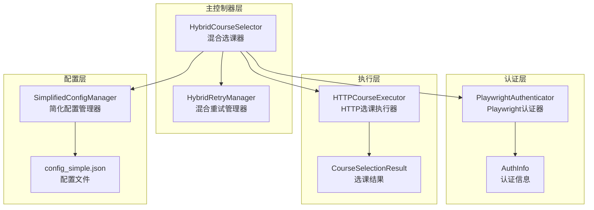
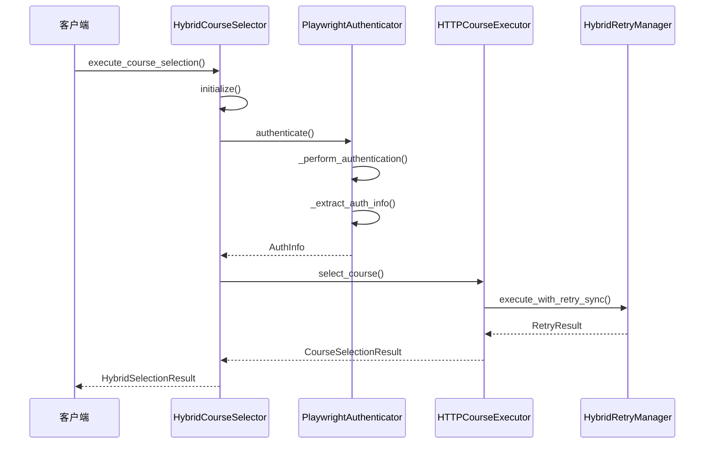
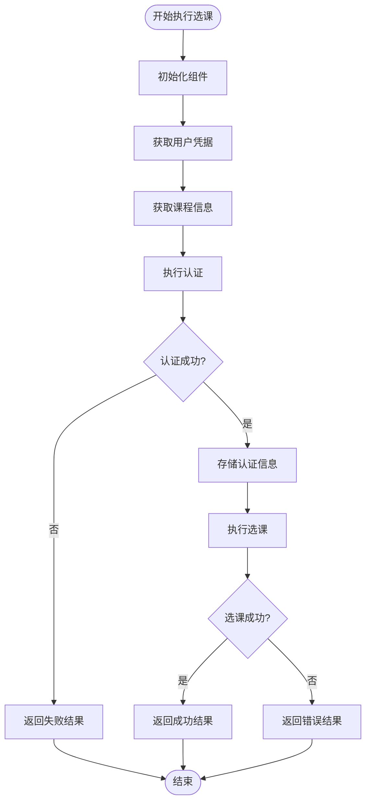
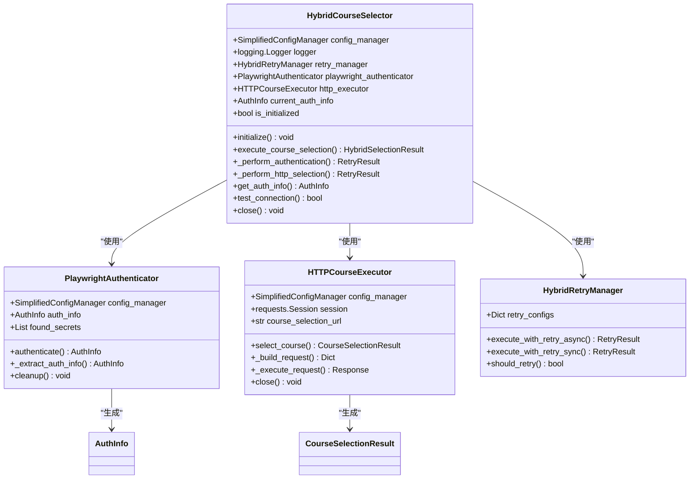
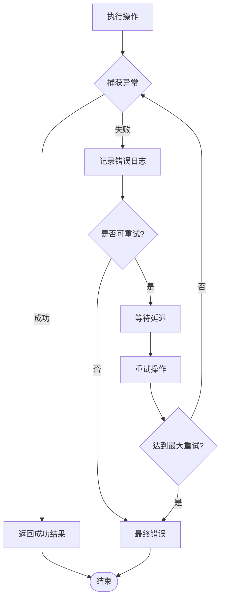
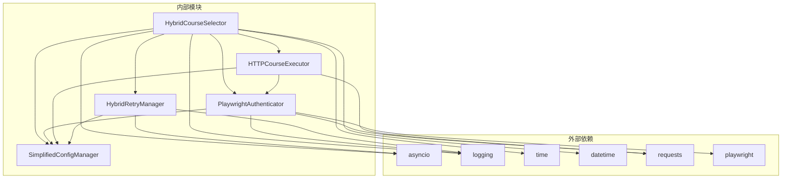

# 主控制器

<cite>
**本文档引用的文件**
- [hybrid_course_selector.py](file://src/hybrid_course_selector.py)
- [playwright_authenticator.py](file://src/playwright_authenticator.py)
- [http_course_executor.py](file://src/http_course_executor.py)
- [hybrid_retry_manager.py](file://src/hybrid_retry_manager.py)
- [simplified_config_manager.py](file://src/simplified_config_manager.py)
- [main_v2_hybrid.py](file://main_v2_hybrid.py)
- [config_simple.json](file://config_simple.json)
</cite>

## 目录
1. [简介](#简介)
2. [项目结构](#项目结构)
3. [核心组件](#核心组件)
4. [架构概览](#架构概览)
5. [详细组件分析](#详细组件分析)
6. [依赖关系分析](#依赖关系分析)
7. [性能考虑](#性能考虑)
8. [故障排除指南](#故障排除指南)
9. [结论](#结论)

## 简介

HybridCourseSelector（混合选课器）是北航选课系统自动化工具方案二的核心协调器，负责整合Playwright认证和HTTP选课两大模块，为用户提供无缝的选课体验。该控制器采用混合架构设计，通过自动化的Playwright登录获取最新认证信息，并使用高效的HTTP请求执行选课操作，同时具备智能重试机制和完善的错误处理策略。

## 项目结构



**图表来源**
- [hybrid_course_selector.py](file://src/hybrid_course_selector.py#L1-L50)
- [playwright_authenticator.py](file://src/playwright_authenticator.py#L1-L50)
- [http_course_executor.py](file://src/http_course_executor.py#L1-L50)

**章节来源**
- [hybrid_course_selector.py](file://src/hybrid_course_selector.py#L1-L407)
- [main_v2_hybrid.py](file://main_v2_hybrid.py#L1-L385)

## 核心组件

### HybridCourseSelector 类

HybridCourseSelector 是整个系统的中央协调器，负责管理认证、执行和重试三大核心模块的生命周期和交互流程。

#### 初始化流程

```python
def __init__(self, config_path: str = "config_simple.json"):
    """
    初始化混合选课器
    
    Args:
        config_path: 简化配置文件路径
    """
    # 核心组件
    self.config_manager = SimplifiedConfigManager(config_path)
    self.logger = self._setup_logger()
    self.retry_manager = HybridRetryManager(self.config_manager, self.logger)
    
    # 子组件（延迟初始化）
    self.playwright_authenticator: Optional[PlaywrightAuthenticator] = None
    self.http_executor: Optional[HTTPCourseExecutor] = None
    
    # 状态信息
    self.current_auth_info: Optional[AuthInfo] = None
    self.is_initialized = False
```

#### 日志系统构建

系统采用分层日志架构，支持文件和控制台双重输出：

```python
def _setup_logger(self) -> logging.Logger:
    """设置日志记录器"""
    try:
        config = self.config_manager.load_config()
        logging_config = config['logging']
        
        logger = logging.getLogger('HybridCourseSelector')
        logger.setLevel(getattr(logging, logging_config['level'].upper()))
        
        if not logger.handlers:
            # 创建文件handler
            log_file = Path(logging_config['file_path'])
            log_file.parent.mkdir(parents=True, exist_ok=True)
            
            handler = logging.FileHandler(log_file, encoding='utf-8')
            formatter = logging.Formatter(logging_config['format'])
            handler.setFormatter(formatter)
            logger.addHandler(handler)
            
            # 添加控制台handler
            console_handler = logging.StreamHandler()
            console_handler.setFormatter(formatter)
            logger.addHandler(console_handler)
        
        return logger
        
    except Exception as e:
        logger = logging.getLogger('HybridCourseSelector')
        logger.setLevel(logging.INFO)
        return logger
```

**章节来源**
- [hybrid_course_selector.py](file://src/hybrid_course_selector.py#L50-L120)

## 架构概览



**图表来源**
- [hybrid_course_selector.py](file://src/hybrid_course_selector.py#L120-L200)
- [playwright_authenticator.py](file://src/playwright_authenticator.py#L80-L150)
- [http_course_executor.py](file://src/http_course_executor.py#L60-L120)

## 详细组件分析

### HybridSelectionResult 数据类

HybridSelectionResult 是选课结果的数据容器，提供了全面的状态信息和统计指标：

```python
@dataclass
class HybridSelectionResult:
    """混合选课结果"""
    success: bool
    message: str
    course_id: str
    course_name: str
    timestamp: datetime
    
    # 认证信息
    auth_success: bool
    auth_attempts: int
    auth_time: float
    
    # 选课信息
    selection_attempts: int
    selection_time: float
    total_time: float
    
    # 详细信息
    auth_error: Optional[str] = None
    selection_error: Optional[str] = None
    response_data: Optional[Dict[str, Any]] = None
```

#### 字段说明与使用场景

- **success**: 表示选课是否成功
- **message**: 详细的选课结果描述
- **course_id/course_name**: 目标课程的基本信息
- **timestamp**: 结果生成的时间戳
- **auth_success**: 认证阶段是否成功
- **auth_attempts/auth_time**: 认证尝试次数和耗时
- **selection_attempts/selection_time**: 选课尝试次数和耗时
- **total_time**: 整个流程的总耗时
- **auth_error/selection_error**: 详细的错误信息
- **response_data**: 服务器返回的原始响应数据

### execute_course_selection 主方法

execute_course_selection 是系统的核心入口点，实现了完整的混合选课流程：



**图表来源**
- [hybrid_course_selector.py](file://src/hybrid_course_selector.py#L120-L250)

#### 执行逻辑详解

1. **组件初始化**: 调用 `initialize()` 方法确保所有子组件就绪
2. **凭据获取**: 从配置文件或参数中获取用户名和密码
3. **课程信息**: 从配置文件或参数中获取课程ID、批次ID和课程名称
4. **认证阶段**: 调用 `_perform_authentication()` 执行Playwright认证
5. **选课阶段**: 调用 `_perform_http_selection()` 执行HTTP选课
6. **结果封装**: 将各阶段的结果整合到 HybridSelectionResult 中

### 认证与执行的协调机制



**图表来源**
- [hybrid_course_selector.py](file://src/hybrid_course_selector.py#L50-L120)
- [playwright_authenticator.py](file://src/playwright_authenticator.py#L50-L100)
- [http_course_executor.py](file://src/http_course_executor.py#L40-L80)

**章节来源**
- [hybrid_course_selector.py](file://src/hybrid_course_selector.py#L120-L300)

### 组件依赖注入机制

系统采用延迟初始化和依赖注入的设计模式：

```python
def initialize(self) -> None:
    """初始化所有子组件"""
    try:
        if self.is_initialized:
            return
        
        self.logger.info("开始初始化混合选课器子组件")
        
        # 加载配置
        config = self.config_manager.load_config()
        
        # 初始化子组件
        self.playwright_authenticator = PlaywrightAuthenticator(self.config_manager, self.logger)
        self.http_executor = HTTPCourseExecutor(self.config_manager, self.logger)
        
        self.is_initialized = True
        self.logger.info("混合选课器子组件初始化完成")
        
    except Exception as e:
        error_msg = f"混合选课器初始化失败: {str(e)}"
        self.logger.error(error_msg)
        raise HybridCourseSelectorError(error_msg)
```

这种设计的优势：
- **按需初始化**: 只有在真正需要时才创建组件实例
- **资源节约**: 避免不必要的资源消耗
- **错误隔离**: 单个组件初始化失败不会影响其他组件
- **测试友好**: 可以轻松模拟或替换组件

### 错误处理策略

系统实现了多层次的错误处理机制：



**图表来源**
- [hybrid_retry_manager.py](file://src/hybrid_retry_manager.py#L100-L200)

### 资源清理机制

系统提供了完善的资源清理机制：

```python
def close(self) -> None:
    """清理资源"""
    try:
        if self.http_executor:
            self.http_executor.close()
        
        # 清理认证信息
        self.current_auth_info = None
        
        self.logger.info("混合选课器资源清理完成")
        
    except Exception as e:
        self.logger.debug(f"清理资源时出错: {str(e)}")
```

**章节来源**
- [hybrid_course_selector.py](file://src/hybrid_course_selector.py#L300-L407)

## 依赖关系分析



**图表来源**
- [hybrid_course_selector.py](file://src/hybrid_course_selector.py#L1-L30)
- [playwright_authenticator.py](file://src/playwright_authenticator.py#L1-L30)
- [http_course_executor.py](file://src/http_course_executor.py#L1-L30)

**章节来源**
- [hybrid_course_selector.py](file://src/hybrid_course_selector.py#L1-L40)
- [playwright_authenticator.py](file://src/playwright_authenticator.py#L1-L40)
- [http_course_executor.py](file://src/http_course_executor.py#L1-L40)

## 性能考虑

### 异步操作优化

系统充分利用异步编程模型提升性能：

- **认证阶段**: 使用 Playwright 的异步 API 进行网页操作
- **重试管理**: 支持异步和同步两种重试模式
- **网络请求**: HTTP 选课使用异步请求提高并发能力

### 内存管理

- **延迟初始化**: 只在需要时创建组件实例
- **资源清理**: 提供显式的 close() 方法释放资源
- **状态管理**: 及时清理认证信息避免内存泄漏

### 网络优化

- **连接复用**: HTTP 选课执行器使用 requests.Session 复用连接
- **超时控制**: 合理设置请求超时时间避免长时间阻塞
- **重试策略**: 智能的指数退避算法减少服务器压力

## 故障排除指南

### 常见问题与解决方案

#### 1. 认证失败

**症状**: Playwright 认证过程中断或失败
**原因**: 
- 网络连接不稳定
- 登录凭据错误
- 选课系统维护

**解决方案**:
```python
# 检查网络连接
if not selector.test_connection():
    print("网络连接失败，请检查网络设置")

# 验证配置文件
try:
    config = selector.config_manager.load_config()
except SimplifiedConfigValidationError as e:
    print(f"配置文件错误: {e}")
```

#### 2. 选课失败

**症状**: HTTP 选课请求返回错误状态码
**原因**:
- 认证信息过期
- 课程已满或不存在
- 网络请求被拦截

**解决方案**:
- 系统会自动重新认证并重试
- 检查课程ID和批次ID是否正确
- 查看日志文件获取详细错误信息

#### 3. 配置问题

**症状**: 程序启动时提示配置错误
**原因**:
- 配置文件格式错误
- 必需字段缺失
- 文件路径错误

**解决方案**:
```bash
# 使用内置配置测试功能
python main_v2_hybrid.py --test

# 查看配置帮助信息
python main_v2_hybrid.py --help-config
```

**章节来源**
- [hybrid_course_selector.py](file://src/hybrid_course_selector.py#L350-L407)
- [main_v2_hybrid.py](file://main_v2_hybrid.py#L150-L250)

## 结论

HybridCourseSelector 作为北航选课系统自动化工具方案二的核心控制器，成功地实现了以下目标：

### 设计优势

1. **模块化架构**: 清晰的职责分离使系统易于维护和扩展
2. **智能重试**: 适应不同操作类型的重试策略提高了成功率
3. **自动认证**: Playwright 自动化登录确保认证信息始终有效
4. **高效执行**: HTTP 选课方式提供快速的选课体验
5. **完善监控**: 全面的日志记录和状态跟踪便于问题诊断

### 技术特色

- **混合架构**: 结合 Playwright 和 HTTP 的优势
- **异步设计**: 充分利用 Python 异步编程能力
- **错误恢复**: 多层次的错误处理和自动恢复机制
- **配置简化**: 用户友好的配置文件设计
- **资源管理**: 完善的资源生命周期管理

### 应用价值

该控制器不仅解决了北航选课系统的自动化难题，还为类似场景提供了可借鉴的架构模式。通过自动化的认证和高效的选课执行，显著提升了用户体验和选课成功率，是现代 Web 自动化工具的优秀实践案例。