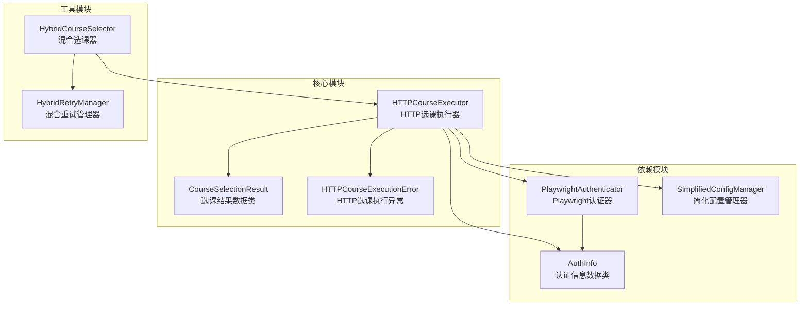
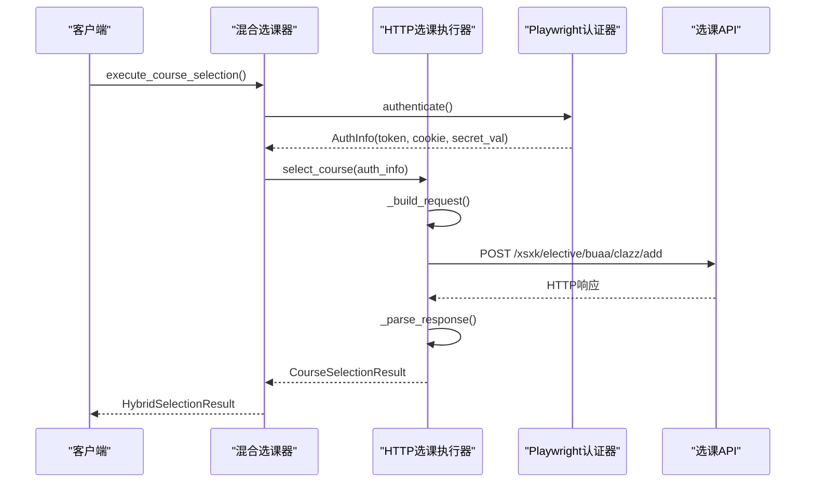
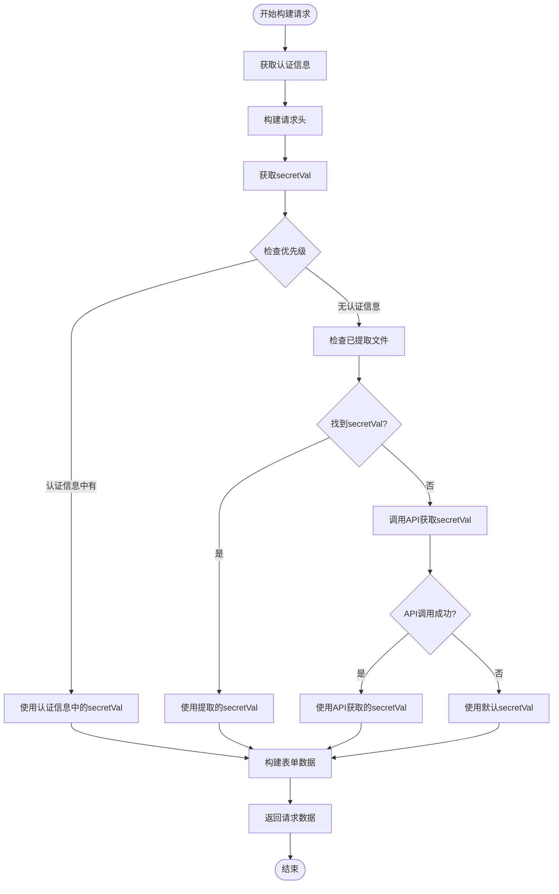
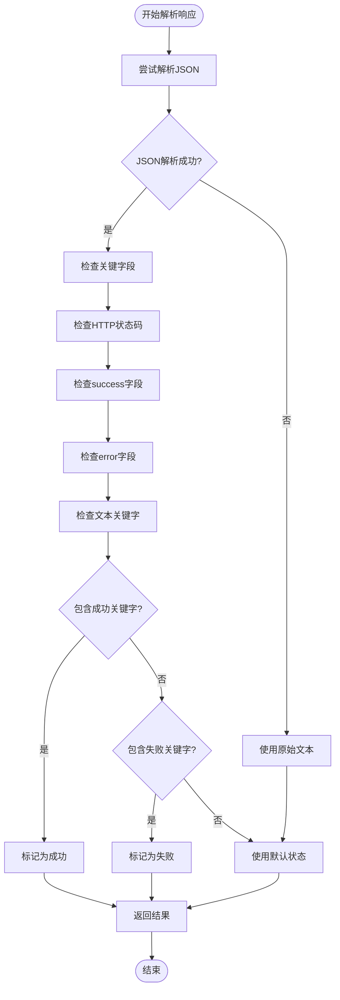
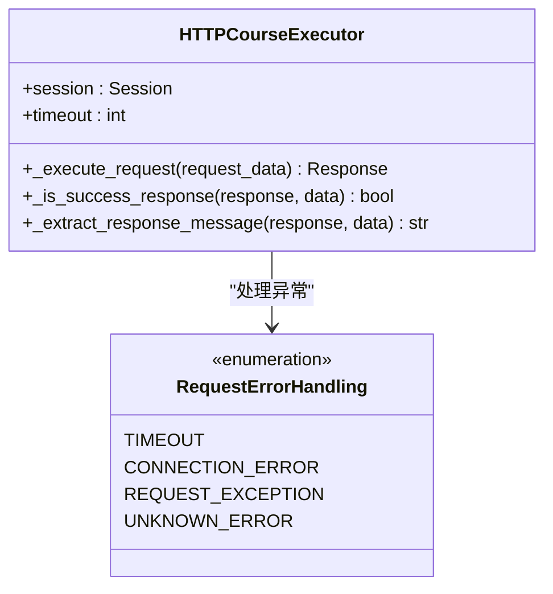
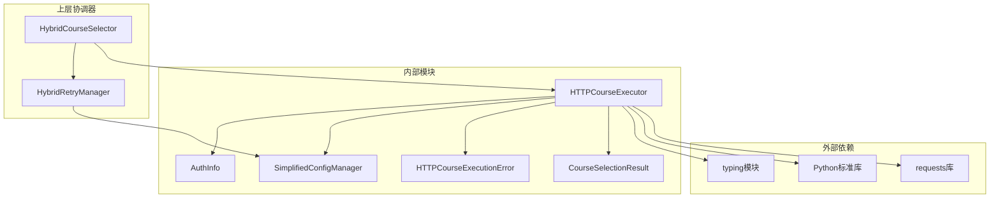

# HTTP选课执行模块文档

<cite>
**本文档引用的文件**
- [http_course_executor.py](file://src/http_course_executor.py)
- [playwright_authenticator.py](file://src/playwright_authenticator.py)
- [simplified_config_manager.py](file://src/simplified_config_manager.py)
- [hybrid_course_selector.py](file://src/hybrid_course_selector.py)
- [hybrid_retry_manager.py](file://src/hybrid_retry_manager.py)
- [main_v2_hybrid.py](file://main_v2_hybrid.py)
</cite>

## 目录
1. [简介](#简介)
2. [项目结构](#项目结构)
3. [核心组件](#核心组件)
4. [架构概览](#架构概览)
5. [详细组件分析](#详细组件分析)
6. [依赖关系分析](#依赖关系分析)
7. [性能考虑](#性能考虑)
8. [故障排除指南](#故障排除指南)
9. [结论](#结论)

## 简介

HTTP选课执行模块是方案二的核心组件之一，专门设计用于通过HTTP请求方式执行高效的选课操作。该模块基于PlaywrightAuthenticator提供的认证信息，利用requests库直接与选课接口通信，实现了比传统浏览器自动化更快速、更稳定的选课机制。

该模块的主要特点包括：
- **动态请求构建**：根据认证信息动态构建包含authorization、cookie、secretVal等关键头信息的HTTP请求
- **多层secretVal获取策略**：优先使用认证信息中的secretVal，其次从已提取文件获取，最后通过API动态获取
- **智能响应解析**：通过状态码、JSON内容和文本关键字综合判断选课成功与否
- **完善的错误处理**：提供详细的错误信息和重试机制
- **连接管理**：支持HTTP会话管理和超时处理的最佳实践

## 项目结构

HTTP选课执行模块在项目中的组织结构如下：



**图表来源**
- [http_course_executor.py](file://src/http_course_executor.py#L1-L616)
- [playwright_authenticator.py](file://src/playwright_authenticator.py#L1-L988)
- [hybrid_course_selector.py](file://src/hybrid_course_selector.py#L1-L407)

**章节来源**
- [http_course_executor.py](file://src/http_course_executor.py#L1-L50)
- [main_v2_hybrid.py](file://main_v2_hybrid.py#L1-L100)

## 核心组件

### HTTPCourseExecutor类

HTTPCourseExecutor是整个模块的核心执行器，负责协调所有的选课操作。它继承了以下关键功能：

- **HTTP会话管理**：维护持久的HTTP会话，提高请求效率
- **请求构建**：动态生成符合API要求的HTTP请求
- **响应解析**：智能解析服务器响应，判断选课结果
- **错误处理**：提供详细的错误信息和异常处理

### CourseSelectionResult数据类

CourseSelectionResult是一个数据传输对象，封装了选课操作的所有相关信息：

```python
@dataclass
class CourseSelectionResult:
    success: bool
    message: str
    course_id: str
    course_name: str
    timestamp: datetime
    attempt_count: int = 1
    response_data: Optional[Dict[str, Any]] = None
    error_details: Optional[str] = None
    http_status: Optional[int] = None
```

该数据类的设计特点：
- **类型安全**：使用Python类型注解确保数据完整性
- **可扩展性**：预留字段支持未来功能扩展
- **信息丰富**：包含完整的选课过程信息

**章节来源**
- [http_course_executor.py](file://src/http_course_executor.py#L25-L40)
- [http_course_executor.py](file://src/http_course_executor.py#L42-L60)

## 架构概览

HTTP选课执行模块采用分层架构设计，确保了代码的清晰性和可维护性：



**图表来源**
- [hybrid_course_selector.py](file://src/hybrid_course_selector.py#L100-L150)
- [http_course_executor.py](file://src/http_course_executor.py#L62-L120)

## 详细组件分析

### _build_request方法详解

_build_request方法是HTTP选课执行器的核心功能，负责构建完整的HTTP请求：



**图表来源**
- [http_course_executor.py](file://src/http_course_executor.py#L122-L180)

#### 请求头构建策略

_build_request方法构建的请求头包含以下关键字段：

1. **认证相关**：
   - `authorization`: JWT Token
   - `cookie`: 用户会话Cookie
   - `batchid`: 选课批次ID

2. **内容类型**：
   - `content-type`: application/x-www-form-urlencoded
   - `accept`: application/json, text/plain, */*

3. **安全相关**：
   - `origin`: https://byxk.buaa.edu.cn
   - `referer`: https://byxk.buaa.edu.cn/xsxk/elective/buaa
   - `user-agent`: 模拟Chrome浏览器

#### secretVal获取策略

secretVal的获取遵循严格的优先级顺序：

1. **认证信息优先**：首先检查AuthInfo对象中是否包含secret_val字段
2. **已提取文件**：从extracted_secrets.json文件中获取最新的secretVal
3. **API动态获取**：调用课程列表API获取secretVal
4. **默认值**：使用空字符串作为最后的备选方案

**章节来源**
- [http_course_executor.py](file://src/http_course_executor.py#L122-L200)

### 响应解析策略

HTTP选课执行器实现了多层次的响应解析策略：



**图表来源**
- [http_course_executor.py](file://src/http_course_executor.py#L320-L400)

#### 成功判断逻辑

系统通过多个维度判断选课是否成功：

1. **HTTP状态码**：200或201状态码通常表示成功
2. **JSON字段**：检查success、status、code等字段的值
3. **错误检测**：识别包含错误信息的字段
4. **文本关键字**：搜索成功或失败的关键词

#### 消息提取机制

_extract_response_message方法提供了智能的消息提取：

- 优先从JSON响应中提取message字段
- 使用响应文本作为备选方案
- 根据HTTP状态码生成默认消息
- 对长文本进行截断处理

**章节来源**
- [http_course_executor.py](file://src/http_course_executor.py#L320-L450)

### _execute_request方法

_execute_request方法负责执行实际的HTTP请求，实现了完整的错误处理机制：



**图表来源**
- [http_course_executor.py](file://src/http_course_executor.py#L250-L320)

该方法的错误处理策略包括：

1. **超时处理**：捕获requests.exceptions.Timeout异常
2. **连接错误**：处理requests.exceptions.ConnectionError
3. **通用异常**：捕获requests.exceptions.RequestException
4. **未知异常**：捕获所有其他异常类型

**章节来源**
- [http_course_executor.py](file://src/http_course_executor.py#L250-L320)

### secretVal获取机制

#### get_secret_val_from_extracted方法

该方法从已提取的secrets文件中获取最新的secretVal：

```python
def get_secret_val_from_extracted(self) -> str:
    """
    从已提取的secrets文件中获取最新的secretVal
    这些secretVal是通过快速提取器成功获取的
    """
```

获取逻辑：
1. 检查extracted_secrets.json文件是否存在
2. 按时间戳排序，获取最新的secretVal
3. 返回有效的secretVal值或空字符串

#### get_secret_val_from_api方法

该方法通过课程列表API获取secretVal作为备用方案：

```python
def get_secret_val_from_api(self, auth_info: AuthInfo) -> str:
    """
    通过课程列表API获取secretVal（作为fallback机制）
    根据深度分析结果，secretVal包含在课程列表API的响应中
    """
```

API调用特点：
- 使用与认证信息相同的headers
- 发送标准的课程列表查询参数
- 支持多种secretVal格式的正则匹配

**章节来源**
- [http_course_executor.py](file://src/http_course_executor.py#L200-L250)
- [http_course_executor.py](file://src/http_course_executor.py#L252-L320)

## 依赖关系分析

HTTP选课执行模块的依赖关系体现了清晰的分层架构：



**图表来源**
- [http_course_executor.py](file://src/http_course_executor.py#L1-L25)
- [hybrid_course_selector.py](file://src/hybrid_course_selector.py#L1-L50)

### 核心依赖说明

1. **requests库**：提供HTTP请求功能
2. **dataclasses**：支持数据类的使用
3. **typing**：提供类型注解支持
4. **SimplifiedConfigManager**：配置管理
5. **AuthInfo**：认证信息载体

**章节来源**
- [http_course_executor.py](file://src/http_course_executor.py#L1-L25)

## 性能考虑

### HTTP会话管理

HTTPCourseExecutor使用requests.Session()来维护HTTP会话，这带来了以下性能优势：

1. **连接复用**：避免每次请求都建立新的TCP连接
2. **Cookie持久化**：自动处理Cookie，减少认证开销
3. **连接池**：利用HTTP/1.1的连接复用特性

### 超时设置

模块设置了合理的超时参数：
- **请求超时**：10秒（可配置）
- **API调用超时**：15秒（备用方案）

### 重试机制

结合HybridRetryManager的智能重试策略：
- **登录重试**：较慢但稳定的策略
- **HTTP重试**：快速响应的策略
- **指数退避**：避免对服务器造成过大压力

## 故障排除指南

### 常见问题及解决方案

#### 1. secretVal获取失败

**症状**：选课请求中缺少secretVal参数
**解决方案**：
- 检查认证信息是否包含secret_val字段
- 验证extracted_secrets.json文件是否存在且有效
- 确认API调用权限和网络连接

#### 2. HTTP请求超时

**症状**：requests.exceptions.Timeout异常
**解决方案**：
- 增加超时时间配置
- 检查网络连接稳定性
- 验证目标服务器可用性

#### 3. 认证失败

**症状**：401或403状态码
**解决方案**：
- 重新获取认证信息
- 检查Token是否过期
- 验证Cookie有效性

#### 4. 响应解析错误

**症状**：JSONDecodeError或解析结果不准确
**解决方案**：
- 检查响应内容格式
- 更新响应解析逻辑
- 添加更多的错误处理分支

**章节来源**
- [http_course_executor.py](file://src/http_course_executor.py#L250-L320)
- [http_course_executor.py](file://src/http_course_executor.py#L450-L500)

## 结论

HTTP选课执行模块是一个设计精良、功能完备的选课系统组件。它通过以下特点实现了高效的选课操作：

1. **模块化设计**：清晰的职责分离和接口定义
2. **智能策略**：多层secretVal获取和响应解析策略
3. **健壮性**：完善的错误处理和重试机制
4. **性能优化**：HTTP会话管理和超时控制
5. **可维护性**：良好的代码结构和文档

该模块为方案二提供了坚实的HTTP选课基础，支持与Playwright认证器的无缝集成，实现了从认证到选课的完整自动化流程。通过合理的架构设计和错误处理机制，确保了系统的稳定性和可靠性，为用户提供流畅的选课体验。