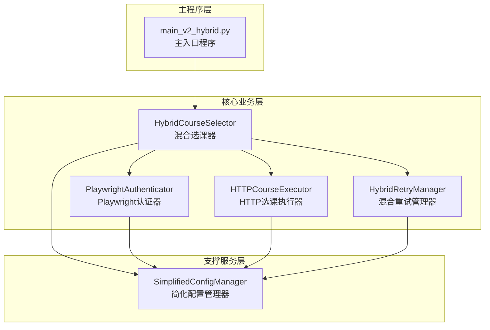
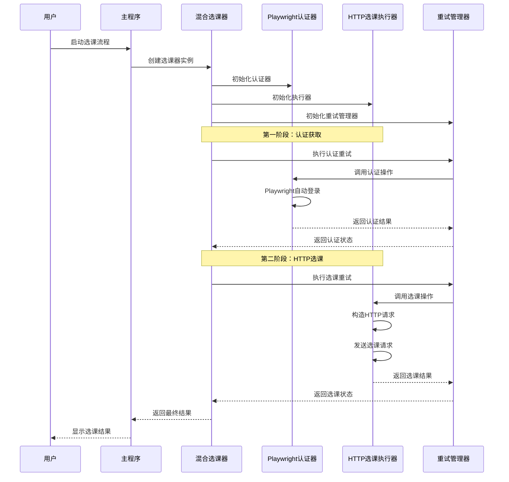
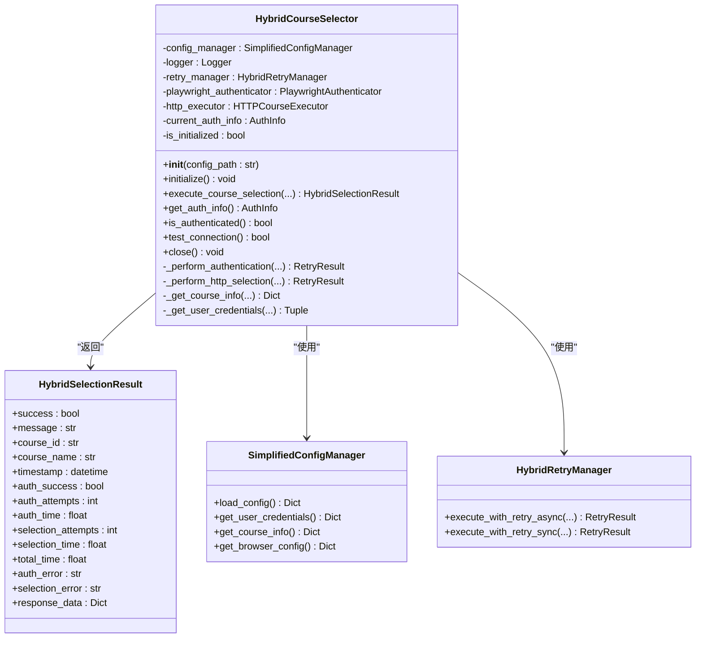
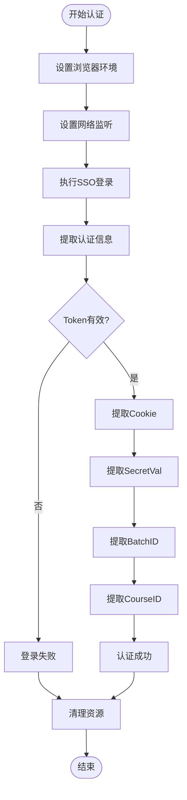
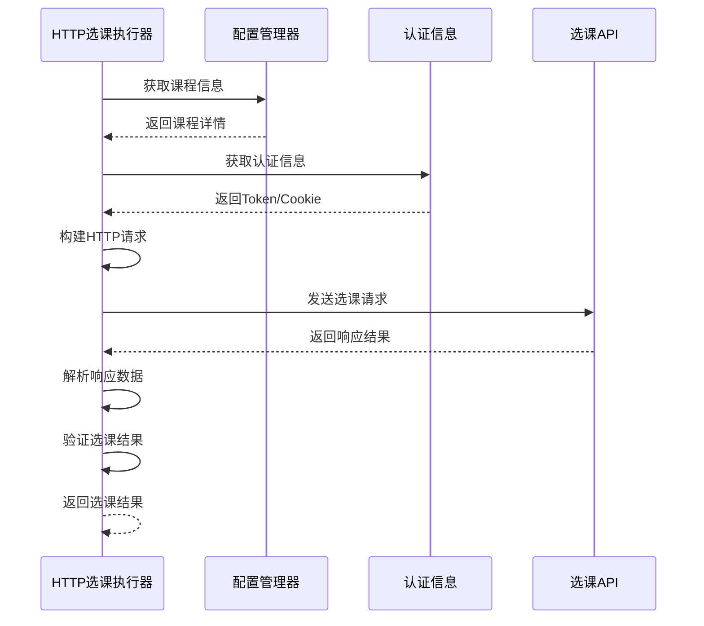
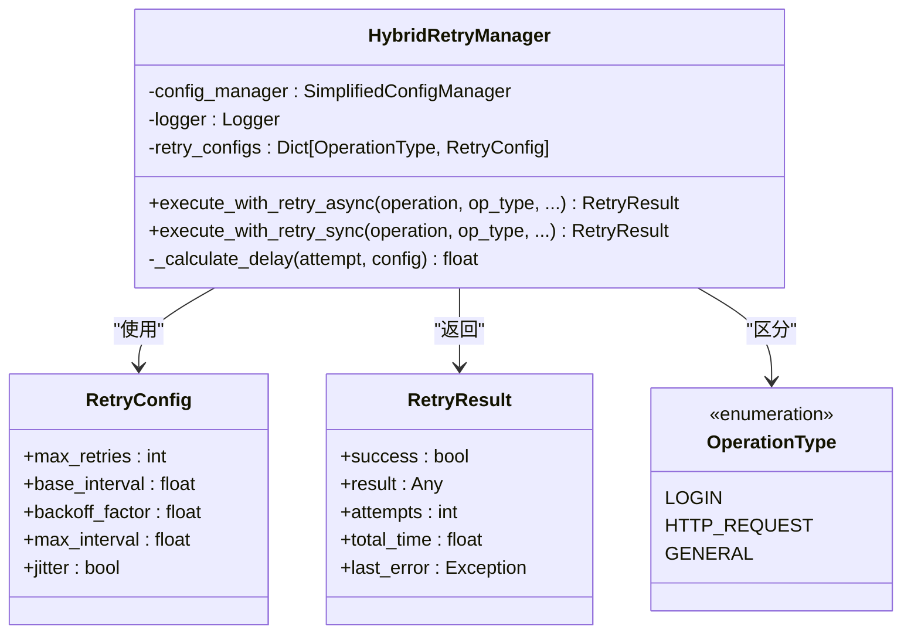
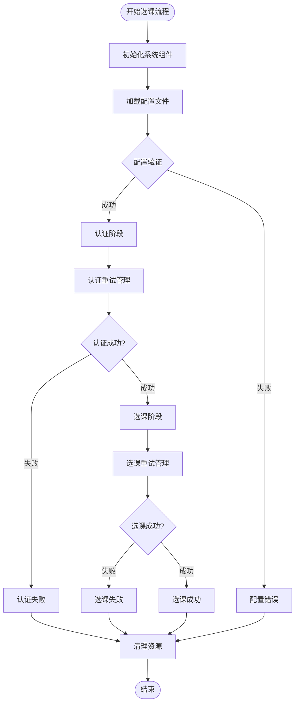
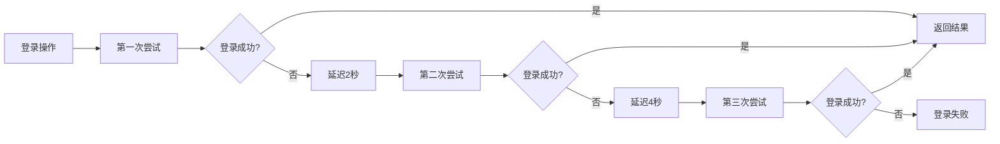
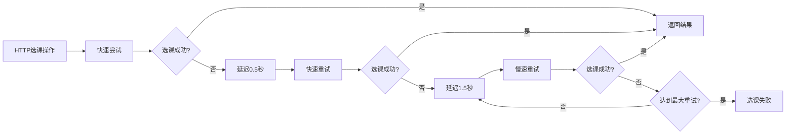
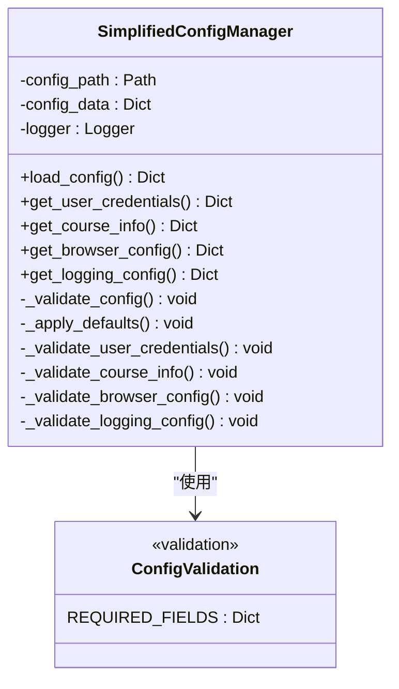

# 核心架构

<cite>
**本文档引用的文件**
- [hybrid_course_selector.py](file://src/hybrid_course_selector.py)
- [playwright_authenticator.py](file://src/playwright_authenticator.py)
- [http_course_executor.py](file://src/http_course_executor.py)
- [hybrid_retry_manager.py](file://src/hybrid_retry_manager.py)
- [simplified_config_manager.py](file://src/simplified_config_manager.py)
- [main_v2_hybrid.py](file://main_v2_hybrid.py)
- [config_simple.json](file://config_simple.json)
</cite>

## 目录
1. [简介](#简介)
2. [项目结构概览](#项目结构概览)
3. [核心架构概述](#核心架构概述)
4. [四大核心模块详解](#四大核心模块详解)
5. [数据流与控制流](#数据流与控制流)
6. [智能重试机制](#智能重试机制)
7. [配置管理系统](#配置管理系统)
8. [性能考虑](#性能考虑)
9. [故障排除指南](#故障排除指南)
10. [总结](#总结)

## 简介

方案二（混合架构）是一个创新的北航选课系统自动化解决方案，采用混合架构设计，结合了Playwright自动登录和HTTP选课的优势。该架构通过四个核心模块的协同工作，实现了高效、稳定的选课流程，同时具备智能重试机制和简化配置管理。

## 项目结构概览

**图表来源**
- [main_v2_hybrid.py](file://main_v2_hybrid.py#L1-L50)
- [hybrid_course_selector.py](file://src/hybrid_course_selector.py#L1-L100)

## 核心架构概述

混合架构采用了分层设计思想，将复杂的选课流程分解为独立的功能模块，每个模块专注于特定的职责。这种设计不仅提高了代码的可维护性和可扩展性，还确保了系统的稳定性和可靠性。

**图表来源**
- [hybrid_course_selector.py](file://src/hybrid_course_selector.py#L100-L200)
- [playwright_authenticator.py](file://src/playwright_authenticator.py#L80-L150)
- [http_course_executor.py](file://src/http_course_executor.py#L80-L150)

## 四大核心模块详解

### 1. HybridCourseSelector - 主控制器

HybridCourseSelector是整个系统的核心协调器，负责整合各个子模块的工作，提供统一的选课接口。

**图表来源**
- [hybrid_course_selector.py](file://src/hybrid_course_selector.py#L40-L100)
- [hybrid_course_selector.py](file://src/hybrid_course_selector.py#L30-L40)

**章节来源**
- [hybrid_course_selector.py](file://src/hybrid_course_selector.py#L1-L407)

### 2. PlaywrightAuthenticator - 自动认证模块

PlaywrightAuthenticator使用Playwright库模拟真实用户登录流程，自动提取关键认证信息，为后续的HTTP选课提供安全保障。

**图表来源**
- [playwright_authenticator.py](file://src/playwright_authenticator.py#L80-L200)
- [playwright_authenticator.py](file://src/playwright_authenticator.py#L200-L300)

该模块的核心功能包括：
- **自动SSO登录**：模拟真实用户登录北航统一认证系统
- **认证信息提取**：自动提取Token、Cookie、SecretVal等关键认证信息
- **网络监听**：实时捕获认证过程中的API请求和响应
- **状态管理**：维护认证状态和网络响应历史

**章节来源**
- [playwright_authenticator.py](file://src/playwright_authenticator.py#L1-L988)

### 3. HTTPCourseExecutor - 高效选课模块

HTTPCourseExecutor负责构造合法的HTTP请求，直接与选课接口通信，实现高效的选课操作。

**图表来源**
- [http_course_executor.py](file://src/http_course_executor.py#L80-L150)
- [http_course_executor.py](file://src/http_course_executor.py#L150-L200)

该模块的主要特性：
- **动态请求构建**：根据认证信息动态构建HTTP请求头和请求体
- **多源SecretVal获取**：优先使用认证信息中的SecretVal，其次从已提取文件获取，最后通过API动态获取
- **响应解析**：智能解析API响应，提取关键信息并验证选课结果
- **状态码处理**：根据不同HTTP状态码提供相应的错误处理策略

**章节来源**
- [http_course_executor.py](file://src/http_course_executor.py#L1-L616)

### 4. HybridRetryManager - 智能重试管理器

HybridRetryManager为系统提供了适应性的重试机制，针对不同类型的错误采用不同的重试策略。

**图表来源**
- [hybrid_retry_manager.py](file://src/hybrid_retry_manager.py#L30-L80)
- [hybrid_retry_manager.py](file://src/hybrid_retry_manager.py#L80-L150)

**章节来源**
- [hybrid_retry_manager.py](file://src/hybrid_retry_manager.py#L1-L393)

## 数据流与控制流

整个选课流程遵循严格的顺序控制，确保每个阶段的成功完成才能进入下一阶段。

**图表来源**
- [hybrid_course_selector.py](file://src/hybrid_course_selector.py#L100-L200)
- [hybrid_course_selector.py](file://src/hybrid_course_selector.py#L200-L300)

## 智能重试机制

混合重试机制是系统的重要特性，它为不同类型的错误提供了针对性的恢复策略。

### 登录重试策略

**图表来源**
- [hybrid_retry_manager.py](file://src/hybrid_retry_manager.py#L100-L150)

### HTTP选课重试策略

**图表来源**
- [hybrid_retry_manager.py](file://src/hybrid_retry_manager.py#L150-L200)

## 配置管理系统

简化配置管理器（SimplifiedConfigManager）为系统提供了灵活且易于使用的配置管理功能。

**图表来源**
- [simplified_config_manager.py](file://src/simplified_config_manager.py#L30-L100)
- [simplified_config_manager.py](file://src/simplified_config_manager.py#L100-L200)

**章节来源**
- [simplified_config_manager.py](file://src/simplified_config_manager.py#L1-L324)

## 性能考虑

混合架构在设计时充分考虑了性能优化，主要体现在以下几个方面：

1. **异步操作**：认证阶段使用异步操作，避免阻塞主线程
2. **HTTP选课**：直接使用HTTP请求而非浏览器操作，显著提升执行效率
3. **智能重试**：针对不同错误类型采用不同的重试策略，减少不必要的重试
4. **资源管理**：及时清理浏览器实例和HTTP会话，避免内存泄漏

## 故障排除指南

### 常见问题及解决方案

1. **认证失败**
   - 检查用户名密码是否正确
   - 确认网络连接正常
   - 查看日志文件获取详细错误信息

2. **选课失败**
   - 验证课程ID和批次ID是否正确
   - 检查选课时间是否在允许范围内
   - 确认认证信息是否过期

3. **配置错误**
   - 使用`--test`参数测试配置
   - 参考配置帮助信息
   - 确认配置文件格式正确

**章节来源**
- [main_v2_hybrid.py](file://main_v2_hybrid.py#L150-L250)

## 总结

方案二（混合架构）通过精心设计的四大核心模块，实现了高效、稳定的北航选课系统自动化。该架构的主要优势包括：

1. **模块化设计**：清晰的职责分离，便于维护和扩展
2. **智能重试**：针对不同错误类型采用适应性重试策略
3. **简化配置**：只需配置用户名密码和课程信息
4. **高性能**：结合Playwright认证和HTTP选课的优势
5. **稳定性**：完善的错误处理和资源管理机制

这种混合架构设计不仅解决了传统方案的局限性，还为未来的功能扩展奠定了坚实的基础。通过合理的模块划分和智能的错误处理机制，系统能够在各种复杂环境下稳定运行，为用户提供可靠的选课服务。