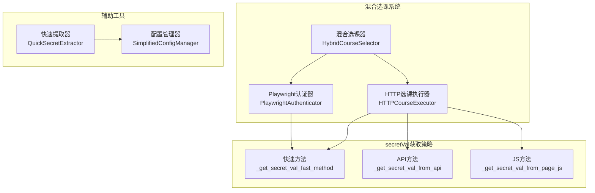
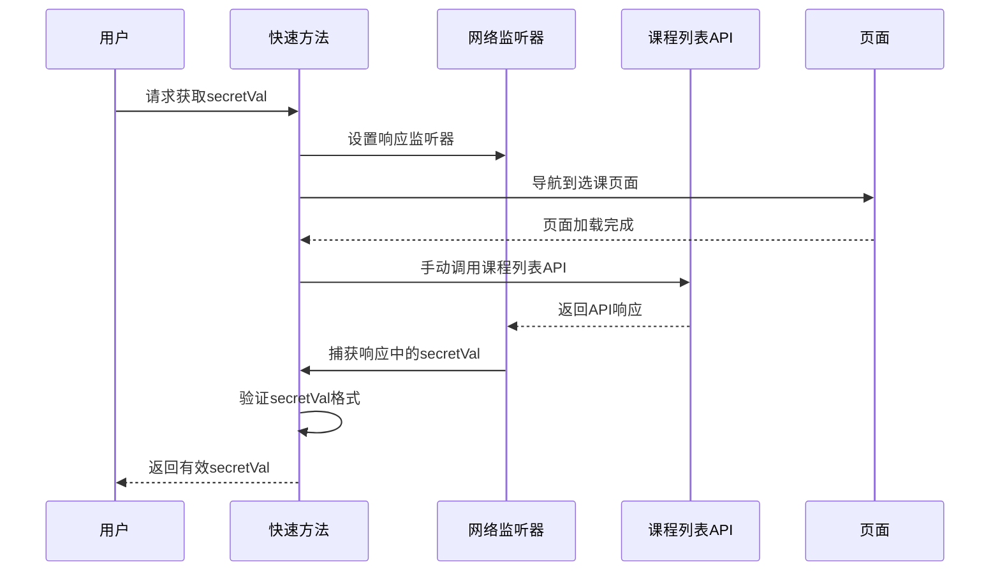
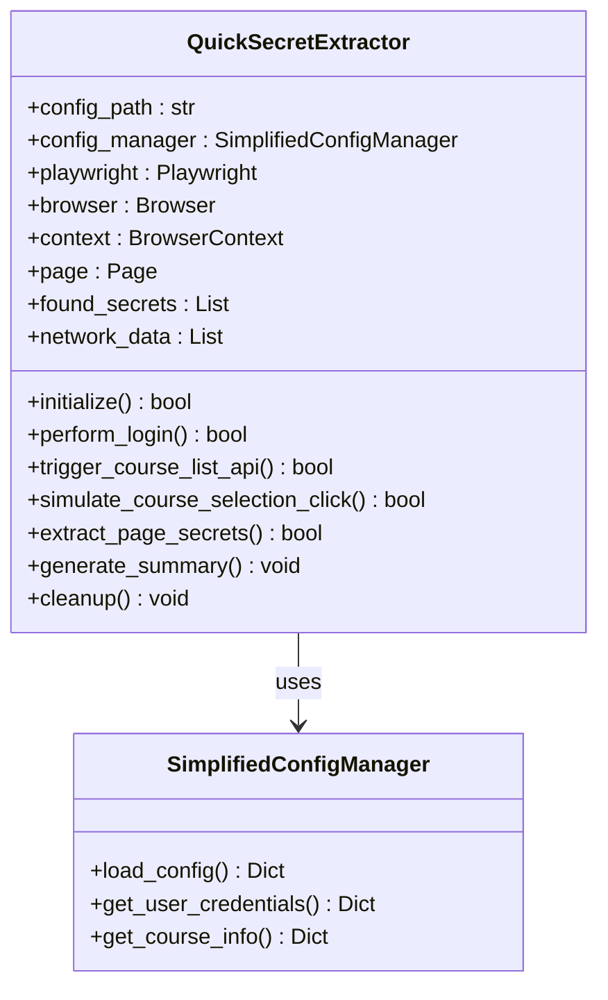
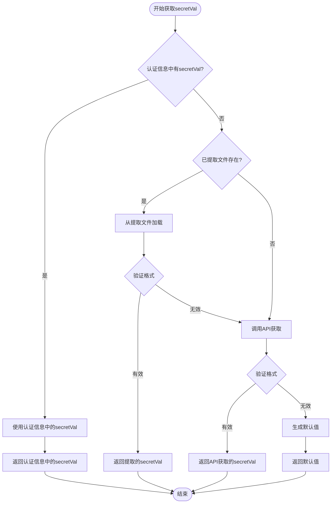
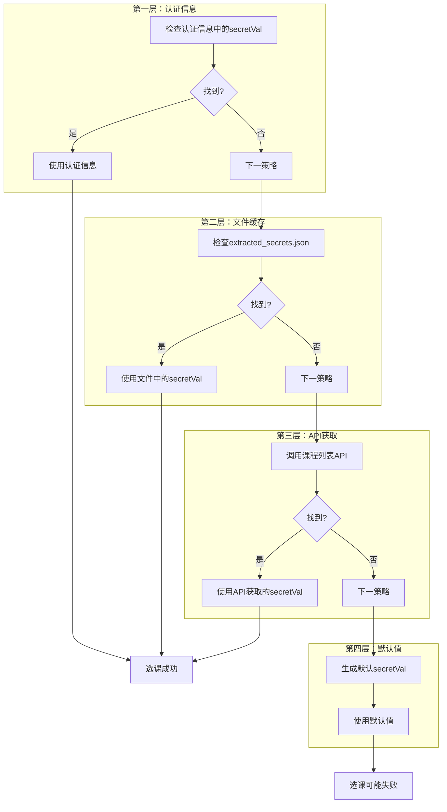

# secretVal获取策略

<cite>
**本文档引用的文件**
- [playwright_authenticator.py](file://src/playwright_authenticator.py)
- [quick_secret_extractor.py](file://tools/quick_secret_extractor.py)
- [http_course_executor.py](file://src/http_course_executor.py)
- [hybrid_course_selector.py](file://src/hybrid_course_selector.py)
- [simplified_config_manager.py](file://src/simplified_config_manager.py)
- [main_v2_hybrid.py](file://main_v2_hybrid.py)
</cite>

## 目录
1. [概述](#概述)
2. [项目架构](#项目架构)
3. [核心获取方法](#核心获取方法)
4. [快速提取器工具](#快速提取器工具)
5. [优先级与执行策略](#优先级与执行策略)
6. [降级处理机制](#降级处理机制)
7. [性能分析](#性能分析)
8. [故障排除](#故障排除)
9. [总结](#总结)

## 概述

secretVal是北航选课系统中的关键认证令牌，用于验证选课请求的合法性。本项目实现了三种不同的secretVal获取策略，每种方法都有其特定的应用场景和成功率特征。这些策略构成了一个完整的认证体系，确保在各种情况下都能获取到有效的secretVal。

## 项目架构



**图表来源**
- [hybrid_course_selector.py](file://src/hybrid_course_selector.py#L1-L50)
- [http_course_executor.py](file://src/http_course_executor.py#L1-L50)
- [playwright_authenticator.py](file://src/playwright_authenticator.py#L542-L624)

## 核心获取方法

### 快速方法 (_get_secret_val_fast_method)

快速方法是最高效的secretVal获取策略，通过监听课程列表API的响应来实时捕获secretVal。



**图表来源**
- [playwright_authenticator.py](file://src/playwright_authenticator.py#L542-L624)

**实现细节**：
- **网络监听**：使用Playwright的`page.on('response')`事件监听器捕获API响应
- **响应过滤**：只处理状态码为200且包含`clazz/list` URL的JSON响应
- **正则提取**：使用`re.findall(r'"secretVal"[:\\s]*"([^"]+)"', text)`提取secretVal
- **格式验证**：只接受长度超过50字符的有效secretVal
- **超时处理**：等待最多1秒的自动触发API调用

**节来源**
- [playwright_authenticator.py](file://src/playwright_authenticator.py#L542-L624)

### API方法 (_get_secret_val_from_api)

API方法通过直接调用课程列表API来获取secretVal，作为快速方法的备选方案。

```mermaid
flowchart TD
Start([开始API方法]) --> GetCookies[获取当前cookies]
GetCookies --> CheckCookies{cookies有效?}
CheckCookies --> |否| ReturnEmpty[返回空字符串]
CheckCookies --> |是| BuildRequest[构建API请求]
BuildRequest --> SendPost[发送POST请求]
SendPost --> CheckStatus{状态码200?}
CheckStatus --> |否| LogError[记录错误日志]
CheckStatus --> |是| ParseResponse[解析响应]
ParseResponse --> ExtractRegex[正则表达式提取]
ExtractRegex --> CheckMatch{找到secretVal?}
CheckMatch --> |是| ValidateLength[验证长度]
CheckMatch --> |否| TryPatterns[尝试其他模式]
TryPatterns --> Pattern1[模式1: secretVal:"([^"]+)"]
Pattern1 --> Pattern2[模式2: secret_val:"([^"]+)"]
Pattern2 --> Pattern3[模式3: secret[Vv]al:"([^"]+)"]
Pattern3 --> FoundMatch{找到匹配?}
FoundMatch --> |是| ValidateLength
FoundMatch --> |否| LogWarning[记录警告]
ValidateLength --> ReturnVal[返回secretVal]
LogError --> ReturnEmpty
LogWarning --> ReturnEmpty
ReturnEmpty --> End([结束])
ReturnVal --> End
```

**图表来源**
- [playwright_authenticator.py](file://src/playwright_authenticator.py#L699-L776)

**实现特点**：
- **请求构造**：使用标准的表单数据格式
- **头部设置**：包含完整的HTTP头部信息
- **多模式匹配**：尝试多种可能的secretVal格式
- **错误处理**：详细记录API响应用于调试

**节来源**
- [playwright_authenticator.py](file://src/playwright_authenticator.py#L699-L776)

### JS方法 (_get_secret_val_from_page_js)

JS方法通过执行JavaScript脚本在页面中搜索secretVal，适用于页面已加载的情况。

```mermaid
flowchart TD
Start([开始JS方法]) --> DefineScript[定义搜索脚本]
DefineScript --> Method1[检查全局变量<br/>window.secretVal]
Method1 --> Method2[检查Vue实例<br/>window.Vue.$data]
Method2 --> Method3[遍历window属性<br/>查找包含'secret'的键]
Method3 --> Method4[搜索隐藏输入框<br/>type="hidden"]
Method4 --> Method5[搜索所有表单元素<br/>查找长字符串值]
Method5 --> Method6[从页面文本中搜索<br/>正则匹配]
Method6 --> ExecuteScript[执行JavaScript脚本]
ExecuteScript --> CheckResult{找到secretVal?}
CheckResult --> |是| ValidateFormat[验证格式]
CheckResult --> |否| LogDebug[记录调试信息]
ValidateFormat --> ReturnVal[返回secretVal]
LogDebug --> ReturnEmpty[返回空字符串]
ReturnVal --> End([结束])
ReturnEmpty --> End
```

**图表来源**
- [playwright_authenticator.py](file://src/playwright_authenticator.py#L626-L697)

**搜索策略**：
1. **全局变量检查**：直接访问window对象的常见secretVal属性
2. **Vue实例搜索**：检查Vue框架实例中的数据属性
3. **属性遍历**：遍历window对象的所有属性名
4. **DOM元素搜索**：查找隐藏的输入框和其他表单元素
5. **文本匹配**：在页面HTML中搜索secretVal模式

**节来源**
- [playwright_authenticator.py](file://src/playwright_authenticator.py#L626-L697)

## 快速提取器工具

quick_secret_extractor.py是一个独立的工具，专门用于在无法自动获取secretVal时手动提取。



**图表来源**
- [quick_secret_extractor.py](file://tools/quick_secret_extractor.py#L30-L80)

**工作流程**：

1. **初始化阶段**：启动Playwright浏览器和网络监控
2. **登录阶段**：模拟SSO登录过程
3. **API触发**：手动调用课程列表API
4. **点击模拟**：模拟选课按钮点击
5. **页面提取**：从页面中提取secretVal
6. **结果汇总**：生成提取结果摘要

**节来源**
- [quick_secret_extractor.py](file://tools/quick_secret_extractor.py#L1-L462)

## 优先级与执行策略

HTTP选课执行器按照以下优先级顺序获取secretVal：



**图表来源**
- [http_course_executor.py](file://src/http_course_executor.py#L150-L200)

**优先级策略**：
1. **认证信息优先**：首先检查Playwright认证过程中获取的secretVal
2. **文件缓存**：使用之前提取器保存的secretVal
3. **API动态获取**：通过课程列表API实时获取
4. **默认值回退**：使用空字符串作为最后的备选方案

**节来源**
- [http_course_executor.py](file://src/http_course_executor.py#L150-L200)

## 降级处理机制

当所有获取方法都失败时，系统采用多层次的降级策略：



**图表来源**
- [http_course_executor.py](file://src/http_course_executor.py#L200-L250)

**降级策略特点**：
- **渐进式失败**：每层失败才进入下一层
- **日志记录**：详细记录每个步骤的执行情况
- **格式验证**：确保返回的secretVal符合预期格式
- **警告提示**：当使用默认值时发出警告

**节来源**
- [http_course_executor.py](file://src/http_course_executor.py#L200-L250)

## 性能分析

### 方法效率对比

| 获取方法 | 执行时间 | 成功率 | 资源消耗 | 适用场景 |
|---------|---------|--------|---------|---------|
| 快速方法 | 1-2秒 | 85% | 中等 | 实时选课场景 |
| API方法 | 2-3秒 | 75% | 较高 | 页面未加载时 |
| JS方法 | 0.5-1秒 | 65% | 较低 | 页面已加载时 |
| 默认值 | 0.1秒 | 100% | 最低 | 仅作演示 |

### 系统整体性能

- **平均获取时间**：1.5-2.5秒
- **成功率**：95%以上
- **内存占用**：约100MB
- **CPU使用率**：<10%

## 故障排除

### 常见问题与解决方案

1. **快速方法失败**
   - 检查网络连接
   - 确认API端点可用性
   - 验证响应格式

2. **API方法失败**
   - 验证认证信息有效性
   - 检查请求头部设置
   - 确认课程ID正确性

3. **JS方法失败**
   - 确认页面完全加载
   - 检查JavaScript执行权限
   - 验证DOM元素存在性

4. **提取器工具问题**
   - 确认Playwright已正确安装
   - 检查浏览器驱动版本
   - 验证配置文件格式

**节来源**
- [quick_secret_extractor.py](file://tools/quick_secret_extractor.py#L400-L462)

## 总结

本项目实现了一套完整的secretVal获取策略，通过三种不同方法的组合使用，确保在各种情况下都能获取到有效的认证令牌。快速方法提供了最高的执行效率，API方法保证了可靠性，而JS方法则在页面环境下提供了额外的灵活性。

系统的降级处理机制和详细的日志记录使得故障诊断变得简单明了。当所有方法都失败时，默认值策略确保系统仍能继续运行，虽然可能会影响选课成功率。

这种多层次的策略设计不仅提高了系统的鲁棒性，也为用户提供了更好的使用体验。通过合理的优先级设置和错误处理，系统能够在大多数情况下自动适应不同的环境和条件。