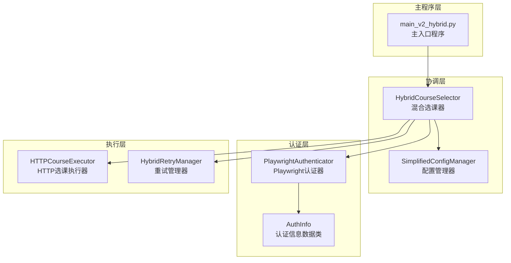
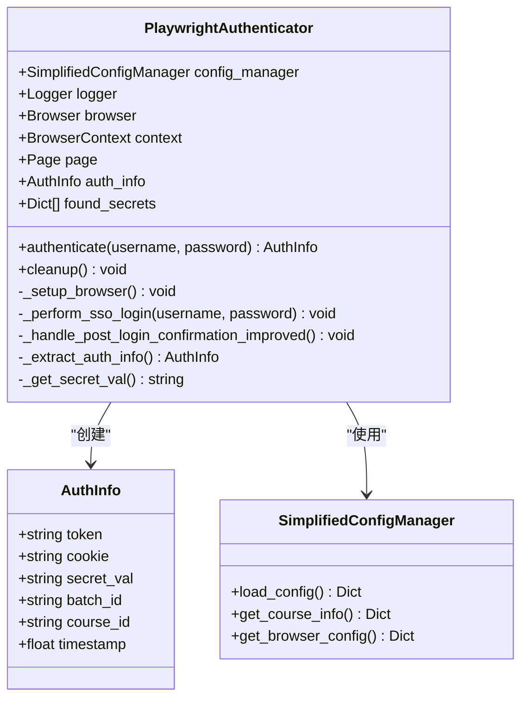
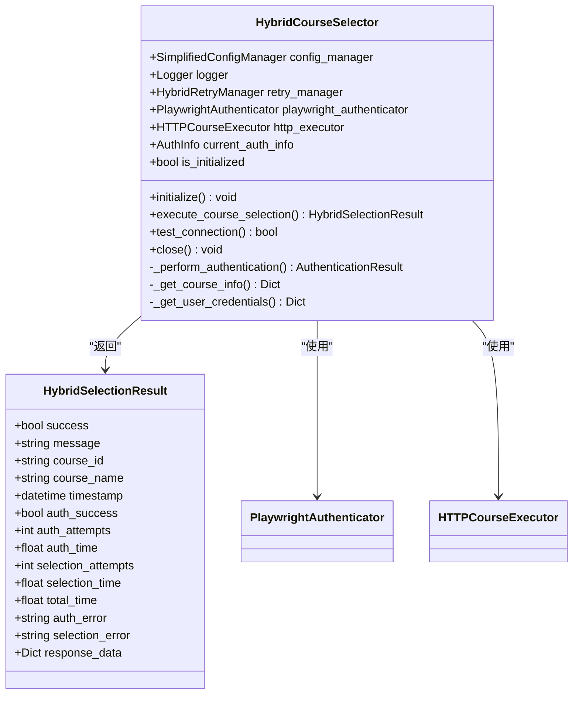
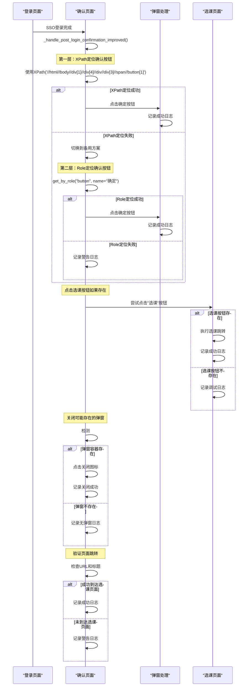
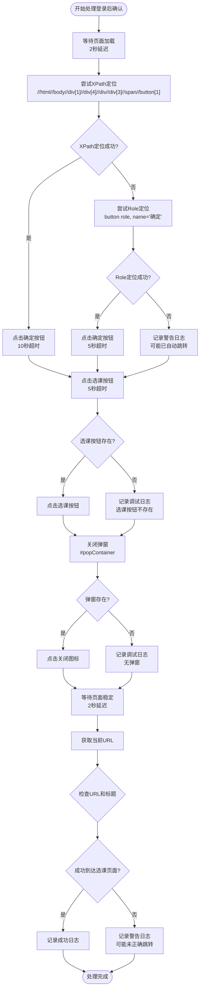
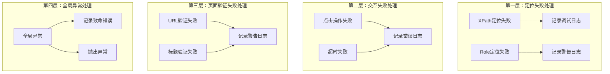

# 登录后确认处理机制

<cite>
**本文档引用的文件**
- [playwright_authenticator.py](file://src/playwright_authenticator.py)
- [hybrid_course_selector.py](file://src/hybrid_course_selector.py)
- [http_course_executor.py](file://src/http_course_executor.py)
- [simplified_config_manager.py](file://src/simplified_config_manager.py)
- [main_v2_hybrid.py](file://main_v2_hybrid.py)
- [config_simple.json](file://config_simple.json)
</cite>

## 目录
1. [简介](#简介)
2. [项目结构概览](#项目结构概览)
3. [核心组件分析](#核心组件分析)
4. [登录后确认处理机制](#登录后确认处理机制)
5. [自动化处理流程](#自动化处理流程)
6. [错误处理与重试机制](#错误处理与重试机制)
7. [性能优化策略](#性能优化策略)
8. [故障排除指南](#故障排除指南)
9. [总结](#总结)

## 简介

本文档详细说明了北航选课系统自动化工具中登录后确认处理机制的实现原理和工作流程。该机制通过改进的XPath定位技术、多层备用方案和智能错误处理，确保用户能够顺利从登录页面跳转到选课系统。

系统采用混合架构设计，结合Playwright自动登录和HTTP选课执行两种方式，提供了完整的认证信息获取和课程选择解决方案。登录后确认处理是整个流程中的关键环节，负责处理登录后的各种弹窗、确认页面和跳转逻辑。

## 项目结构概览

该项目采用模块化设计，主要包含以下核心模块：



**图表来源**
- [main_v2_hybrid.py](file://main_v2_hybrid.py#L1-L50)
- [hybrid_course_selector.py](file://src/hybrid_course_selector.py#L1-L100)
- [playwright_authenticator.py](file://src/playwright_authenticator.py#L1-L50)

**章节来源**
- [main_v2_hybrid.py](file://main_v2_hybrid.py#L1-L100)
- [hybrid_course_selector.py](file://src/hybrid_course_selector.py#L1-L150)

## 核心组件分析

### Playwright认证器

Playwright认证器是系统的核心组件，负责自动化的登录流程和认证信息提取。它继承自`PlaywrightAuthenticator`类，实现了完整的SSO登录流程。



**图表来源**
- [playwright_authenticator.py](file://src/playwright_authenticator.py#L40-L100)
- [simplified_config_manager.py](file://src/simplified_config_manager.py#L30-L80)

### 混合选课器

混合选课器作为系统的协调中心，整合了认证和选课两个核心功能。它负责初始化各个组件、管理认证流程和执行选课操作。



**图表来源**
- [hybrid_course_selector.py](file://src/hybrid_course_selector.py#L60-L120)

**章节来源**
- [playwright_authenticator.py](file://src/playwright_authenticator.py#L40-L200)
- [hybrid_course_selector.py](file://src/hybrid_course_selector.py#L60-L150)

## 登录后确认处理机制

### _handle_post_login_confirmation_improved方法详解

登录后确认处理的核心方法`_handle_post_login_confirmation_improved`实现了多层次的弹窗处理机制，确保用户能够顺利跳转到选课系统。



**图表来源**
- [playwright_authenticator.py](file://src/playwright_authenticator.py#L295-L351)

### XPath精确定位机制

系统首先尝试使用精确的XPath表达式来定位确认按钮：

```python
confirm_button = self.page.locator('//html//body//div[1]//div[4]//div//div[3]//span//button[1]')
await confirm_button.click(timeout=10000)
```

这种定位方式具有以下优势：
- **稳定性高**：基于DOM结构的绝对路径定位
- **准确性强**：直接指向特定的按钮元素
- **容错性好**：即使页面结构变化，只要路径保持不变就能准确定位

### 备用方案：Role定位

当XPath定位失败时，系统会自动切换到基于角色的定位方式：

```python
confirm_button = self.page.get_by_role("button", name="确定")
await confirm_button.click(timeout=5000)
```

这种方式的优势在于：
- **语义化**：基于元素的角色和名称进行定位
- **适应性强**：不受DOM结构调整的影响
- **可读性好**：代码更易理解和维护

### 弹窗广告处理机制

系统还具备处理可能存在的弹窗广告的能力：

```python
popup_close = self.page.locator("#popContainer").get_by_role("img")
await popup_close.click(timeout=3000)
```

这个机制能够：
- **自动检测**：识别页面中存在的弹窗容器
- **智能关闭**：通过图像元素定位并关闭弹窗
- **优雅降级**：如果没有弹窗则不会报错

**章节来源**
- [playwright_authenticator.py](file://src/playwright_authenticator.py#L295-L351)

## 自动化处理流程

### 完整的登录后处理流程



**图表来源**
- [playwright_authenticator.py](file://src/playwright_authenticator.py#L295-L351)

### 日志记录与监控

系统在整个处理过程中持续记录详细的日志信息：

```python
self.logger.info("处理登录后确认页面")
self.logger.info("使用XPath点击确定按钮成功")
self.logger.info("使用role定位点击确定按钮成功")
self.logger.info("点击选课按钮成功")
self.logger.info("关闭弹窗成功")
self.logger.info(f"当前页面URL: {current_url}")
self.logger.info("成功到达选课页面")
self.logger.warning(f"可能未正确到达选课页面，当前URL: {current_url}")
```

这些日志记录包括：
- **操作状态**：每个步骤的执行状态
- **错误信息**：异常情况的详细描述
- **关键数据**：如URL、按钮状态等重要信息
- **性能指标**：操作耗时和成功率统计

**章节来源**
- [playwright_authenticator.py](file://src/playwright_authenticator.py#L295-L351)

## 错误处理与重试机制

### 多层次错误处理策略

系统采用了多层次的错误处理策略，确保即使某个步骤失败也能继续执行后续流程：



**图表来源**
- [playwright_authenticator.py](file://src/playwright_authenticator.py#L295-L351)

### 智能重试机制

混合选课器集成了智能重试管理器，能够根据不同的操作类型采取相应的重试策略：

- **认证重试**：针对登录失败的情况
- **选课重试**：针对选课请求失败的情况
- **网络重试**：针对网络连接不稳定的情况

### 异常跳转预警

系统特别关注异常跳转情况，通过以下机制进行预警：

```python
if "elective" in current_url or "选课" in await self.page.title():
    self.logger.info("成功到达选课页面")
else:
    self.logger.warning(f"可能未正确到达选课页面，当前URL: {current_url}")
```

这种双重验证机制（URL检查和标题检查）提高了判断的准确性。

**章节来源**
- [playwright_authenticator.py](file://src/playwright_authenticator.py#L295-L351)

## 性能优化策略

### 延迟优化

系统在关键位置设置了适当的延迟，平衡了性能和稳定性：

- **页面加载延迟**：2秒等待确保页面完全加载
- **交互延迟**：2秒等待确保元素可见和可点击
- **超时设置**：不同操作设置不同的超时时间

### 资源管理

- **异步操作**：使用asyncio提高并发性能
- **资源清理**：及时释放Playwright资源
- **内存优化**：避免不必要的数据存储

### 缓存机制

系统通过以下方式优化性能：

- **认证信息缓存**：避免重复认证
- **网络响应缓存**：减少重复的API调用
- **配置信息缓存**：快速访问配置数据

## 故障排除指南

### 常见问题及解决方案

#### 1. XPath定位失败

**症状**：日志显示"XPath点击失败，尝试其他方法"

**解决方案**：
- 检查页面DOM结构是否发生变化
- 更新XPath表达式以适配新的页面结构
- 确认页面加载完成后再进行定位

#### 2. 确认按钮未找到

**症状**：日志显示"确定按钮未找到，可能已自动跳转"

**解决方案**：
- 检查页面是否有自动跳转机制
- 验证页面是否已经处于选课状态
- 调整等待时间或检查网络状况

#### 3. 页面跳转异常

**症状**：日志显示"可能未正确到达选课页面"

**解决方案**：
- 检查URL是否正确
- 验证页面标题是否包含"选课"关键字
- 确认网络连接是否稳定

#### 4. 弹窗广告干扰

**症状**：弹窗阻止正常操作

**解决方案**：
- 检查CSS选择器是否正确
- 确认弹窗容器是否存在
- 验证关闭图标是否可点击

### 调试技巧

1. **启用详细日志**：将日志级别设置为DEBUG
2. **截图功能**：在关键步骤截图保存
3. **网络监控**：监控网络请求和响应
4. **页面检查**：使用开发者工具检查页面元素

**章节来源**
- [playwright_authenticator.py](file://src/playwright_authenticator.py#L295-L351)

## 总结

登录后确认处理机制是北航选课系统自动化工具的关键组成部分，通过精心设计的多层定位策略、智能错误处理和完善的日志记录，确保了用户能够稳定地从登录页面跳转到选课系统。

该机制的主要特点包括：

1. **可靠性高**：采用XPath和Role两种定位方式，确保至少有一种方案能够成功
2. **容错性强**：多层次的错误处理和重试机制，能够应对各种异常情况
3. **监控完善**：详细的日志记录和状态监控，便于问题诊断和性能优化
4. **用户体验佳**：自动处理各种弹窗和确认页面，提供流畅的操作体验

通过持续的优化和改进，这套登录后确认处理机制已经成为整个自动化选课系统稳定运行的重要保障。未来还可以考虑引入机器学习算法来进一步提升定位准确性和处理效率。