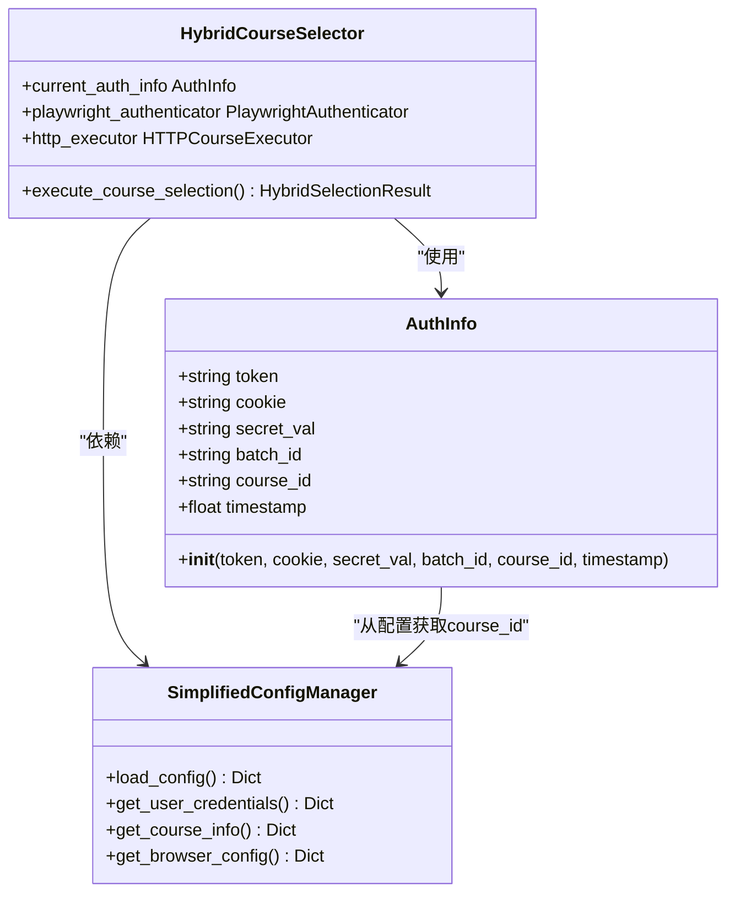
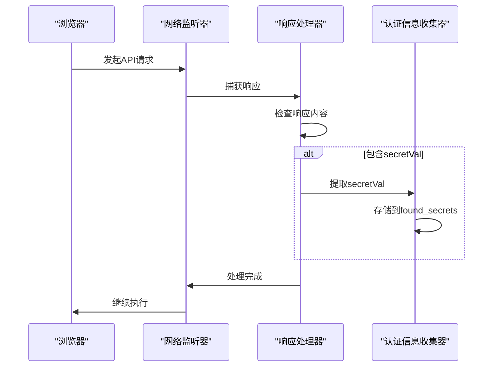
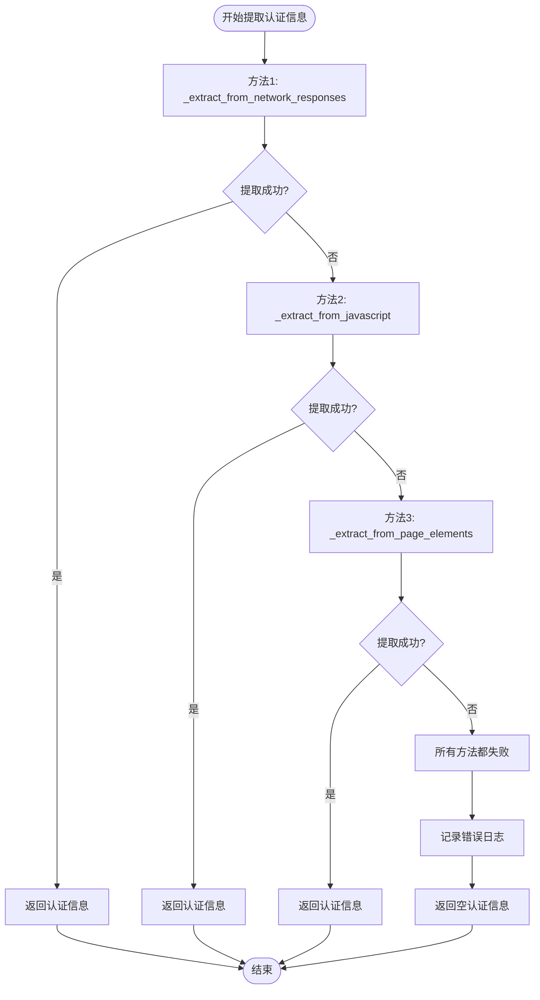
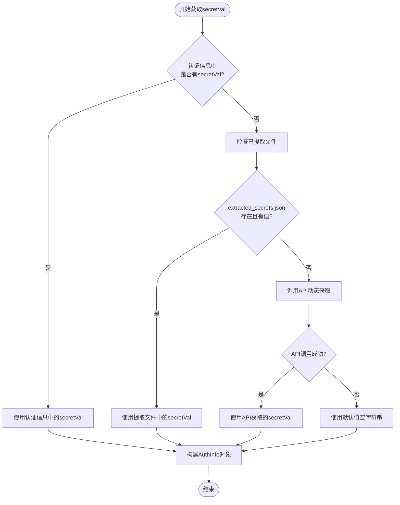
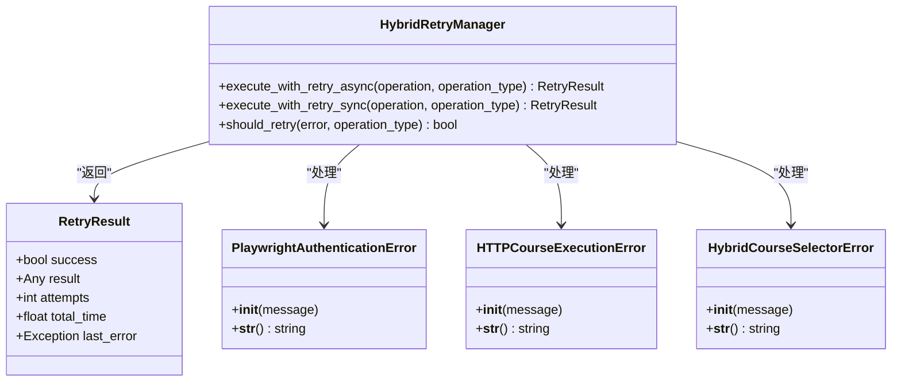
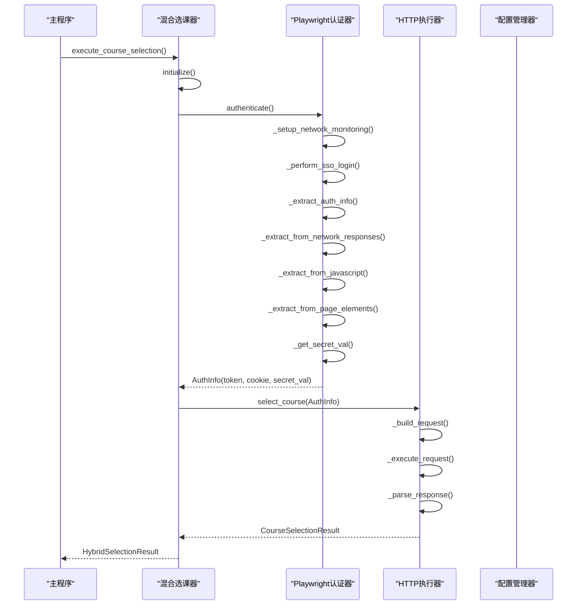

# 认证信息提取机制

<cite>
**本文档引用的文件**
- [playwright_authenticator.py](file://src/playwright_authenticator.py)
- [hybrid_course_selector.py](file://src/hybrid_course_selector.py)
- [http_course_executor.py](file://src/http_course_executor.py)
- [simplified_config_manager.py](file://src/simplified_config_manager.py)
- [hybrid_retry_manager.py](file://src/hybrid_retry_manager.py)
- [quick_secret_extractor.py](file://tools/quick_secret_extractor.py)
- [config_simple.json](file://config_simple.json)
- [main_v2_hybrid.py](file://main_v2_hybrid.py)
</cite>

## 目录
1. [概述](#概述)
2. [认证信息数据模型](#认证信息数据模型)
3. [网络监听机制](#网络监听机制)
4. [认证信息提取策略](#认证信息提取策略)
5. [AuthInfo数据模型构建](#authinfo数据模型构建)
6. [异常处理与回退机制](#异常处理与回退机制)
7. [系统集成与传递路径](#系统集成与传递路径)
8. [性能优化与最佳实践](#性能优化与最佳实践)
9. [故障排除指南](#故障排除指南)
10. [总结](#总结)

## 概述

本系统采用混合架构设计，通过Playwright自动登录获取认证信息，然后使用HTTP请求执行高效选课。认证信息提取是整个系统的核心环节，涉及Token、Cookie和secretVal等多种认证要素的捕获与处理。

认证信息提取机制包含三个主要层面：
- **网络层监听**：通过设置网络监听捕获API调用中的认证信息
- **JavaScript执行**：通过执行JavaScript代码提取页面中的认证数据
- **页面元素解析**：从DOM元素中提取隐藏的认证字段

## 认证信息数据模型

### AuthInfo数据类



**图表来源**
- [playwright_authenticator.py](file://src/playwright_authenticator.py#L30-L35)
- [hybrid_course_selector.py](file://src/hybrid_course_selector.py#L25-L35)

**章节来源**
- [playwright_authenticator.py](file://src/playwright_authenticator.py#L30-L35)
- [hybrid_course_selector.py](file://src/hybrid_course_selector.py#L25-L35)

## 网络监听机制

### _set_up_network_monitoring方法详解

系统通过`_setup_network_monitoring`方法监听页面所有网络请求与响应，重点关注以下API调用：

```python
# 监听的关键API路径
keywords = [
    '/xsxk/web/now', 
    '/xsxk/web/studentInfo',
    '/xsxk/auth/captcha',
    '/xsxk/elective/user',
    '/xsxk/elective/buaa/clazz/list'
]
```

### 网络监听实现原理



**图表来源**
- [playwright_authenticator.py](file://src/playwright_authenticator.py#L130-L180)

### 请求头Token提取

系统从请求头中提取Authorization Token的逻辑：

```python
# 从请求头中提取token
auth_header = request.headers.get('authorization', '')
if auth_header and auth_header.startswith('eyJ'):
    token = auth_header
    self.logger.debug("从请求头提取到Token")
```

### Set-Cookie响应头解析

从Set-Cookie响应头中解析关键会话Cookie：

```python
# 从响应的Set-Cookie中提取cookie信息
response_headers = await response.all_headers()
set_cookie = response_headers.get('set-cookie', '')
if set_cookie and 'token=' in set_cookie:
    # 进一步解析cookie
```

**章节来源**
- [playwright_authenticator.py](file://src/playwright_authenticator.py#L130-L180)
- [playwright_authenticator.py](file://src/playwright_authenticator.py#L800-L850)

## 认证信息提取策略

### 三种提取策略的优先级

系统实现了三种认证信息提取策略，按照优先级顺序执行：



**图表来源**
- [playwright_authenticator.py](file://src/playwright_authenticator.py#L750-L800)

### 方法1: _extract_from_network_responses

从网络响应中提取认证信息是最优先的策略：

```python
async def _extract_from_network_responses(self) -> Optional[AuthInfo]:
    """从网络响应中提取认证信息"""
    token = None
    cookie = None
    
    # 检查所有响应的请求头
    for response in self.network_responses:
        # 从请求头中提取token
        request = response.request
        if request and hasattr(request, 'headers'):
            auth_header = request.headers.get('authorization', '')
            if auth_header and auth_header.startswith('eyJ'):
                token = auth_header
                self.logger.debug("从请求头提取到Token")
        
        # 从响应的Set-Cookie中提取cookie信息
        response_headers = await response.all_headers()
        set_cookie = response_headers.get('set-cookie', '')
        if set_cookie and 'token=' in set_cookie:
            self.logger.debug("从响应头发现Cookie信息")
    
    # 如果从网络响应中获取了token，尝试获取完整的cookie
    if token:
        cookie_str = await self._get_current_cookies()
        if cookie_str:
            course_info = self.config_manager.get_course_info()
            course_id = course_info.get('course_id', '')
            
            # 获取secretVal
            secret_val = await self._get_secret_val(course_id)
            
            return AuthInfo(
                token=token,
                cookie=cookie_str,
                secret_val=secret_val,
                batch_id=course_info.get('batch_id', ''),
                course_id=course_id
            )
    
    return None
```

### 方法2: _extract_from_javascript

从JavaScript执行中提取认证信息：

```python
async def _extract_from_javascript(self) -> Optional[AuthInfo]:
    """从JavaScript执行中提取认证信息"""
    auth_script = """
    () => {
        // 尝试从localStorage或sessionStorage获取token
        const token = localStorage.getItem('token') || 
                    localStorage.getItem('authorization') ||
                    sessionStorage.getItem('token') ||
                    sessionStorage.getItem('authorization');
        
        // 获取cookies
        const cookies = document.cookie;
        
        // 尝试提取token从cookie
        let cookieToken = '';
        const tokenMatch = cookies.match(/token=([^;]+)/);
        if (tokenMatch) {
            cookieToken = tokenMatch[1];
        }
        
        return { 
            token: token || cookieToken, 
            cookies: cookies 
        };
    }
    """
    
    result = await self.page.evaluate(auth_script)
    
    if result and result.get('token'):
        course_info = self.config_manager.get_course_info()
        course_id = course_info.get('course_id', '')
        
        # 获取secretVal
        secret_val = await self._get_secret_val(course_id)
        
        return AuthInfo(
            token=result['token'],
            cookie=result.get('cookies', ''),
            secret_val=secret_val,
            batch_id=course_info.get('batch_id', ''),
            course_id=course_id
        )
    
    return None
```

### 方法3: _extract_from_page_elements

从页面元素中提取认证信息（作为最后的备选方案）：

```python
async def _extract_from_page_elements(self) -> Optional[AuthInfo]:
    """从页面元素中提取认证信息"""
    # 尝试获取当前cookies作为fallback
    cookie_str = await self._get_current_cookies()
    
    if cookie_str and 'token=' in cookie_str:
        # 从cookie中提取token
        token_match = re.search(r'token=([^;]+)', cookie_str)
        if token_match:
            token = token_match.group(1)
            
            course_info = self.config_manager.get_course_info()
            course_id = course_info.get('course_id', '')
            
            # 获取secretVal
            secret_val = await self._get_secret_val(course_id)
            
            return AuthInfo(
                token=token,
                cookie=cookie_str,
                secret_val=secret_val,
                batch_id=course_info.get('batch_id', ''),
                course_id=course_id
            )
    
    return None
```

**章节来源**
- [playwright_authenticator.py](file://src/playwright_authenticator.py#L750-L800)
- [playwright_authenticator.py](file://src/playwright_authenticator.py#L820-L870)
- [playwright_authenticator.py](file://src/playwright_authenticator.py#L890-L940)

## AuthInfo数据模型构建

### secretVal获取机制

secretVal是选课过程中最重要的认证参数，系统提供了多层获取机制：



**图表来源**
- [http_course_executor.py](file://src/http_course_executor.py#L200-L250)

### HTTP请求构建中的secretVal处理

在HTTP选课执行器中，secretVal的获取遵循以下优先级：

```python
def _build_request(self, auth_info: AuthInfo, course_info: Dict[str, str]) -> Dict[str, Any]:
    """构建HTTP请求数据"""
    # 获取secretVal，优先级：认证信息 -> 已提取文件 -> API调用 -> 默认值
    secret_val = getattr(auth_info, 'secret_val', '')
    if secret_val and secret_val.strip():
        self.logger.info(f"使用认证信息中的secretVal: {secret_val[:50]}...")
    else:
        self.logger.info("认证信息中缺少secretVal，尝试从已提取文件获取...")
        secret_val = self.get_secret_val_from_extracted()
        
        if secret_val:
            self.logger.info(f"成功从已提取文件获取secretVal: {secret_val[:50]}...")
        else:
            self.logger.info("未找到已提取的secretVal，尝试API动态获取...")
            secret_val = self.get_secret_val_from_api(auth_info)
            
            if secret_val:
                self.logger.info(f"成功通过API动态获取secretVal: {secret_val[:50]}...")
            else:
                self.logger.warning("无法获取secretVal，使用空值（可能影响选课成功率）")
                secret_val = self._generate_default_secret()
```

### secretVal的API获取方法

系统通过课程列表API获取secretVal：

```python
def get_secret_val_from_api(self, auth_info: AuthInfo) -> str:
    """通过课程列表API获取secretVal（作为fallback机制）"""
    try:
        self.logger.info("尝试通过课程列表API获取secretVal（fallback）...")
        
        # 构造课程列表API请求
        list_url = "https://byxk.buaa.edu.cn/xsxk/elective/buaa/clazz/list"
        
        # 构造请求头
        headers = {
            'authority': 'byxk.buaa.edu.cn',
            'method': 'POST', 
            'path': '/xsxk/elective/buaa/clazz/list',
            'scheme': 'https',
            'accept': 'application/json, text/plain, */*',
            'authorization': auth_info.token,
            'content-type': 'application/x-www-form-urlencoded',
            'cookie': auth_info.cookie,
            'user-agent': 'Mozilla/5.0 (Windows NT 10.0; Win64; x64) AppleWebKit/537.36 (KHTML, like Gecko) Chrome/120.0.0.0 Safari/537.36',
            'origin': 'https://byxk.buaa.edu.cn',
            'referer': 'https://byxk.buaa.edu.cn/xsxk/elective/buaa'
        }
        
        # 构造表单数据
        form_data = {
            "campus": "01",
            "courseTypes": "TJKC",
            "pageNumber": "1",
            "pageSize": "10", 
            "orderBy": ""
        }
        
        # 发送POST请求
        response = self.session.post(
            list_url,
            headers=headers,
            data=form_data,
            timeout=15
        )
        
        if response.status_code == 200:
            response_text = response.text
            self.logger.debug(f"课程列表API响应长度: {len(response_text)} 字符")
            
            # 使用正则表达式从响应中提取secretVal
            import re
            secret_match = re.search(r'"secretVal"\s*:\s*"([^"]+)"', response_text)
            if secret_match:
                secret_val = secret_match.group(1)
                self.logger.info(f"成功从课程列表API获取secretVal: {secret_val[:50]}...")
                return secret_val
        
        return ""
        
    except Exception as e:
        self.logger.error(f"通过API获取secretVal失败: {str(e)}")
        return ""
```

**章节来源**
- [http_course_executor.py](file://src/http_course_executor.py#L200-L250)
- [http_course_executor.py](file://src/http_course_executor.py#L300-L350)

## 异常处理与回退机制

### 多层异常处理架构



**图表来源**
- [playwright_authenticator.py](file://src/playwright_authenticator.py#L35-L40)
- [http_course_executor.py](file://src/http_course_executor.py#L40-L45)
- [hybrid_retry_manager.py](file://src/hybrid_retry_manager.py#L50-L60)

### 重试机制配置

系统为不同操作类型配置了不同的重试策略：

```python
# 登录操作重试配置（较慢但稳定）
LOGIN_RETRY_CONFIG = RetryConfig(
    max_retries=3,
    base_interval=2.0,
    backoff_factor=2.0,
    max_interval=30.0,
    jitter=True
)

# HTTP请求重试配置（快速响应）
HTTP_RETRY_CONFIG = RetryConfig(
    max_retries=5,
    base_interval=0.5,
    backoff_factor=1.5,
    max_interval=10.0,
    jitter=True
)
```

### 异常分类与处理策略

系统根据异常类型决定是否应该重试：

```python
def should_retry(self, error: Exception, operation_type: OperationType) -> bool:
    """判断是否应该重试"""
    # 定义不应重试的异常类型
    non_retryable_errors = [
        # 认证相关错误
        "认证失败", "用户名或密码错误", "账户被锁定",
        # 权限相关错误
        "权限不足", "访问被拒绝",
        # 参数错误
        "参数错误", "配置错误", "课程ID无效"
    ]
    
    error_message = str(error).lower()
    
    # 检查是否为不可重试的错误
    for non_retryable in non_retryable_errors:
        if non_retryable.lower() in error_message:
            self.logger.info(f"检测到不可重试错误: {non_retryable}")
            return False
    
    return True
```

**章节来源**
- [hybrid_retry_manager.py](file://src/hybrid_retry_manager.py#L100-L150)
- [hybrid_retry_manager.py](file://src/hybrid_retry_manager.py#L250-L300)

## 系统集成与传递路径

### 认证信息传递流程



**图表来源**
- [hybrid_course_selector.py](file://src/hybrid_course_selector.py#L150-L200)
- [playwright_authenticator.py](file://src/playwright_authenticator.py#L750-L800)
- [http_course_executor.py](file://src/http_course_executor.py#L80-L130)

### 认证信息在系统中的生命周期

1. **初始化阶段**：配置管理器加载用户凭据和课程信息
2. **认证阶段**：Playwright认证器执行登录并提取认证信息
3. **存储阶段**：认证信息存储在AuthInfo对象中
4. **传递阶段**：认证信息通过参数传递给HTTP执行器
5. **使用阶段**：HTTP执行器在请求中使用认证信息
6. **清理阶段**：认证信息在适当时候被清理

### 配置与认证信息的绑定

```python
def _get_course_info(self, course_id: Optional[str], batch_id: Optional[str]) -> Dict[str, str]:
    """获取课程信息"""
    config_course_info = self.config_manager.get_course_info()
    
    return {
        'course_id': course_id or config_course_info.get('course_id', ''),
        'batch_id': batch_id or config_course_info.get('batch_id', ''),
        'course_name': config_course_info.get('course_name', '未指定')
    }

def _get_user_credentials(self, username: Optional[str], password: Optional[str]) -> Tuple[str, str]:
    """获取用户凭据"""
    if username and password:
        return username, password
    
    config_user_credentials = self.config_manager.get_user_credentials()
    
    return (
        username or config_user_credentials.get('username', ''),
        password or config_user_credentials.get('password', '')
    )
```

**章节来源**
- [hybrid_course_selector.py](file://src/hybrid_course_selector.py#L250-L300)
- [hybrid_course_selector.py](file://src/hybrid_course_selector.py#L300-L350)

## 性能优化与最佳实践

### 网络监听优化

系统通过以下方式优化网络监听性能：

1. **关键词过滤**：只监听关键API路径
2. **异步处理**：使用异步响应处理器
3. **内存管理**：及时清理不需要的响应数据

```python
# 优化的网络监听设置
async def handle_response(response: Response):
    """处理网络响应（优化版）"""
    try:
        url = response.url
        # 只记录相关的API请求
        if any(keyword in url for keyword in keywords):
            self.network_responses.append(response)
            self.logger.debug(f"捕获到认证请求: {url}")
            
            # 实时捕获secretVal
            if response.status == 200 and 'json' in response.headers.get('content-type', '').lower():
                text = await response.text()
                if 'secretVal' in text:
                    secrets = re.findall(r'"secretVal"[:\s]*"([^"]+)"', text)
                    for secret in secrets:
                        if len(secret) > 10:
                            self.found_secrets.append({
                                'value': secret,
                                'source': f'API: {url}',
                                'timestamp': datetime.now().timestamp()
                            })
                            self.logger.info(f"实时捕获到secretVal: {secret[:50]}...")
    except Exception as e:
        self.logger.debug(f"处理网络响应时出错: {str(e)}")
```

### JavaScript执行优化

系统优化了JavaScript执行的效率：

```python
# 优化的JavaScript搜索脚本
search_script = """
() => {
    // 方法1: 检查全局变量
    if (window.secretVal) return window.secretVal;
    if (window.SECRET_VAL) return window.SECRET_VAL;
    if (window._secretVal) return window._secretVal;
    
    // 方法2: 检查Vue实例中的secretVal
    if (window.Vue && window.Vue.$data) {
        const vueData = window.Vue.$data;
        if (vueData.secretVal) return vueData.secretVal;
        if (vueData.secret_val) return vueData.secret_val;
    }
    
    // 方法3: 检查所有window属性
    for (const key in window) {
        if (key.toLowerCase().includes('secret')) {
            const val = window[key];
            if (typeof val === 'string' && val.length > 50 && /^[A-Za-z0-9+/=]+$/.test(val)) {
                return val;
            }
        }
    }
    
    return null;
}
"""
```

### 重试策略优化

系统为不同操作类型定制了不同的重试策略：

```python
# 适应性重试配置
retry_configs = {
    OperationType.LOGIN: RetryConfig(
        max_retries=3,
        base_interval=2.0,      # 较长的基础间隔，适合登录操作
        backoff_factor=2.0,
        max_interval=30.0,      # 最大30秒间隔
        jitter=True
    ),
    OperationType.HTTP_REQUEST: RetryConfig(
        max_retries=5,
        base_interval=0.5,      # 较短的基础间隔，适合快速响应
        backoff_factor=1.5,
        max_interval=10.0,      # 最大10秒间隔
        jitter=True
    )
}
```

**章节来源**
- [playwright_authenticator.py](file://src/playwright_authenticator.py#L130-L180)
- [playwright_authenticator.py](file://src/playwright_authenticator.py#L900-L950)
- [hybrid_retry_manager.py](file://src/hybrid_retry_manager.py#L80-L120)

## 故障排除指南

### 常见认证信息提取失败场景

1. **Token提取失败**
   - 检查网络监听是否正确设置
   - 验证API请求是否包含Authorization头
   - 确认Token格式是否正确（JWT格式）

2. **Cookie提取失败**
   - 检查Set-Cookie响应头是否存在
   - 验证Cookie格式是否正确
   - 确认浏览器上下文是否正确

3. **secretVal提取失败**
   - 检查API响应中是否包含secretVal字段
   - 验证正则表达式是否正确匹配
   - 确认API调用是否成功

### 调试技巧

```python
# 启用详细日志记录
logging.basicConfig(level=logging.DEBUG)

# 检查网络响应
for response in self.network_responses:
    self.logger.debug(f"URL: {response.url}")
    self.logger.debug(f"Status: {response.status}")
    self.logger.debug(f"Headers: {response.headers}")

# 检查JavaScript执行结果
result = await self.page.evaluate("""
    () => {
        console.log('Window properties:', Object.keys(window));
        console.log('Cookies:', document.cookie);
        return {
            token: localStorage.getItem('token'),
            secretVal: window.secretVal
        };
    }
""")
```

### 快速提取器工具

系统提供了专门的快速secret提取器工具：

```python
# 快速提取器的主要功能
async def main():
    extractor = QuickSecretExtractor()
    
    # 初始化
    await extractor.initialize()
    
    # 执行登录
    await extractor.perform_login()
    
    # 从页面提取
    await extractor.extract_page_secrets()
    
    # 触发API调用
    await extractor.trigger_course_list_api()
    
    # 模拟选课点击
    await extractor.simulate_course_selection_click()
    
    # 再次提取
    await extractor.extract_page_secrets()
```

**章节来源**
- [quick_secret_extractor.py](file://tools/quick_secret_extractor.py#L400-L460)

## 总结

本认证信息提取机制通过三层提取策略和完善的异常处理，确保了系统在各种复杂环境下的稳定运行。主要特点包括：

1. **多层次提取策略**：网络监听、JavaScript执行、页面元素解析
2. **智能回退机制**：当一种方法失败时自动尝试下一种方法
3. **完善的异常处理**：针对不同类型的错误采用不同的处理策略
4. **性能优化**：异步处理、关键词过滤、内存管理
5. **工具支持**：提供专门的快速提取器工具辅助调试

这种设计不仅提高了系统的鲁棒性，还为用户提供了更好的使用体验，即使在网络条件不佳或认证信息获取困难的情况下，系统也能通过各种回退机制保证正常运行。