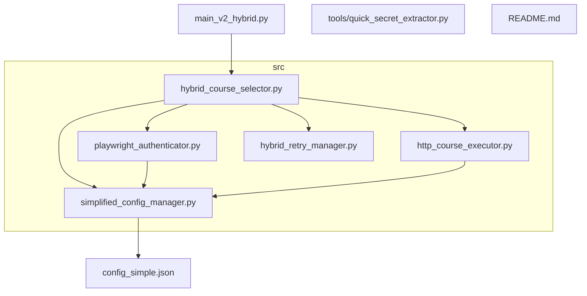
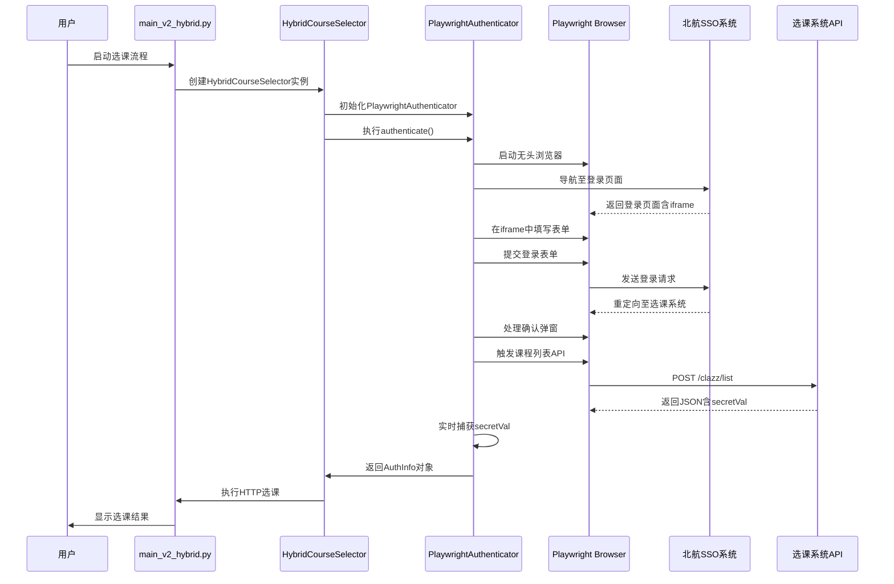
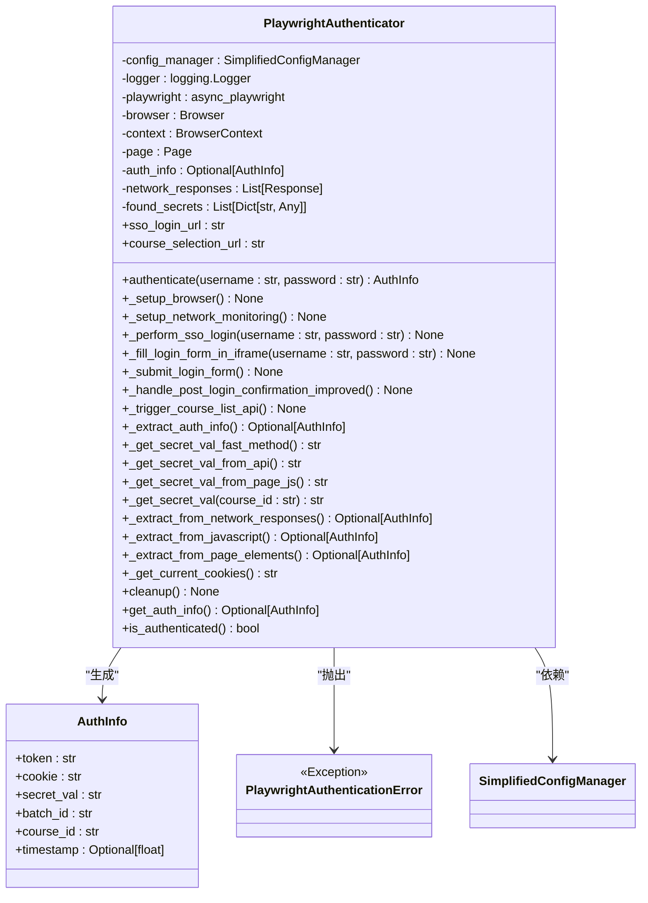
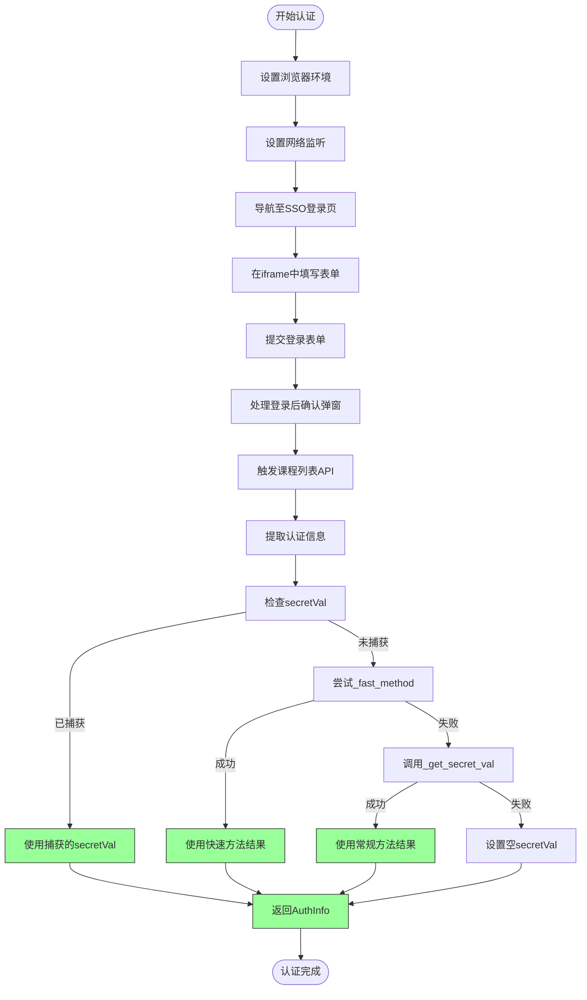
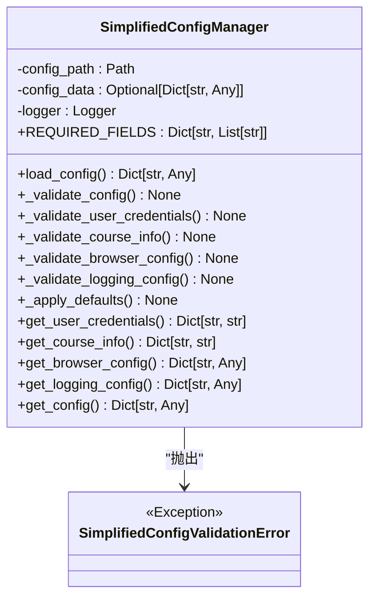
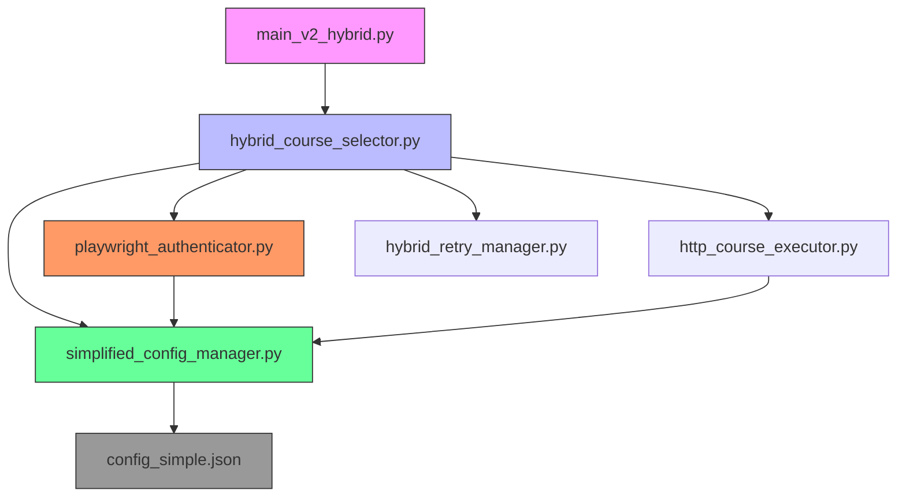

# 认证模块

<cite>
**本文档中引用的文件**   
- [playwright_authenticator.py](file://src/playwright_authenticator.py)
- [simplified_config_manager.py](file://src/simplified_config_manager.py)
- [hybrid_course_selector.py](file://src/hybrid_course_selector.py)
- [main_v2_hybrid.py](file://main_v2_hybrid.py)
</cite>

## 目录
1. [简介](#简介)
2. [项目结构](#项目结构)
3. [核心组件](#核心组件)
4. [架构概述](#架构概述)
5. [详细组件分析](#详细组件分析)
6. [依赖分析](#依赖分析)
7. [性能考虑](#性能考虑)
8. [故障排除指南](#故障排除指南)
9. [结论](#结论)

## 简介
本项目旨在实现北航选课系统的自动化操作，核心功能是通过Playwright库自动完成SSO（单点登录）认证流程，并提取关键的认证信息用于后续的HTTP选课请求。该系统采用混合架构设计，结合了浏览器自动化与高效HTTP请求的优势，实现了稳定、快速的选课能力。认证模块作为整个系统的基础，负责获取Token、Cookie和secretVal等关键认证参数，为后续的选课操作提供必要的认证信息。

## 项目结构

**图源**
- [main_v2_hybrid.py](file://main_v2_hybrid.py#L1-L50)
- [hybrid_course_selector.py](file://src/hybrid_course_selector.py#L1-L50)

**本节来源**
- [main_v2_hybrid.py](file://main_v2_hybrid.py#L1-L50)
- [src](file://src)

## 核心组件

认证模块的核心由`PlaywrightAuthenticator`类实现，该类封装了完整的SSO登录流程和认证信息提取逻辑。`AuthInfo`数据类用于统一管理提取到的认证信息，包括token、cookie、secretVal等关键字段。`SimplifiedConfigManager`类负责加载和验证配置文件，为认证过程提供必要的用户凭证和系统配置。这些组件协同工作，确保认证过程的稳定性和可靠性。

**本节来源**
- [playwright_authenticator.py](file://src/playwright_authenticator.py#L1-L100)
- [simplified_config_manager.py](file://src/simplified_config_manager.py#L1-L50)

## 架构概述

**图源**
- [playwright_authenticator.py](file://src/playwright_authenticator.py#L1-L50)
- [hybrid_course_selector.py](file://src/hybrid_course_selector.py#L1-L50)
- [main_v2_hybrid.py](file://main_v2_hybrid.py#L1-L50)

## 详细组件分析

### Playwright认证器分析

`PlaywrightAuthenticator`类是整个认证流程的核心，它利用Playwright库的异步API精确模拟用户操作，完成从登录到信息提取的全过程。

#### 类结构与数据模型

**图源**
- [playwright_authenticator.py](file://src/playwright_authenticator.py#L1-L50)

#### 认证流程分析

**图源**
- [playwright_authenticator.py](file://src/playwright_authenticator.py#L1-L50)

**本节来源**
- [playwright_authenticator.py](file://src/playwright_authenticator.py#L1-L988)

### 配置管理器分析

`SimplifiedConfigManager`类为整个系统提供了统一的配置管理接口，确保认证过程所需的用户凭证和系统配置能够被正确加载和验证。

**图源**
- [simplified_config_manager.py](file://src/simplified_config_manager.py#L1-L50)

**本节来源**
- [simplified_config_manager.py](file://src/simplified_config_manager.py#L1-L324)

## 依赖分析

**图源**
- [main_v2_hybrid.py](file://main_v2_hybrid.py#L1-L50)
- [hybrid_course_selector.py](file://src/hybrid_course_selector.py#L1-L50)
- [playwright_authenticator.py](file://src/playwright_authenticator.py#L1-L50)
- [simplified_config_manager.py](file://src/simplified_config_manager.py#L1-L50)

**本节来源**
- [main_v2_hybrid.py](file://main_v2_hybrid.py#L1-L50)
- [src](file://src)

## 性能考虑
认证模块在设计时充分考虑了性能因素。通过使用无头浏览器（headless mode）和合理的`slow_mo`延迟设置，在保证操作稳定性的前提下尽可能提高了执行速度。网络监听机制采用异步事件处理，避免了轮询带来的性能开销。`_get_secret_val_fast_method`等优化策略通过直接调用API获取关键信息，减少了不必要的页面导航和等待时间。整体设计在稳定性和效率之间取得了良好平衡。

## 故障排除指南

以下是一些常见的认证失败原因及排查建议：

1.  **配置文件错误**：检查`config_simple.json`是否存在，格式是否正确，占位符是否已替换。
    - **来源**：[simplified_config_manager.py](file://src/simplified_config_manager.py#L1-L50)

2.  **网络连接问题**：确保网络通畅，能够访问北航SSO系统。
    - **来源**：[hybrid_course_selector.py](file://src/hybrid_course_selector.py#L1-L50)

3.  **登录凭证错误**：确认用户名和密码正确无误。
    - **来源**：[playwright_authenticator.py](file://src/playwright_authenticator.py#L1-L50)

4.  **页面元素定位失败**：北航SSO系统前端更新可能导致iframe ID或按钮文本变化。
    - **来源**：[playwright_authenticator.py](file://src/playwright_authenticator.py#L1-L50)

5.  **secretVal提取失败**：API响应结构可能发生变化，需要更新正则表达式或提取逻辑。
    - **来源**：[playwright_authenticator.py](file://src/playwright_authenticator.py#L1-L50)

6.  **浏览器环境问题**：Playwright依赖的Chromium浏览器可能未正确安装或存在兼容性问题。
    - **来源**：[playwright_authenticator.py](file://src/playwright_authenticator.py#L1-L50)

## 结论
Playwright认证模块通过自动化浏览器操作，成功解决了北航选课系统复杂的认证流程。其设计充分考虑了稳定性、效率和可维护性，通过多层次的secretVal提取策略和完善的异常处理机制，确保了认证过程的高成功率。该模块为整个选课系统提供了可靠的基础，是实现自动化选课的关键环节。