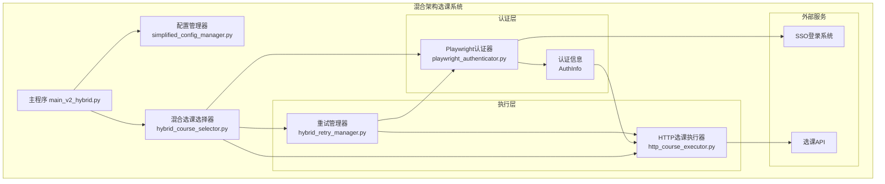
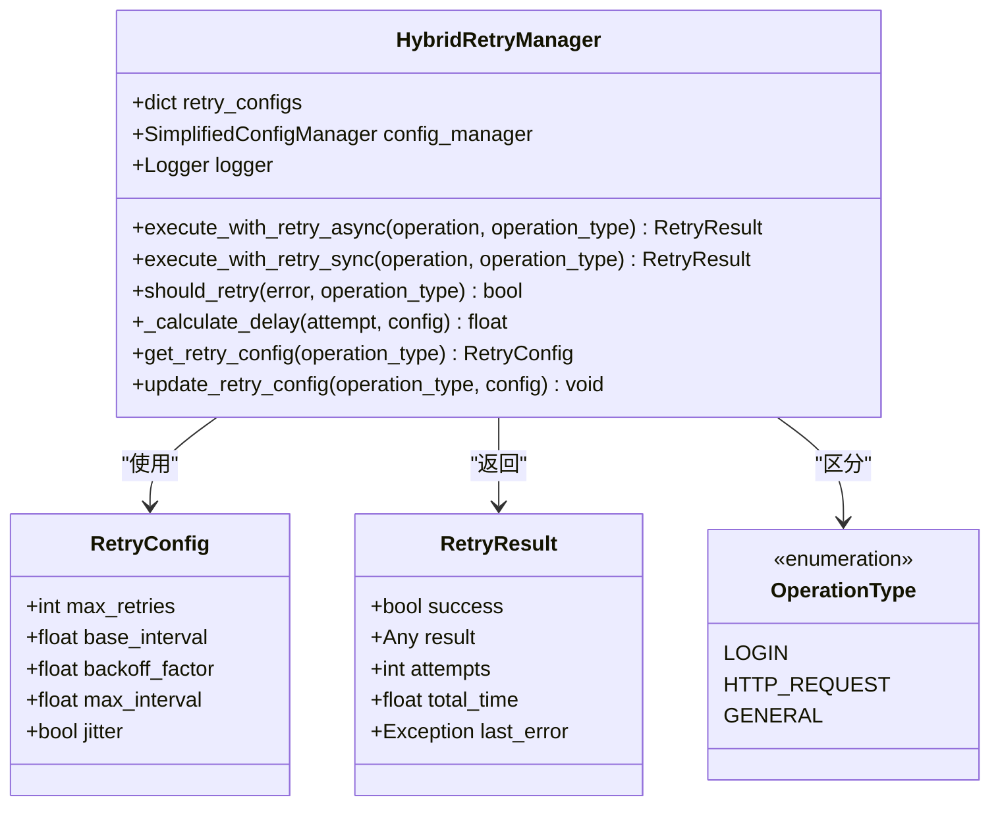
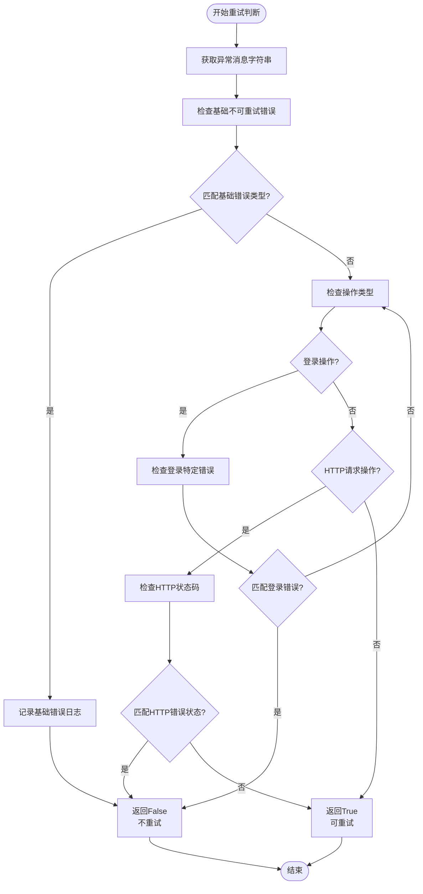
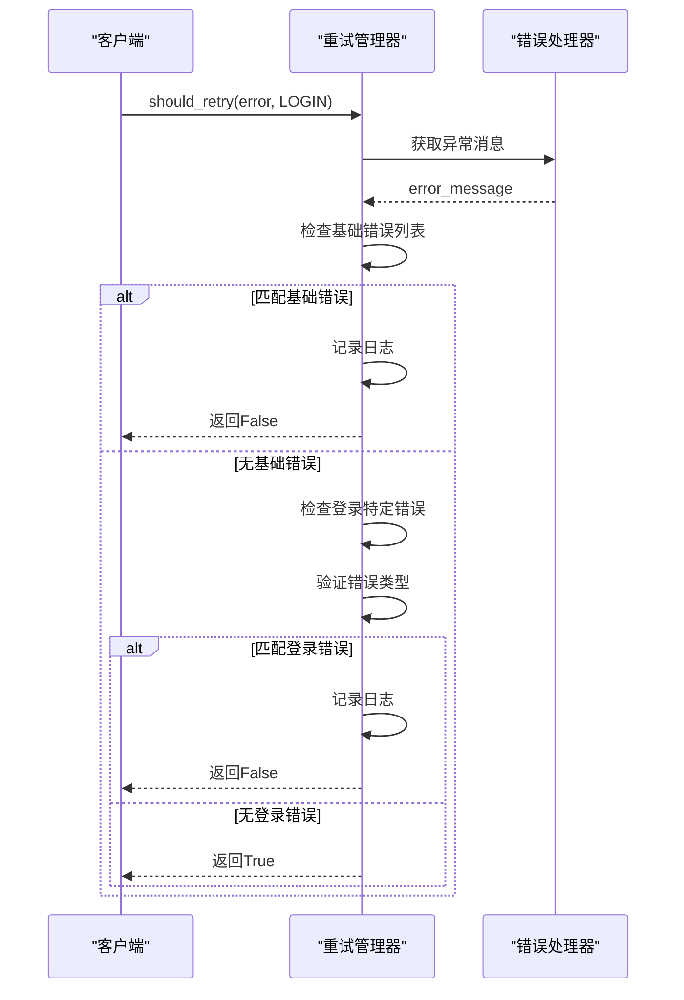
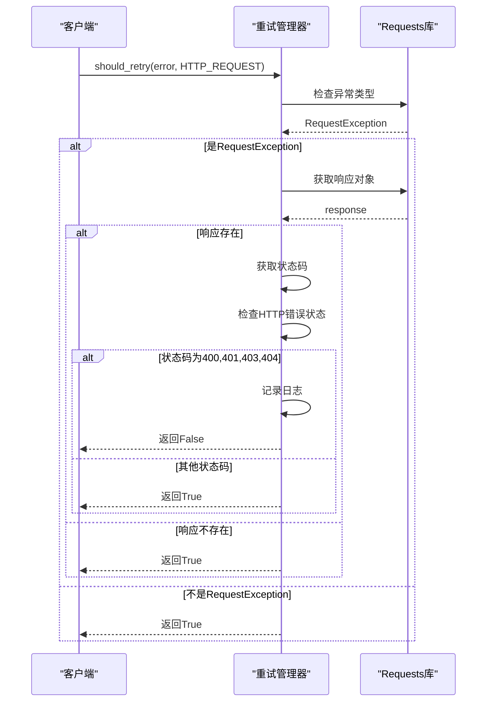
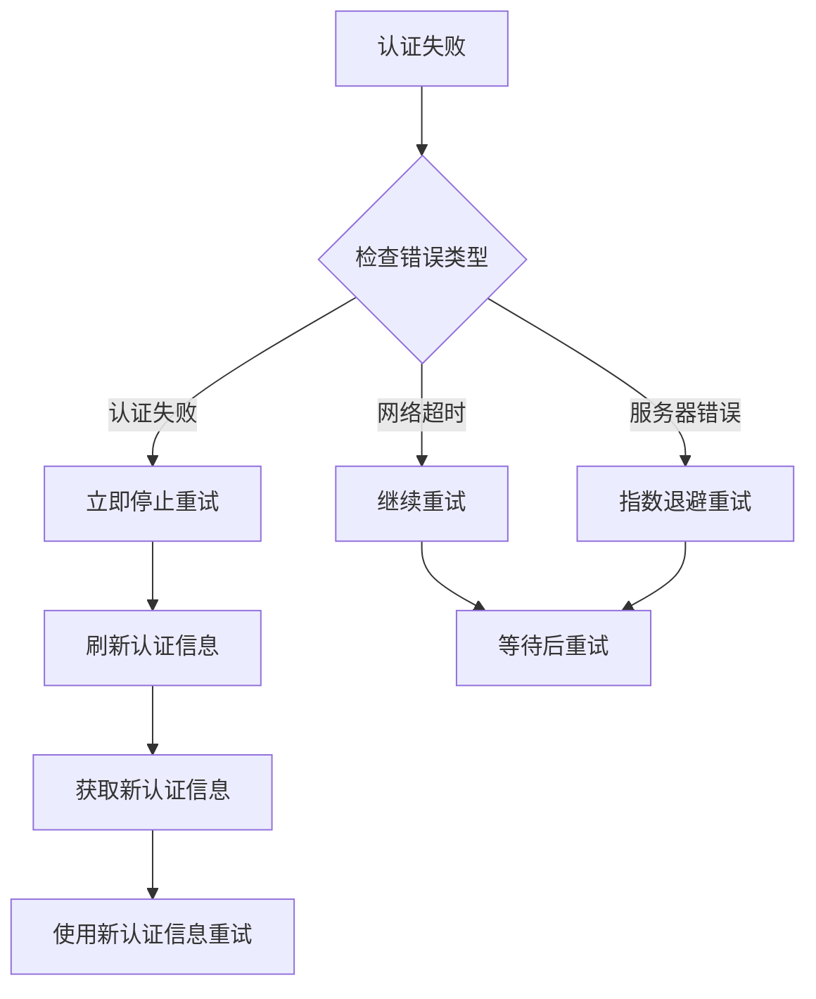
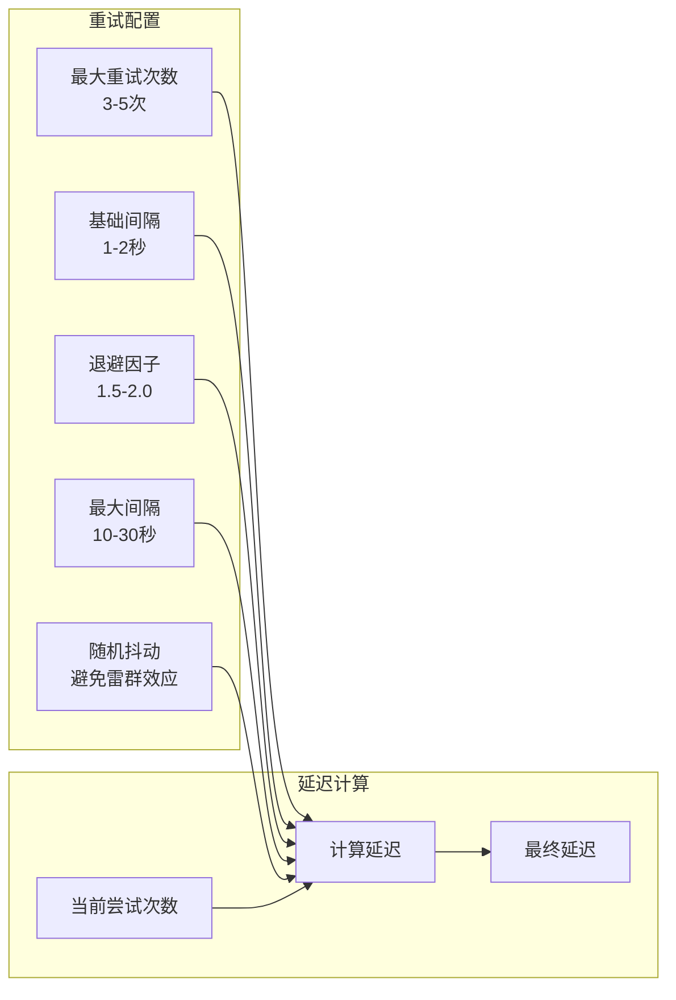

# 重试决策逻辑

<cite>
**本文档引用的文件**
- [hybrid_retry_manager.py](file://src/hybrid_retry_manager.py)
- [playwright_authenticator.py](file://src/playwright_authenticator.py)
- [http_course_executor.py](file://src/http_course_executor.py)
- [simplified_config_manager.py](file://src/simplified_config_manager.py)
- [main_v2_hybrid.py](file://main_v2_hybrid.py)
- [README.md](file://README.md)
</cite>

## 目录
1. [简介](#简介)
2. [项目架构概览](#项目架构概览)
3. [核心重试管理器](#核心重试管理器)
4. [智能重试决策逻辑](#智能重试决策逻辑)
5. [操作类型差异化处理](#操作类型差异化处理)
6. [实际应用场景分析](#实际应用场景分析)
7. [性能优化与用户体验](#性能优化与用户体验)
8. [故障排除指南](#故障排除指南)
9. [总结](#总结)

## 简介

本项目采用混合架构设计，结合Playwright自动登录的可靠性和HTTP直接请求的高效性，实现了最佳的选课体验。其中，智能重试决策逻辑是整个系统的核心组件之一，它能够基于异常信息准确识别不可重试的错误类型，避免无效重试浪费资源，同时确保关键操作的成功率。

智能重试决策逻辑主要体现在`should_retry`方法中，该方法能够：
- 基于异常信息（error.message）识别不可重试的错误类型
- 针对OperationType.LOGIN和OperationType.HTTP_REQUEST的不同判断规则
- 提供精细化错误处理策略
- 提升系统鲁棒性与用户体验

## 项目架构概览



**图表来源**
- [main_v2_hybrid.py](file://main_v2_hybrid.py#L1-L50)
- [hybrid_course_selector.py](file://src/hybrid_course_selector.py)
- [hybrid_retry_manager.py](file://src/hybrid_retry_manager.py#L1-L100)

## 核心重试管理器

混合重试管理器（HybridRetryManager）是整个系统的核心组件，提供了适应性重试机制，支持登录重试和HTTP请求重试两种不同的重试策略。



**图表来源**
- [hybrid_retry_manager.py](file://src/hybrid_retry_manager.py#L20-L80)

**章节来源**
- [hybrid_retry_manager.py](file://src/hybrid_retry_manager.py#L1-L393)

## 智能重试决策逻辑

`should_retry`方法是智能重试决策的核心，它基于异常信息（error.message）识别不可重试的错误类型，避免无效重试浪费资源。

### 基础错误分类



**图表来源**
- [hybrid_retry_manager.py](file://src/hybrid_retry_manager.py#L265-L312)

### 不可重试错误类型

系统预定义了以下不可重试的错误类型：

1. **认证相关错误**
   - "认证失败"
   - "用户名或密码错误"
   - "账户被锁定"

2. **权限相关错误**
   - "权限不足"
   - "访问被拒绝"

3. **参数错误**
   - "参数错误"
   - "配置错误"
   - "课程ID无效"

这些错误类型通过字符串匹配的方式进行识别，确保能够准确判断哪些错误不应该触发重试。

**章节来源**
- [hybrid_retry_manager.py](file://src/hybrid_retry_manager.py#L265-L312)

## 操作类型差异化处理

系统针对不同的操作类型提供了差异化的重试判断规则，体现了精细化错误处理策略。

### 登录操作特殊判断



**图表来源**
- [hybrid_retry_manager.py](file://src/hybrid_retry_manager.py#L285-L295)

对于登录操作，系统额外检查以下特定错误类型：
- "验证码错误"
- "用户不存在"
- "密码错误"

这些错误通常表明用户凭据存在问题，不需要重试。

### HTTP请求操作特殊判断



**图表来源**
- [hybrid_retry_manager.py](file://src/hybrid_retry_manager.py#L296-L305)

对于HTTP请求操作，系统检查以下HTTP状态码：
- **400 Bad Request**: 请求参数错误
- **401 Unauthorized**: 未授权访问
- **403 Forbidden**: 禁止访问
- **404 Not Found**: 资源不存在

这些状态码通常表示客户端错误，不需要重试。

**章节来源**
- [hybrid_retry_manager.py](file://src/hybrid_retry_manager.py#L265-L312)

## 实际应用场景分析

### 场景一：密码错误立即终止重试

当用户输入错误的密码时，系统会立即终止重试，避免浪费资源：

```python
# 示例错误消息
error_message = "用户名或密码错误"

# should_retry判断流程
if "用户名或密码错误" in error_message.lower():
    # 立即返回False，不重试
    return False
```

这种处理方式的优势：
- **节省资源**: 避免重复发送无效的认证请求
- **及时反馈**: 用户可以立即修改密码重新尝试
- **防止封禁**: 减少因频繁认证失败导致的账号锁定风险

### 场景二：网络超时继续重试

当遇到网络超时时，系统会继续重试：

```python
# 示例错误消息
error_message = "Connection timeout"

# should_retry判断流程
if "Connection timeout" in error_message.lower():
    # 返回True，继续重试
    return True
```

这种处理方式的优势：
- **提高成功率**: 网络波动是常见现象，适当重试可以提高最终成功率
- **增强鲁棒性**: 系统能够应对临时的网络不稳定
- **优化用户体验**: 用户无需手动干预即可完成选课

### 场景三：认证信息过期处理



**图表来源**
- [playwright_authenticator.py](file://src/playwright_authenticator.py#L80-L120)

**章节来源**
- [hybrid_retry_manager.py](file://src/hybrid_retry_manager.py#L265-L312)
- [playwright_authenticator.py](file://src/playwright_authenticator.py#L80-L150)

## 性能优化与用户体验

### 指数退避算法

系统采用指数退避算法来计算重试间隔，既保证了系统的响应性，又避免了对服务器造成过大压力。



**图表来源**
- [hybrid_retry_manager.py](file://src/hybrid_retry_manager.py#L150-L180)

### 配置差异化

系统为不同操作类型提供了差异化的重试配置：

| 操作类型 | 最大重试次数 | 基础间隔 | 退避因子 | 最大间隔 |
|---------|-------------|----------|----------|----------|
| LOGIN | 3 | 2.0秒 | 2.0 | 30.0秒 |
| HTTP_REQUEST | 5 | 0.5秒 | 1.5 | 10.0秒 |
| GENERAL | 3 | 1.0秒 | 2.0 | 30.0秒 |

这种差异化配置体现了系统对不同操作特性的理解：
- **登录操作**：较慢但稳定，重试间隔较长
- **HTTP请求**：快速响应，重试次数较多
- **通用操作**：平衡考虑

**章节来源**
- [hybrid_retry_manager.py](file://src/hybrid_retry_manager.py#L80-L120)

## 故障排除指南

### 常见重试问题诊断

1. **频繁重试但失败**
   - 检查网络连接稳定性
   - 验证认证信息是否有效
   - 查看日志中的具体错误类型

2. **不该重试却重试**
   - 确认错误消息是否包含预定义的关键词
   - 检查操作类型是否正确传递
   - 验证异常类型是否符合预期

3. **该重试却不重试**
   - 检查错误消息是否被正确转换为小写
   - 确认操作类型是否为LOGIN或HTTP_REQUEST
   - 验证HTTP状态码是否在允许范围内

### 调试技巧

```python
# 启用详细日志记录
logger.setLevel(logging.DEBUG)

# 检查重试配置
retry_manager = HybridRetryManager()
config = retry_manager.get_retry_config(OperationType.LOGIN)
print(f"登录重试配置: {config}")

# 测试重试决策
error = Exception("用户名或密码错误")
should_retry = retry_manager.should_retry(error, OperationType.LOGIN)
print(f"是否应该重试: {should_retry}")
```

**章节来源**
- [hybrid_retry_manager.py](file://src/hybrid_retry_manager.py#L315-L330)

## 总结

智能重试决策逻辑是混合架构选课系统的重要组成部分，它通过以下方式提升了系统的整体性能和用户体验：

### 核心优势

1. **精准错误识别**: 基于异常信息的字符串匹配，能够准确识别不可重试的错误类型
2. **差异化处理**: 针对不同操作类型提供定制化的重试策略
3. **智能决策**: 结合业务场景和错误性质，做出最优的重试决策
4. **资源优化**: 避免无效重试，合理利用系统资源

### 技术亮点

- **字符串匹配算法**: 简单高效的错误类型识别
- **操作类型区分**: Login和HTTP_REQUEST的差异化处理
- **HTTP状态码过滤**: 对HTTP请求的特殊错误状态码进行过滤
- **日志记录**: 完整的错误处理和决策记录

### 应用价值

这套智能重试决策逻辑不仅适用于选课系统，也可以作为其他需要高可靠性的网络应用的参考实现。它展示了如何通过合理的错误处理策略，在保证系统稳定性的同时，最大化用户体验。

通过这种精细化的错误处理策略，系统能够在各种复杂环境下保持稳定的性能表现，为用户提供可靠的选课服务。