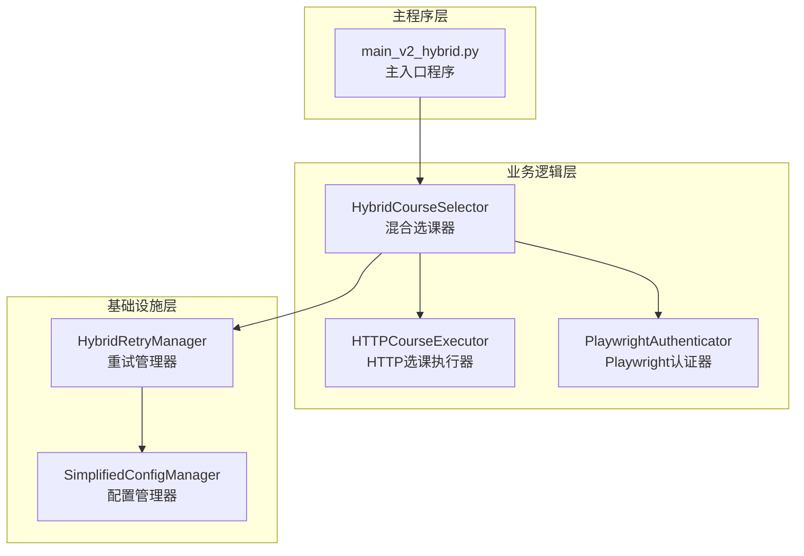
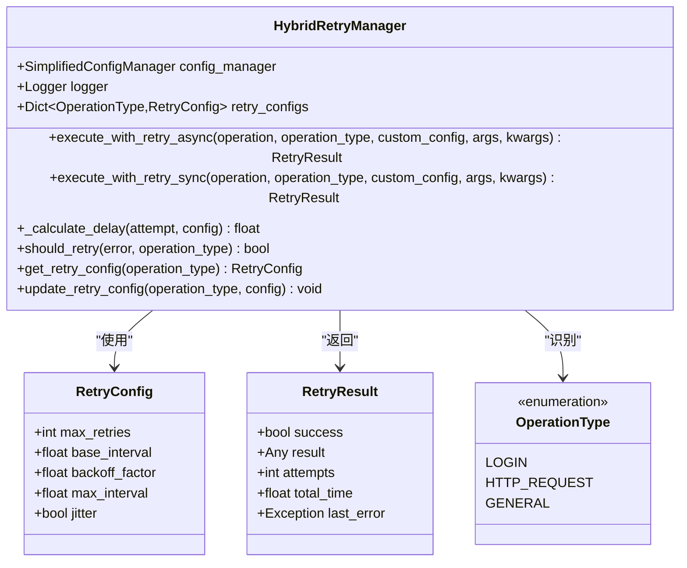
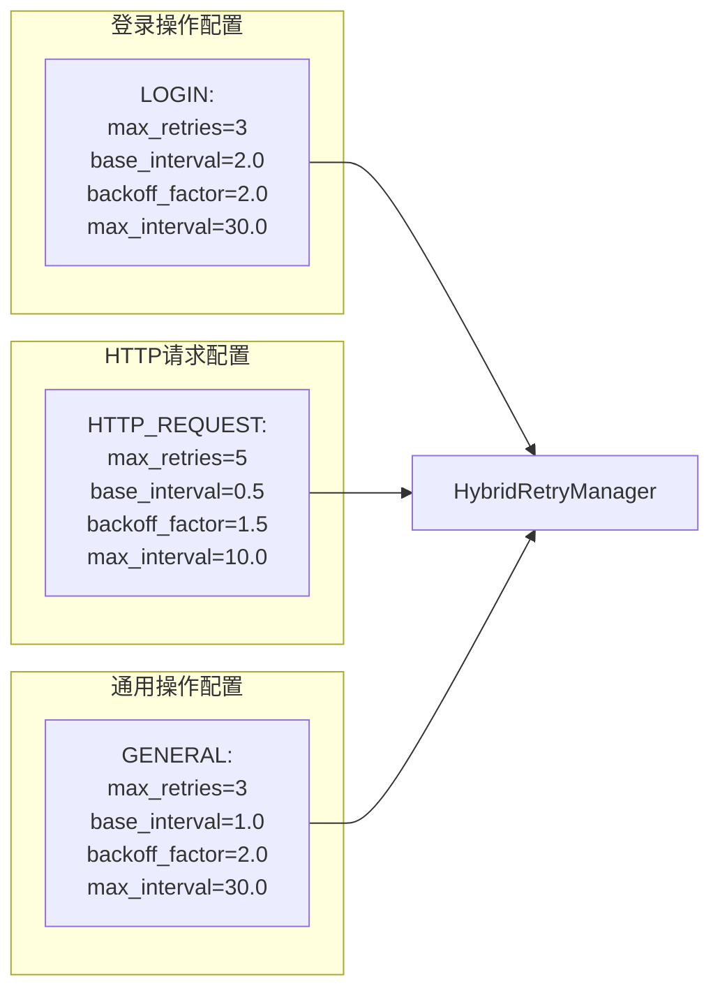
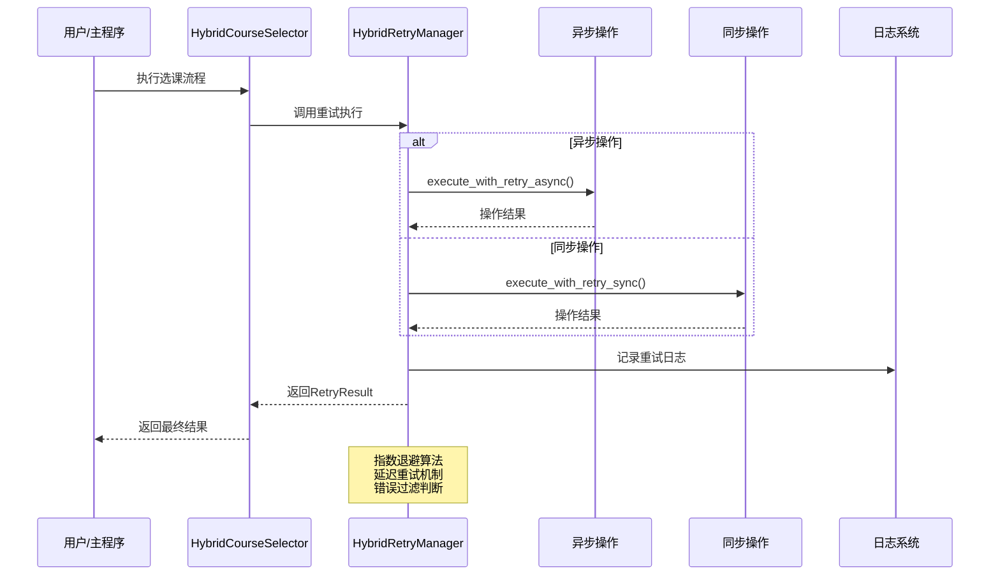
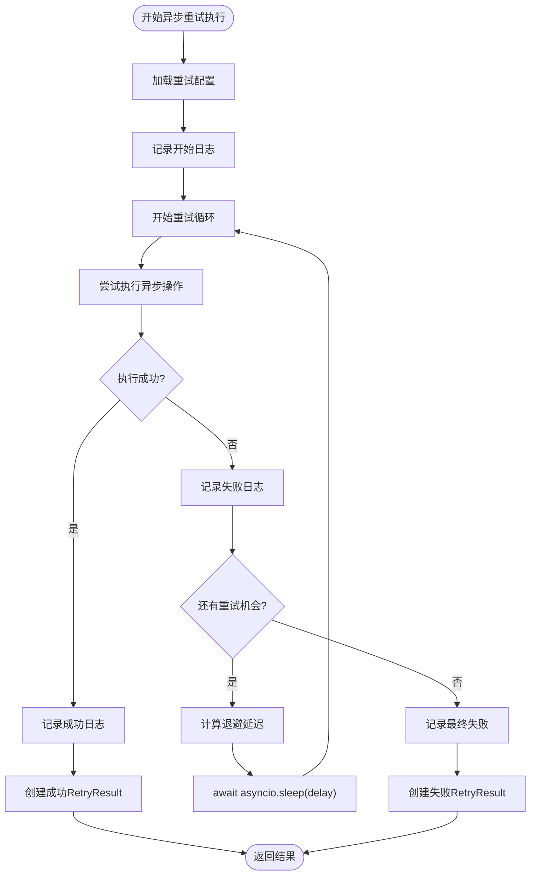
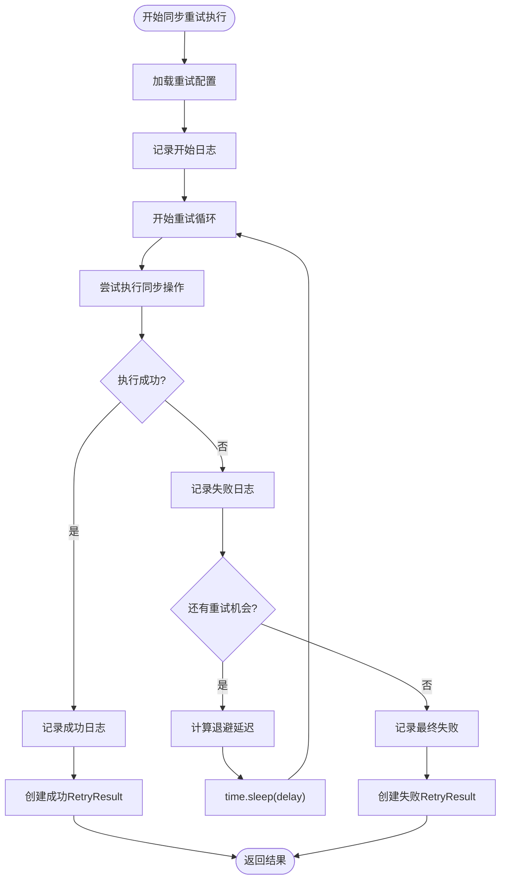
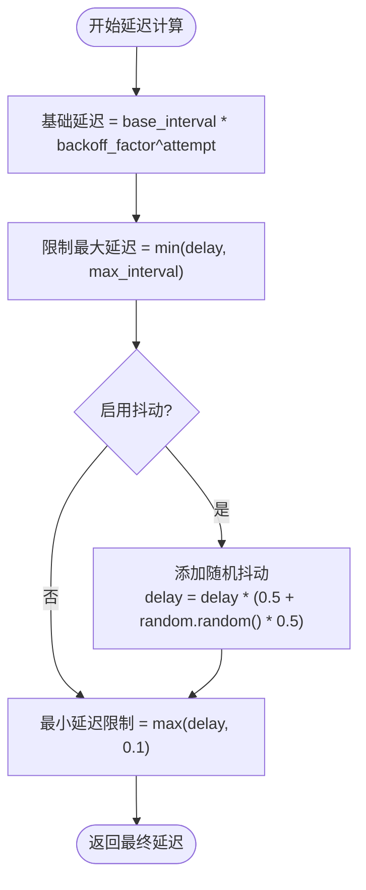
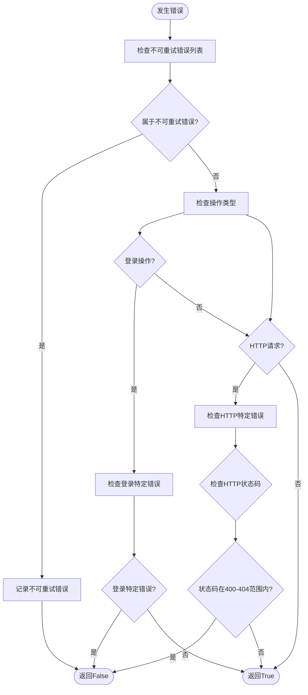
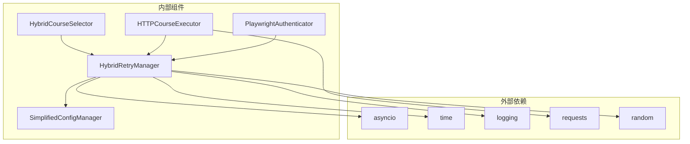
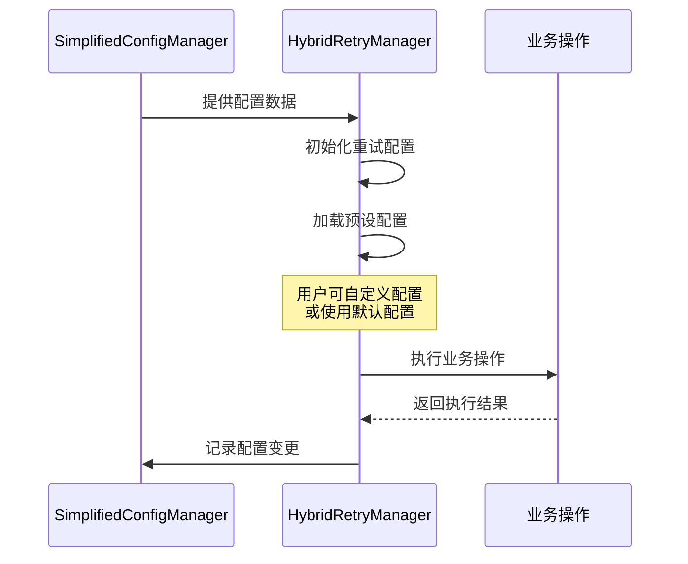

# 重试执行机制

<cite>
**本文档引用的文件**
- [hybrid_retry_manager.py](file://src/hybrid_retry_manager.py)
- [hybrid_course_selector.py](file://src/hybrid_course_selector.py)
- [http_course_executor.py](file://src/http_course_executor.py)
- [playwright_authenticator.py](file://src/playwright_authenticator.py)
- [simplified_config_manager.py](file://src/simplified_config_manager.py)
- [main_v2_hybrid.py](file://main_v2_hybrid.py)
</cite>

## 目录
1. [简介](#简介)
2. [项目结构概览](#项目结构概览)
3. [核心组件分析](#核心组件分析)
4. [架构概览](#架构概览)
5. [详细组件分析](#详细组件分析)
6. [依赖关系分析](#依赖关系分析)
7. [性能考虑](#性能考虑)
8. [故障排除指南](#故障排除指南)
9. [结论](#结论)

## 简介

HybridRetryManager是一个专为北航选课系统自动化工具设计的智能重试管理器，提供了两种重试执行方式：`execute_with_retry_async`（异步）和`execute_with_retry_sync`（同步）。该组件为方案二提供了适应性重试机制，支持登录重试和HTTP请求重试两种不同的重试策略。

该重试机制的核心特点包括：
- 指数退避算法实现智能延迟重试
- 可配置的重试参数（最大重试次数、基础间隔、退避因子等）
- 统一的重试接口设计
- 完善的日志记录和错误处理
- 针对不同操作类型（登录、HTTP请求、通用操作）的差异化配置

## 项目结构概览

该项目采用混合架构设计，主要包含以下核心模块：

**图表来源**
- [main_v2_hybrid.py](file://main_v2_hybrid.py#L1-L50)
- [hybrid_course_selector.py](file://src/hybrid_course_selector.py#L1-L50)
- [hybrid_retry_manager.py](file://src/hybrid_retry_manager.py#L1-L50)

**章节来源**
- [main_v2_hybrid.py](file://main_v2_hybrid.py#L1-L100)
- [hybrid_course_selector.py](file://src/hybrid_course_selector.py#L1-L100)

## 核心组件分析

### HybridRetryManager类结构

HybridRetryManager是整个重试机制的核心组件，提供了统一的重试接口和灵活的配置管理：

**图表来源**
- [hybrid_retry_manager.py](file://src/hybrid_retry_manager.py#L25-L60)
- [hybrid_retry_manager.py](file://src/hybrid_retry_manager.py#L130-L180)

### 操作类型配置

系统预定义了三种操作类型，每种都有专门的重试配置：

**图表来源**
- [hybrid_retry_manager.py](file://src/hybrid_retry_manager.py#L70-L95)

**章节来源**
- [hybrid_retry_manager.py](file://src/hybrid_retry_manager.py#L25-L120)

## 架构概览

### 整体架构设计

HybridRetryManager在整个系统中扮演着关键的容错角色，为各个子组件提供可靠的重试保障：

**图表来源**
- [hybrid_course_selector.py](file://src/hybrid_course_selector.py#L150-L200)
- [hybrid_retry_manager.py](file://src/hybrid_retry_manager.py#L130-L200)

## 详细组件分析

### 异步重试执行方法

`execute_with_retry_async`方法专门用于处理异步操作，如Playwright认证：

**图表来源**
- [hybrid_retry_manager.py](file://src/hybrid_retry_manager.py#L130-L180)

#### 异步方法特点

1. **协程支持**: 使用`await`关键字等待异步操作完成
2. **非阻塞等待**: 使用`asyncio.sleep()`实现异步延迟
3. **并发友好**: 不会阻塞事件循环，适合高并发场景
4. **资源效率**: 更好的内存和CPU利用率

### 同步重试执行方法

`execute_with_retry_sync`方法用于处理同步操作，如HTTP选课：

**图表来源**
- [hybrid_retry_manager.py](file://src/hybrid_retry_manager.py#L182-L232)

#### 同步方法特点

1. **阻塞等待**: 使用`time.sleep()`实现同步延迟
2. **简单直接**: 适用于不需要并发的场景
3. **兼容性好**: 兼容所有标准Python函数
4. **调试方便**: 更容易进行调试和问题定位

### 指数退避算法实现

重试管理器的核心是`_calculate_delay`方法，实现了智能的延迟计算：

**图表来源**
- [hybrid_retry_manager.py](file://src/hybrid_retry_manager.py#L234-L250)

#### 算法特性

1. **指数增长**: 延迟时间呈指数级增长，减少服务器压力
2. **最大限制**: 防止无限增长，保护系统资源
3. **随机抖动**: 避免多个请求同时重试导致的雷群效应
4. **最小保证**: 确保至少有一定延迟，避免过于频繁的重试

### 错误过滤和重试决策

系统实现了智能的错误过滤机制，决定哪些错误应该重试：

**图表来源**
- [hybrid_retry_manager.py](file://src/hybrid_retry_manager.py#L252-L290)

**章节来源**
- [hybrid_retry_manager.py](file://src/hybrid_retry_manager.py#L130-L300)

## 依赖关系分析

### 组件间依赖关系

**图表来源**
- [hybrid_retry_manager.py](file://src/hybrid_retry_manager.py#L1-L20)
- [hybrid_course_selector.py](file://src/hybrid_course_selector.py#L1-L20)

### 配置管理集成

HybridRetryManager与SimplifiedConfigManager紧密集成，提供灵活的配置管理：

**图表来源**
- [simplified_config_manager.py](file://src/simplified_config_manager.py#L50-L100)
- [hybrid_retry_manager.py](file://src/hybrid_retry_manager.py#L60-L95)

**章节来源**
- [hybrid_retry_manager.py](file://src/hybrid_retry_manager.py#L1-L50)
- [simplified_config_manager.py](file://src/simplified_config_manager.py#L1-L100)

## 性能考虑

### 异步vs同步选择

选择合适的重试执行方式需要考虑以下因素：

1. **并发需求**: 异步更适合高并发场景
2. **资源消耗**: 同步占用更多线程资源
3. **复杂度**: 同步代码更易于理解和维护
4. **兼容性**: 同步兼容所有Python函数

### 性能优化建议

1. **合理配置重试参数**: 根据操作类型调整最大重试次数和基础间隔
2. **启用抖动**: 减少网络拥塞和雷群效应
3. **及时错误过滤**: 避免对不可重试错误进行无意义的重试
4. **监控重试效果**: 通过日志分析重试成功率和性能影响

## 故障排除指南

### 常见问题和解决方案

#### 重试次数过多

**症状**: 操作长时间未完成，重试次数接近上限
**原因**: 网络不稳定或服务器响应缓慢
**解决方案**: 
- 检查网络连接质量
- 调整最大重试次数配置
- 增加基础间隔时间

#### 延迟时间过长

**症状**: 重试间隔时间过长，影响用户体验
**原因**: 指数退避算法导致延迟时间快速增长
**解决方案**:
- 降低退避因子
- 调整最大间隔时间
- 优化错误过滤逻辑

#### 日志记录不完整

**症状**: 重试过程中的关键信息缺失
**原因**: 日志级别设置不当或记录器配置错误
**解决方案**:
- 检查日志级别设置
- 验证日志文件路径和权限
- 确认日志格式配置

**章节来源**
- [hybrid_retry_manager.py](file://src/hybrid_retry_manager.py#L252-L320)

## 结论

HybridRetryManager为北航选课系统自动化工具提供了强大而灵活的重试机制。通过区分异步和同步执行方式，系统能够适应不同类型的业务操作需求。指数退避算法和智能错误过滤确保了重试的有效性和效率。

该组件的主要优势包括：

1. **统一接口**: 提供一致的重试API，简化业务代码
2. **智能配置**: 针对不同操作类型提供专门的配置
3. **灵活扩展**: 支持自定义配置和错误过滤规则
4. **完善监控**: 详细的日志记录和结果反馈
5. **高可用性**: 有效应对网络异常和临时故障

通过合理的配置和使用，HybridRetryManager能够显著提高系统的稳定性和可靠性，为用户提供更好的选课体验。