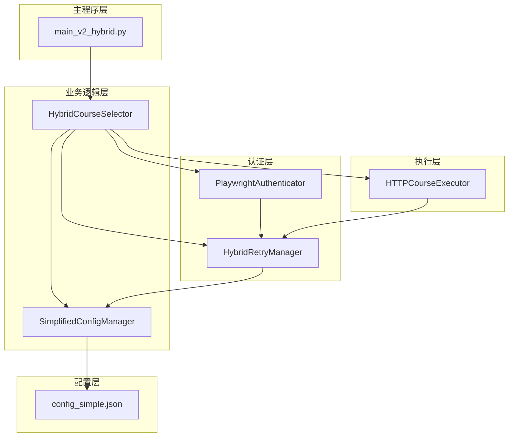
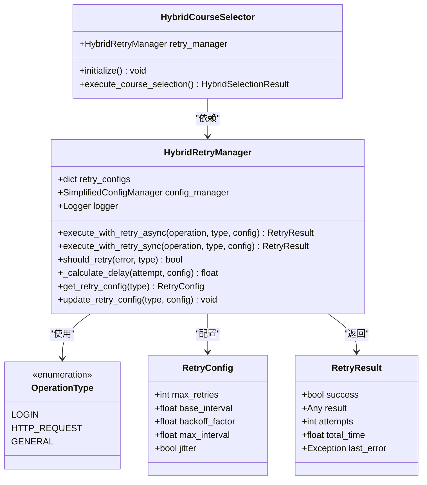
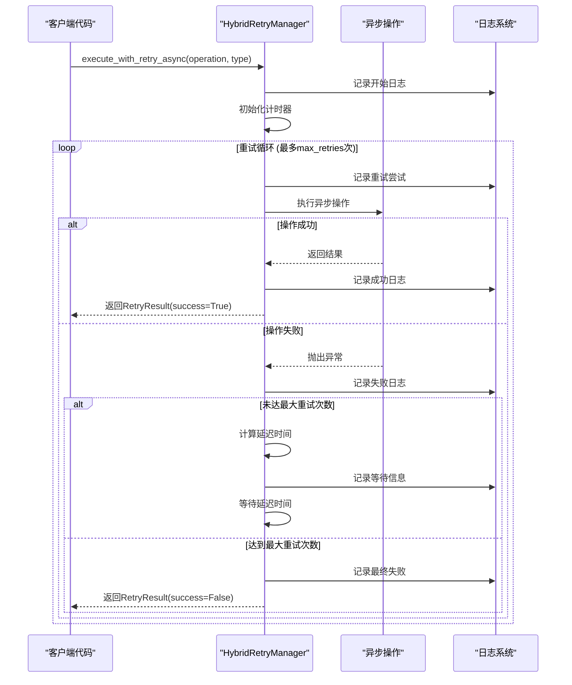
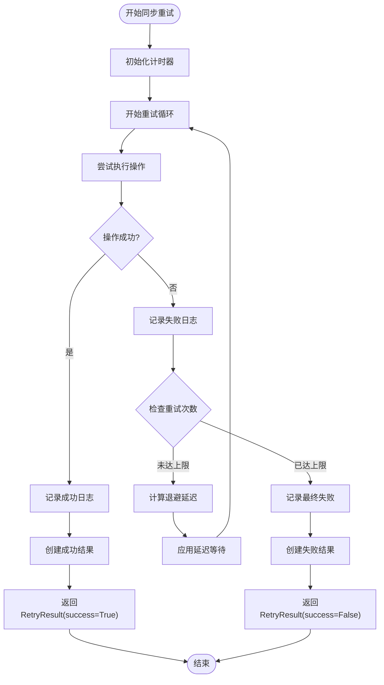
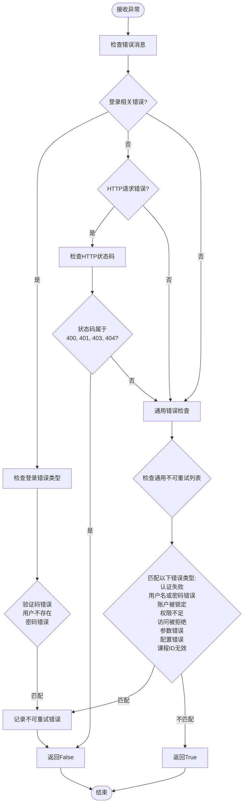
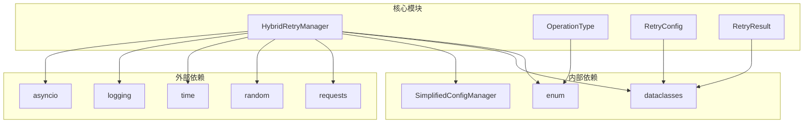

# 混合重试管理器设计与功能文档

<cite>
**本文档引用的文件**
- [hybrid_retry_manager.py](file://src/hybrid_retry_manager.py)
- [simplified_config_manager.py](file://src/simplified_config_manager.py)
- [hybrid_course_selector.py](file://src/hybrid_course_selector.py)
- [playwright_authenticator.py](file://src/playwright_authenticator.py)
- [http_course_executor.py](file://src/http_course_executor.py)
- [main_v2_hybrid.py](file://main_v2_hybrid.py)
- [README.md](file://README.md)
</cite>

## 目录
1. [引言](#引言)
2. [项目结构概览](#项目结构概览)
3. [核心组件分析](#核心组件分析)
4. [架构概览](#架构概览)
5. [详细组件分析](#详细组件分析)
6. [依赖关系分析](#依赖关系分析)
7. [性能考虑](#性能考虑)
8. [故障排除指南](#故障排除指南)
9. [结论](#结论)

## 引言

混合重试管理器（HybridRetryManager）是北航选课系统自动化工具的核心组件之一，专为方案二设计，提供了适应性重试机制来处理登录操作和HTTP请求两种不同类型的失败场景。该系统通过智能的指数退避算法、随机抖动和差异化重试策略，显著提高了系统的可靠性和用户体验。

该重试管理器的主要特点包括：
- 支持三种操作类型：登录、HTTP请求和通用操作
- 为每种操作类型提供定制化的重试配置
- 实现了智能的错误识别机制
- 提供统一的异步和同步重试接口
- 包含详细的重试结果跟踪和日志记录

## 项目结构概览

混合重试管理器作为整个混合架构的重要组成部分，与其他核心模块紧密协作：



**图表来源**
- [main_v2_hybrid.py](file://main_v2_hybrid.py#L1-L50)
- [hybrid_course_selector.py](file://src/hybrid_course_selector.py#L1-L50)
- [hybrid_retry_manager.py](file://src/hybrid_retry_manager.py#L1-L50)

**章节来源**
- [main_v2_hybrid.py](file://main_v2_hybrid.py#L1-L100)
- [hybrid_course_selector.py](file://src/hybrid_course_selector.py#L1-L100)

## 核心组件分析

### OperationType枚举系统

OperationType枚举定义了三种核心操作类型，每种类型都有其特定的重试策略和适用场景：

```python
class OperationType(Enum):
    """操作类型枚举"""
    LOGIN = "login"          # 登录操作，较慢但稳定
    HTTP_REQUEST = "http_request"  # HTTP请求操作，快速响应
    GENERAL = "general"      # 通用操作，平衡策略
```

### RetryConfig配置系统

每个操作类型都配备了专门的重试配置，这些配置经过精心调优以适应不同的操作特性：

```python
@dataclass
class RetryConfig:
    """重试配置"""
    max_retries: int = 3           # 最大重试次数
    base_interval: float = 1.0     # 基础间隔时间（秒）
    backoff_factor: float = 2.0    # 退避因子
    max_interval: float = 60.0     # 最大间隔时间
    jitter: bool = True            # 是否启用随机抖动
```

**章节来源**
- [hybrid_retry_manager.py](file://src/hybrid_retry_manager.py#L20-L45)

## 架构概览

混合重试管理器采用了分层架构设计，确保了代码的可维护性和扩展性：



**图表来源**
- [hybrid_retry_manager.py](file://src/hybrid_retry_manager.py#L20-L100)
- [hybrid_course_selector.py](file://src/hybrid_course_selector.py#L50-L100)

## 详细组件分析

### 核心重试方法实现

#### 异步重试执行器（execute_with_retry_async）

异步重试执行器是系统的核心组件，负责处理需要长时间等待的异步操作：



**图表来源**
- [hybrid_retry_manager.py](file://src/hybrid_retry_manager.py#L80-L150)

#### 同步重试执行器（execute_with_retry_sync）

同步重试执行器专门处理不需要异步等待的同步操作：



**图表来源**
- [hybrid_retry_manager.py](file://src/hybrid_retry_manager.py#L152-L220)

### 指数退避算法实现

指数退避算法是重试机制的核心，通过逐步增加等待时间来提高成功的可能性：

```python
def _calculate_delay(self, attempt: int, config: RetryConfig) -> float:
    """
    计算重试延迟时间
    
    Args:
        attempt: 当前尝试次数（从0开始）
        config: 重试配置
        
    Returns:
        延迟时间（秒）
    """
    # 指数退避算法
    delay = config.base_interval * (config.backoff_factor ** attempt)
    
    # 限制最大延迟
    delay = min(delay, config.max_interval)
    
    # 添加随机抖动以避免雷群效应
    if config.jitter:
        import random
        delay = delay * (0.5 + random.random() * 0.5)
    
    return max(delay, 0.1)  # 最小延迟0.1秒
```

该算法的关键特性：
- **指数增长**：每次重试间隔呈指数倍增长
- **最大限制**：防止无限延长等待时间
- **随机抖动**：减少多个客户端同时重试的概率
- **最小保证**：确保至少有合理的等待时间

### 智能错误识别机制

should_retry方法实现了智能的错误分类机制，能够识别哪些错误不应该重试：



**图表来源**
- [hybrid_retry_manager.py](file://src/hybrid_retry_manager.py#L280-L320)

### 预设重试配置

系统为每种操作类型预设了优化的重试配置：

```python
# 登录操作配置 - 较慢但稳定
OperationType.LOGIN: RetryConfig(
    max_retries=3,
    base_interval=2.0,      # 较长的基础间隔
    backoff_factor=2.0,     # 适中的退避因子
    max_interval=30.0,      # 最大30秒间隔
    jitter=True             # 启用抖动
),

# HTTP请求配置 - 快速响应
OperationType.HTTP_REQUEST: RetryConfig(
    max_retries=5,          # 更多次数重试
    base_interval=0.5,      # 较短的基础间隔
    backoff_factor=1.5,     # 较小的退避因子
    max_interval=10.0,      # 最大10秒间隔
    jitter=True             # 启用抖动
),

# 通用操作配置 - 平衡策略
OperationType.GENERAL: RetryConfig(
    max_retries=3,
    base_interval=1.0,      # 标准基础间隔
    backoff_factor=2.0,     # 标准退避因子
    max_interval=30.0,      # 标准最大间隔
    jitter=True             # 启用抖动
)
```

**章节来源**
- [hybrid_retry_manager.py](file://src/hybrid_retry_manager.py#L80-L393)

## 依赖关系分析

混合重试管理器的依赖关系体现了清晰的分层架构：



**图表来源**
- [hybrid_retry_manager.py](file://src/hybrid_retry_manager.py#L1-L20)

**章节来源**
- [hybrid_retry_manager.py](file://src/hybrid_retry_manager.py#L1-L30)

## 性能考虑

### 重试策略优化

混合重试管理器在设计时充分考虑了性能因素：

1. **差异化重试策略**：不同操作类型采用不同的重试配置
2. **智能错误过滤**：避免对不可重试错误进行无效重试
3. **指数退避算法**：平衡重试频率和成功率
4. **随机抖动**：减少网络拥塞和雷群效应

### 内存和资源管理

- **轻量级设计**：使用dataclass减少内存占用
- **及时清理**：异步操作完成后及时释放资源
- **异常安全**：确保异常情况下资源正确释放

### 扩展性考虑

- **配置驱动**：通过配置文件轻松调整重试参数
- **插件式设计**：支持自定义重试配置和错误处理
- **向后兼容**：保持API稳定性以便未来扩展

## 故障排除指南

### 常见重试问题

1. **重试次数过多**
   - 检查网络连接稳定性
   - 验证目标服务可用性
   - 调整max_retries配置

2. **重试间隔过长**
   - 检查backoff_factor设置
   - 验证max_interval限制
   - 考虑使用更积极的重试策略

3. **不应该重试的错误被重试**
   - 检查should_retry方法的错误识别规则
   - 更新非重试错误列表
   - 验证错误消息匹配逻辑

### 调试技巧

- **启用详细日志**：设置日志级别为DEBUG
- **监控重试过程**：观察重试次数和间隔变化
- **分析错误类型**：理解不同错误的重试行为

**章节来源**
- [hybrid_retry_manager.py](file://src/hybrid_retry_manager.py#L280-L350)

## 结论

混合重试管理器是一个设计精良、功能完备的重试系统，它成功地解决了北航选课系统自动化工具中的关键挑战。通过差异化重试策略、智能错误识别和优化的退避算法，该系统显著提高了系统的可靠性和用户体验。

### 主要优势

1. **适应性强**：针对不同操作类型提供定制化策略
2. **智能识别**：能够准确区分可重试和不可重试的错误
3. **性能优化**：通过指数退避和随机抖动提高效率
4. **易于使用**：提供简洁的API和丰富的配置选项
5. **可扩展性**：良好的架构设计支持未来功能扩展

### 未来改进方向

1. **动态配置**：根据历史重试数据动态调整配置
2. **机器学习**：基于错误模式预测最优重试策略
3. **分布式支持**：支持多实例间的重试协调
4. **监控集成**：与监控系统深度集成提供更好的可观测性

混合重试管理器不仅是一个技术组件，更是整个混合架构设计理念的体现，它展示了如何通过精心设计的系统架构来解决复杂的工程问题。