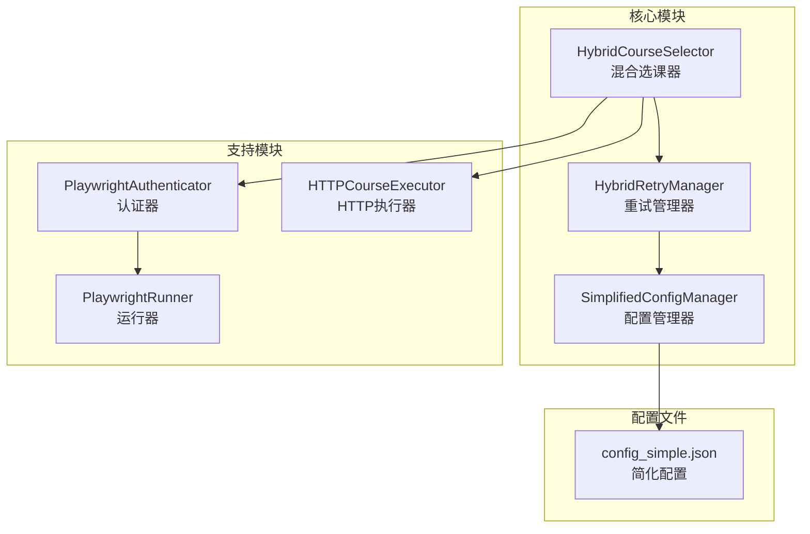
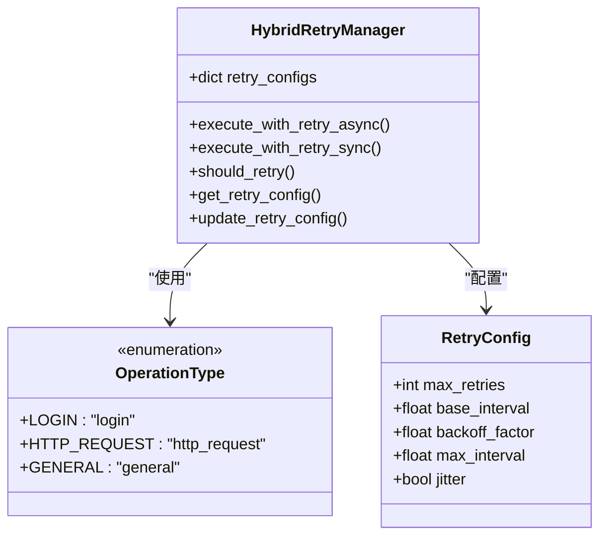
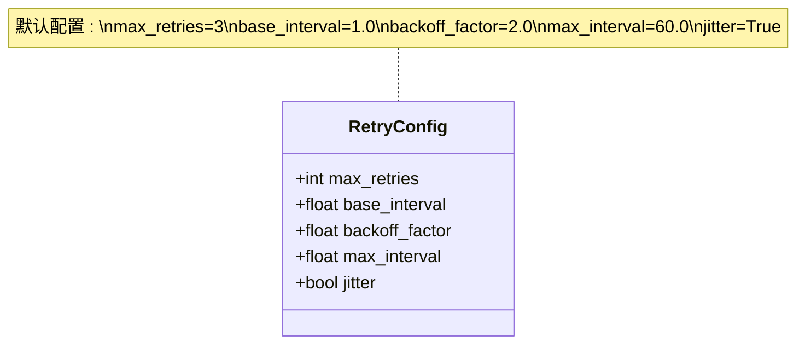
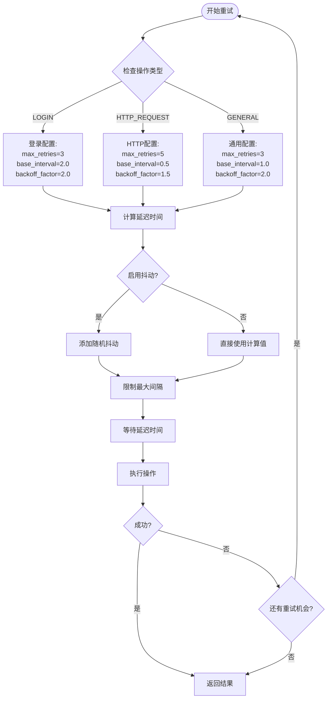
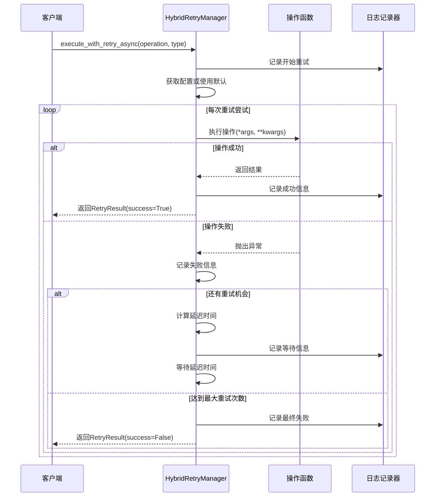
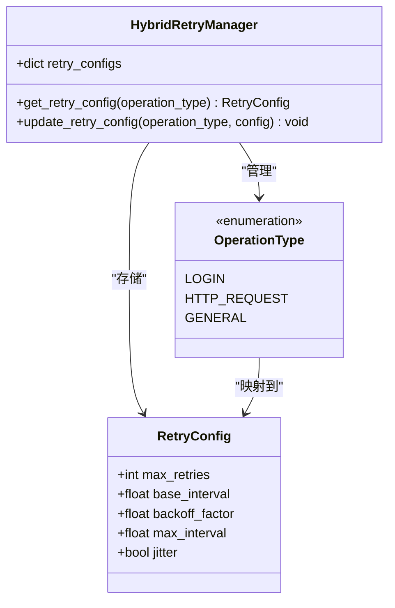
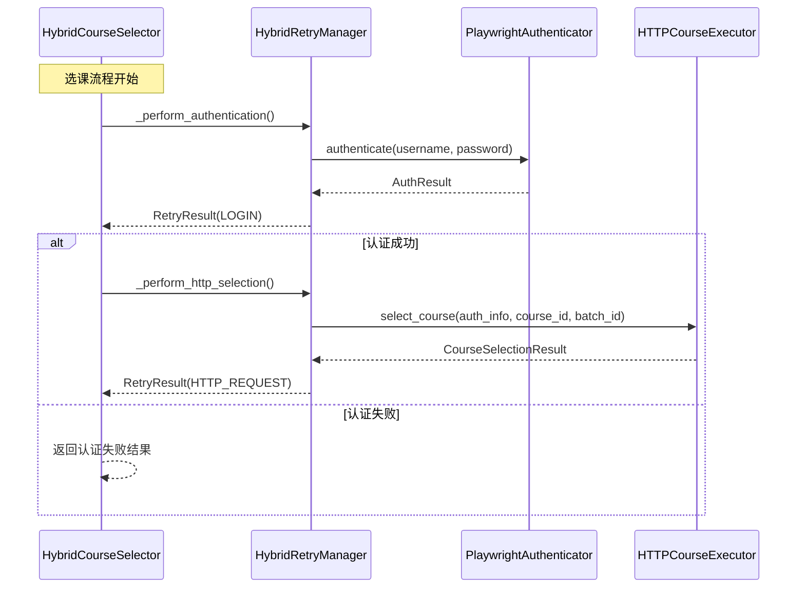
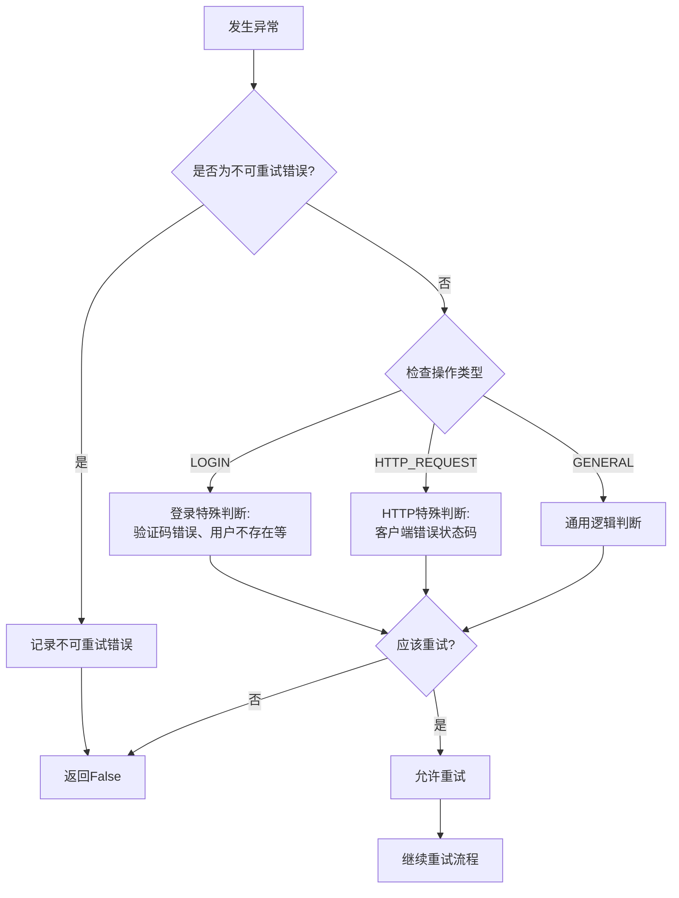

# 重试策略配置机制

<cite>
**本文档引用的文件**
- [hybrid_retry_manager.py](file://src/hybrid_retry_manager.py)
- [simplified_config_manager.py](file://src/simplified_config_manager.py)
- [hybrid_course_selector.py](file://src/hybrid_course_selector.py)
- [http_course_executor.py](file://src/http_course_executor.py)
- [main_v2_hybrid.py](file://main_v2_hybrid.py)
</cite>

## 目录
1. [简介](#简介)
2. [项目结构概览](#项目结构概览)
3. [OperationType枚举详解](#operationtype枚举详解)
4. [RetryConfig配置参数](#retryconfig配置参数)
5. [默认配置设计分析](#默认配置设计分析)
6. [重试策略执行机制](#重试策略执行机制)
7. [动态配置管理](#动态配置管理)
8. [实际应用场景](#实际应用场景)
9. [性能考虑](#性能考虑)
10. [故障排除指南](#故障排除指南)
11. [总结](#总结)

## 简介

HybridRetryManager是一个专为北航选课系统设计的智能重试管理器，为方案二提供了适应性重试机制。该系统支持登录重试和HTTP请求重_RETRY机制，采用指数退避算法和可配置的重试参数，确保在网络不稳定或服务临时故障的情况下仍能保持高成功率。

## 项目结构概览



**图表来源**
- [hybrid_retry_manager.py](file://src/hybrid_retry_manager.py#L1-L50)
- [hybrid_course_selector.py](file://src/hybrid_course_selector.py#L1-L50)

## OperationType枚举详解

OperationType枚举定义了三种不同的操作类型，每种类型都有其特定的重试策略：



**图表来源**
- [hybrid_retry_manager.py](file://src/hybrid_retry_manager.py#L20-L30)
- [hybrid_retry_manager.py](file://src/hybrid_retry_manager.py#L32-L38)

### LOGIN操作类型

**用途**: 专门用于处理登录认证过程中的重试需求

**特点**:
- 较低的最大重试次数（3次）
- 较长的基础间隔（2.0秒）
- 适中的退避因子（2.0）
- 有限的最大间隔（30.0秒）

**设计考量**: 登录操作通常涉及网络认证服务器的交互，需要更多的容错能力，但不应该过于频繁地重试，以免触发安全机制。

### HTTP_REQUEST操作类型

**用途**: 用于处理HTTP请求相关的重试需求

**特点**:
- 较高的最大重试次数（5次）
- 较短的基础间隔（0.5秒）
- 较低的退避因子（1.5）
- 适中的最大间隔（10.0秒）

**设计考量**: HTTP请求通常是快速响应的操作，需要更高的重试频率来应对短暂的网络波动，但重试间隔不宜过长以免影响用户体验。

### GENERAL操作类型

**用途**: 通用操作类型的默认配置

**特点**:
- 中等的最大重试次数（3次）
- 中等的基础间隔（1.0秒）
- 标准的退避因子（2.0）
- 适中的最大间隔（30.0秒）

**设计考量**: 作为备用配置，适用于未明确指定操作类型的场景。

**章节来源**
- [hybrid_retry_manager.py](file://src/hybrid_retry_manager.py#L20-L30)
- [hybrid_retry_manager.py](file://src/hybrid_retry_manager.py#L50-L80)

## RetryConfig配置参数

RetryConfig数据类定义了重试策略的所有可配置参数：



**图表来源**
- [hybrid_retry_manager.py](file://src/hybrid_retry_manager.py#L32-L38)

### 参数详细说明

1. **max_retries**: 最大重试次数
   - 控制整个重试过程中的最大尝试次数
   - 包括首次执行和所有重试尝试

2. **base_interval**: 基础重试间隔（秒）
   - 指数退避算法的初始等待时间
   - 影响第一次重试的等待时间

3. **backoff_factor**: 退避因子
   - 决定每次重试间隔的增长速度
   - 典型值为2.0，表示每次翻倍

4. **max_interval**: 最大重试间隔（秒）
   - 限制重试间隔的最大值
   - 防止过长的等待时间

5. **jitter**: 抖动启用标志
   - 添加随机抖动以避免雷群效应
   - 提高系统的整体稳定性

**章节来源**
- [hybrid_retry_manager.py](file://src/hybrid_retry_manager.py#L32-L38)

## 默认配置设计分析

### HTTP请求重试频率更高的原因

HTTP请求的默认配置具有以下特点：
- **max_retries=5**: 更多的重试机会
- **base_interval=0.5**: 更短的初始等待时间
- **backoff_factor=1.5**: 较慢的间隔增长速度

**设计考量**:
1. **快速响应需求**: HTTP请求需要快速得到响应，不适合长时间等待
2. **网络波动容忍**: 短暂的网络波动不会导致严重的后果
3. **用户体验**: 用户期望看到快速的结果反馈

### 登录操作更保守的原因

登录操作的默认配置具有以下特点：
- **max_retries=3**: 较少的重试机会
- **base_interval=2.0**: 较长的初始等待时间
- **backoff_factor=2.0**: 标准的间隔增长速度
- **max_interval=30.0**: 适中的最大等待时间

**设计考量**:
1. **安全机制避免**: 频繁的登录尝试可能触发安全机制
2. **资源保护**: 减少对认证服务器的压力
3. **错误识别**: 更保守的策略有助于识别真正的认证问题



**图表来源**
- [hybrid_retry_manager.py](file://src/hybrid_retry_manager.py#L150-L200)
- [hybrid_retry_manager.py](file://src/hybrid_retry_manager.py#L250-L280)

**章节来源**
- [hybrid_retry_manager.py](file://src/hybrid_retry_manager.py#L50-L80)

## 重试策略执行机制

### 异步重试执行流程



**图表来源**
- [hybrid_retry_manager.py](file://src/hybrid_retry_manager.py#L82-L150)

### 同步重试执行流程

同步版本的执行流程与异步版本类似，主要区别在于等待机制：

1. **异步等待**: 使用`await asyncio.sleep(delay)`
2. **同步等待**: 使用`time.sleep(delay)`

### 延迟时间计算算法

```mermaid
flowchart TD
Start([开始计算延迟]) --> CalcBase[计算基础延迟:<br/>base_interval × (backoff_factor ^ attempt)]
CalcBase --> LimitMax[限制最大间隔:<br/>min(calculated, max_interval)]
LimitMax --> CheckJitter{启用抖动?}
CheckJitter --> |是| AddJitter[添加抖动:<br/>delay × (0.5 + random × 0.5)]
CheckJitter --> |否| NoJitter[保持原值]
AddJitter --> MinDelay[最小延迟限制:<br/>max(delay, 0.1)]
NoJitter --> MinDelay
MinDelay --> Return([返回最终延迟])
```

**图表来源**
- [hybrid_retry_manager.py](file://src/hybrid_retry_manager.py#L250-L280)

**章节来源**
- [hybrid_retry_manager.py](file://src/hybrid_retry_manager.py#L82-L150)
- [hybrid_retry_manager.py](file://src/hybrid_retry_manager.py#L250-L280)

## 动态配置管理

### 配置获取和更新机制



**图表来源**
- [hybrid_retry_manager.py](file://src/hybrid_retry_manager.py#L280-L290)

### 配置管理方法

1. **get_retry_config()**: 获取指定操作类型的重试配置
   ```python
   def get_retry_config(self, operation_type: OperationType) -> RetryConfig:
       """获取指定操作类型的重试配置"""
       return self.retry_configs.get(operation_type, self.retry_configs[OperationType.GENERAL])
   ```

2. **update_retry_config()**: 更新指定操作类型的重试配置
   ```python
   def update_retry_config(self, operation_type: OperationType, config: RetryConfig) -> None:
       """更新指定操作类型的重试配置"""
       self.retry_configs[operation_type] = config
       self.logger.info(f"更新{operation_type.value}的重试配置")
   ```

### 配置优先级规则

1. **自定义配置优先**: 传入的custom_config参数优先于预定义配置
2. **操作类型匹配**: 根据OperationType选择相应的配置
3. **回退机制**: 如果找不到对应配置，则使用GENERAL类型的默认配置

**章节来源**
- [hybrid_retry_manager.py](file://src/hybrid_retry_manager.py#L280-L290)

## 实际应用场景

### 在混合选课流程中的应用

在HybridCourseSelector中，重试管理器被广泛应用于两个关键阶段：



**图表来源**
- [hybrid_course_selector.py](file://src/hybrid_course_selector.py#L280-L320)
- [hybrid_course_selector.py](file://src/hybrid_course_selector.py#L320-L360)

### 具体使用示例

1. **认证阶段**:
   ```python
   async def _perform_authentication(self, credentials: Tuple[str, str]) -> RetryResult:
       username, password = credentials
       
       async def auth_operation():
           return await self.playwright_authenticator.authenticate(username, password)
       
       return await self.retry_manager.execute_with_retry_async(
           auth_operation,
           OperationType.LOGIN
       )
   ```

2. **HTTP选课阶段**:
   ```python
   def _perform_http_selection(self, course_info: Dict[str, str]) -> RetryResult:
       def selection_operation():
           return self.http_executor.select_course(
               self.current_auth_info,
               course_info['course_id'],
               course_info['batch_id']
           )
       
       return self.retry_manager.execute_with_retry_sync(
           selection_operation,
           OperationType.HTTP_REQUEST
       )
   ```

### 错误判断和过滤机制



**图表来源**
- [hybrid_retry_manager.py](file://src/hybrid_retry_manager.py#L282-L320)

**章节来源**
- [hybrid_course_selector.py](file://src/hybrid_course_selector.py#L280-L320)
- [hybrid_course_selector.py](file://src/hybrid_course_selector.py#L320-L360)
- [hybrid_retry_manager.py](file://src/hybrid_retry_manager.py#L282-L320)

## 性能考虑

### 指数退避算法的优势

1. **减少服务器压力**: 随着重试次数增加，请求间隔逐渐增大
2. **提高成功率**: 避免在短时间内发送大量重试请求
3. **防止雷群效应**: 随机抖动分散重试时间点

### 内存和CPU使用优化

1. **延迟计算**: 只在需要重试时才计算延迟时间
2. **配置缓存**: 预定义的配置对象避免重复创建
3. **异常处理**: 高效的错误分类和过滤机制

### 网络效率优化

1. **连接复用**: HTTP执行器使用requests.Session保持连接
2. **超时控制**: 合理的超时设置避免长时间等待
3. **状态码过滤**: 及时识别不需要重试的状态码

## 故障排除指南

### 常见问题和解决方案

1. **重试次数过多导致失败**
   - 检查OperationType是否正确设置
   - 调整max_retries参数
   - 分析错误类型是否适合重试

2. **重试间隔过长**
   - 检查backoff_factor和max_interval设置
   - 考虑网络状况和服务器负载
   - 评估业务需求对响应时间的要求

3. **抖动效果不明显**
   - 确认jitter参数设置为True
   - 检查random模块导入是否正常
   - 观察日志中的延迟时间分布

### 调试技巧

1. **启用详细日志**: 设置日志级别为DEBUG
2. **监控重试过程**: 关注每次重试的延迟时间和错误信息
3. **分析配置应用**: 确认使用的配置是否符合预期

**章节来源**
- [hybrid_retry_manager.py](file://src/hybrid_retry_manager.py#L250-L280)

## 总结

HybridRetryManager通过精心设计的重试策略配置机制，为北航选课系统提供了可靠的容错能力。其核心优势包括：

1. **分层配置策略**: 不同操作类型采用不同的重试参数
2. **智能错误判断**: 能够识别不可重试的错误类型
3. **灵活配置管理**: 支持运行时动态调整重试策略
4. **高效执行机制**: 采用指数退避算法和抖动技术
5. **完整的错误处理**: 提供详细的重试结果和错误信息

这种设计不仅提高了系统的稳定性和可靠性，还为不同类型的业务操作提供了最适合的重试策略，确保了选课流程的成功率和用户体验。