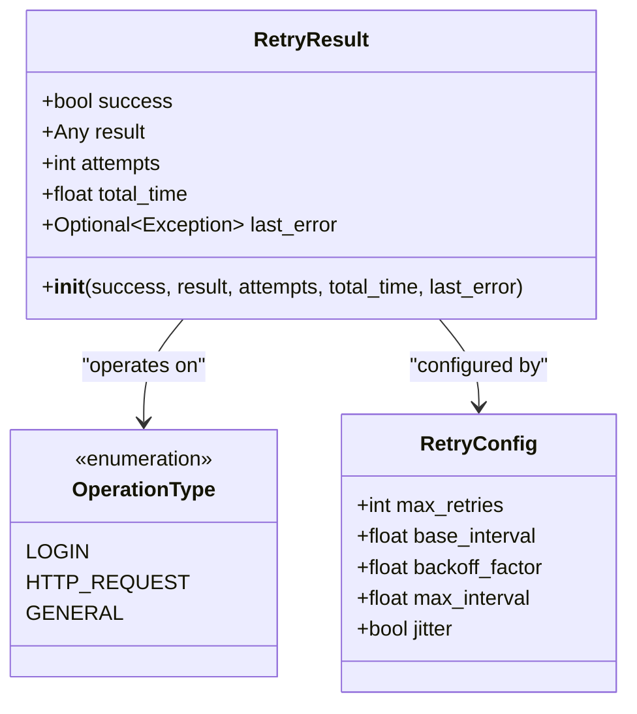
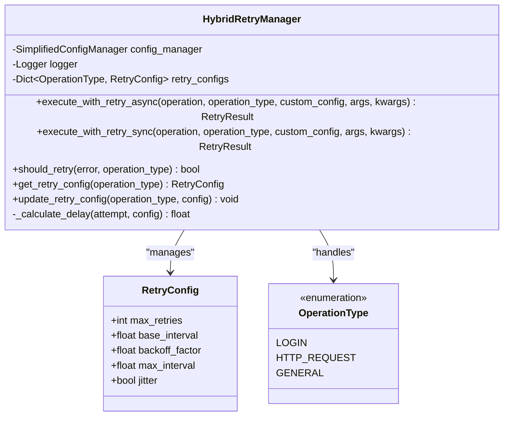
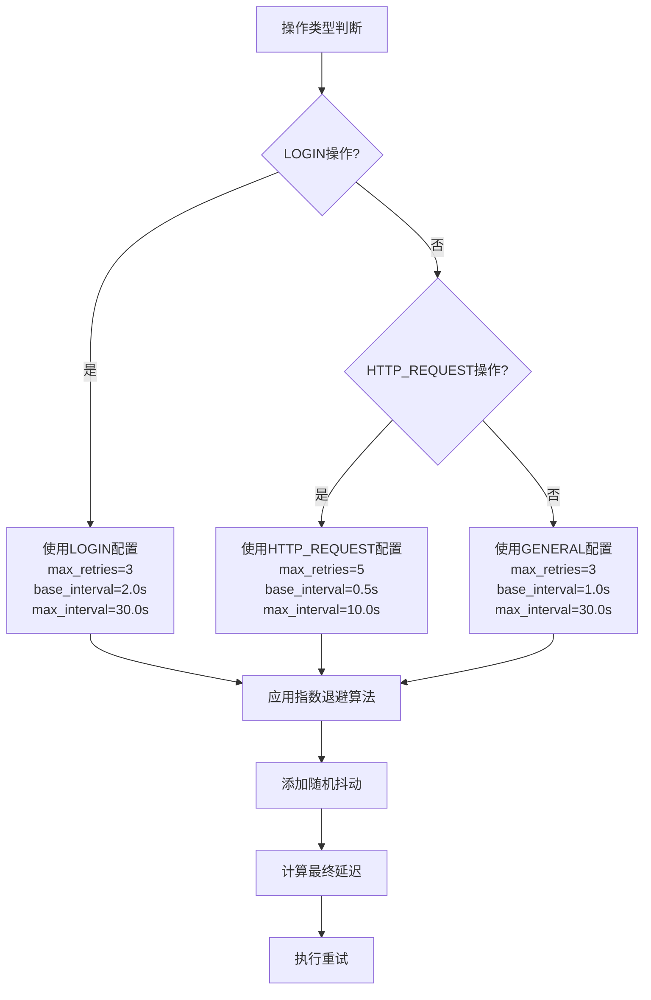

# 重试结果与便利函数

<cite>
**本文档引用的文件**
- [hybrid_retry_manager.py](file://src/hybrid_retry_manager.py)
- [hybrid_course_selector.py](file://src/hybrid_course_selector.py)
- [http_course_executor.py](file://src/http_course_executor.py)
- [playwright_authenticator.py](file://src/playwright_authenticator.py)
- [main_v2_hybrid.py](file://main_v2_hybrid.py)
- [simplified_config_manager.py](file://src/simplified_config_manager.py)
</cite>

## 目录
1. [简介](#简介)
2. [RetryResult数据类详解](#retryresult数据类详解)
3. [核心重试管理器](#核心重试管理器)
4. [便利函数分析](#便利函数分析)
5. [重试策略与配置](#重试策略与配置)
6. [使用示例](#使用示例)
7. [性能考量](#性能考量)
8. [故障排除指南](#故障排除指南)
9. [总结](#总结)

## 简介

混合重试管理器（HybridRetryManager）是北航选课系统自动化工具的核心组件之一，为方案二提供了适应性重试机制。该系统支持登录重试和HTTP请求重试两种不同的重试策略，通过指数退避算法和可配置的重试参数，显著提升了系统的稳定性和可靠性。

## RetryResult数据类详解

### 数据结构概述

`RetryResult` 是重试操作的结果容器，包含了完整的重试过程信息：



**图表来源**
- [hybrid_retry_manager.py](file://src/hybrid_retry_manager.py#L35-L42)
- [hybrid_retry_manager.py](file://src/hybrid_retry_manager.py#L25-L32)
- [hybrid_retry_manager.py](file://src/hybrid_retry_manager.py#L45-L51)

### 字段详细说明

#### success (布尔值)
- **含义**: 表示重试操作是否最终成功
- **使用场景**: 用于判断整个重试过程的结果状态
- **典型值**: `True` 表示操作成功，`False` 表示达到最大重试次数仍失败

#### result (任意类型)
- **含义**: 操作成功时返回的实际结果
- **使用场景**: 包含业务逻辑的实际返回值，如认证信息、选课结果等
- **典型值**: 
  - 认证操作：`AuthInfo` 对象
  - HTTP操作：`CourseSelectionResult` 对象
  - 通用操作：具体业务返回值

#### attempts (整数)
- **含义**: 实际执行的重试次数（包括首次尝试）
- **使用场景**: 评估重试策略的有效性，监控系统稳定性
- **典型值**: 1-5次（取决于配置）

#### total_time (浮点数)
- **含义**: 从开始到结束的总耗时（秒）
- **使用场景**: 性能监控，计算重试开销
- **典型值**: 0.5-60秒（取决于操作类型和重试次数）

#### last_error (可选异常)
- **含义**: 最后一次尝试失败时抛出的异常
- **使用场景**: 错误诊断，异常分类处理
- **典型值**: `Exception` 子类实例

**章节来源**
- [hybrid_retry_manager.py](file://src/hybrid_retry_manager.py#L35-L42)

## 核心重试管理器

### HybridRetryManager 类架构



**图表来源**
- [hybrid_retry_manager.py](file://src/hybrid_retry_manager.py#L54-L392)
- [hybrid_retry_manager.py](file://src/hybrid_retry_manager.py#L45-L51)
- [hybrid_retry_manager.py](file://src/hybrid_retry_manager.py#L25-L32)

### 重试策略实现

#### 指数退避算法

系统采用指数退避算法来计算重试间隔：

```python
# 基础退避公式: delay = base_interval * (backoff_factor ** attempt)
# 示例配置下的延迟序列（基于默认配置）:
# 第1次重试: 1.0s
# 第2次重试: 2.0s  
# 第3次重试: 4.0s
# 第4次重试: 8.0s
# 第5次重试: 16.0s（达到最大限制）
```

#### 随机抖动机制

为了防止多个客户端同时重试导致的"雷群效应"，系统实现了随机抖动：

```python
# 抖动范围: delay * (0.5 + random.random() * 0.5)
# 例如：4.0s 的延迟会被调整为 2.0-4.0s 之间的随机值
```

**章节来源**
- [hybrid_retry_manager.py](file://src/hybrid_retry_manager.py#L200-L220)

## 便利函数分析

### retry_login_operation 函数

这是一个专门针对登录操作的便利函数：

```python
async def retry_login_operation(
    operation: Callable,
    retry_manager: Optional[HybridRetryManager] = None,
    *args,
    **kwargs
) -> RetryResult:
```

**特点与优势**：
- **专门化设计**: 专为登录操作优化，使用 LOGIN 类型配置
- **异步支持**: 基于 async/await 模型，适合 Playwright 认证
- **自动配置**: 默认使用预设的登录重试配置
- **错误处理**: 完整的异常捕获和重试逻辑

**适用场景**：
- Playwright 自动登录认证
- 需要稳定认证的业务流程
- 高可靠性要求的操作

### retry_http_operation 函数

这是针对 HTTP 请求操作的同步便利函数：

```python
def retry_http_operation(
    operation: Callable,
    retry_manager: Optional[HybridRetryManager] = None,
    *args,
    **kwargs
) -> RetryResult:
```

**特点与优势**：
- **同步设计**: 适用于 HTTP 执行器的同步调用
- **高效处理**: 针对 HTTP 请求的快速响应特性
- **灵活配置**: 支持自定义重试管理器
- **广泛适用**: 可用于各种 HTTP 操作

**适用场景**：
- HTTP 选课请求
- API 调用操作
- 快速响应的网络请求

### create_hybrid_retry_manager 函数

这是一个工厂函数，用于创建重试管理器实例：

```python
def create_hybrid_retry_manager(
    config_manager: Optional[SimplifiedConfigManager] = None,
    logger: Optional[logging.Logger] = None
) -> HybridRetryManager:
```

**功能与价值**：
- **配置注入**: 支持传入自定义配置管理器
- **日志集成**: 可注入自定义日志记录器
- **依赖注入**: 符合依赖注入原则，便于测试
- **统一入口**: 提供标准化的重试管理器创建方式

**章节来源**
- [hybrid_retry_manager.py](file://src/hybrid_retry_manager.py#L350-L392)

## 重试策略与配置

### 预设配置策略

系统为不同操作类型提供了预设的重试配置：



**图表来源**
- [hybrid_retry_manager.py](file://src/hybrid_retry_manager.py#L65-L95)

### 自定义配置支持

用户可以通过 `custom_config` 参数提供自定义配置：

```python
# 自定义重试配置示例
custom_config = RetryConfig(
    max_retries=10,
    base_interval=0.1,
    backoff_factor=1.2,
    max_interval=30.0,
    jitter=False
)

# 使用自定义配置执行重试
result = await retry_manager.execute_with_retry_async(
    operation, 
    OperationType.GENERAL, 
    custom_config
)
```

**章节来源**
- [hybrid_retry_manager.py](file://src/hybrid_retry_manager.py#L65-L95)

## 使用示例

### 基本使用模式

#### 1. 直接使用重试管理器

```python
# 创建重试管理器
retry_manager = HybridRetryManager()

# 执行带重试的登录操作
async def login_operation():
    # 实际的登录逻辑
    pass

result = await retry_manager.execute_with_retry_async(
    login_operation, 
    OperationType.LOGIN
)

# 检查结果
if result.success:
    print(f"登录成功，尝试次数: {result.attempts}")
else:
    print(f"登录失败，最后错误: {result.last_error}")
```

#### 2. 使用便利函数

```python
# 使用登录便利函数
result = await retry_login_operation(login_operation)

# 使用HTTP便利函数
result = retry_http_operation(http_operation)
```

#### 3. 在混合选课器中的应用

```python
# 在 HybridCourseSelector 中的使用示例
async def _perform_authentication(self, credentials: Tuple[str, str]) -> RetryResult:
    username, password = credentials
    
    async def auth_operation():
        return await self.playwright_authenticator.authenticate(username, password)
    
    return await self.retry_manager.execute_with_retry_async(
        auth_operation,
        OperationType.LOGIN
    )

def _perform_http_selection(self, course_info: Dict[str, str]) -> RetryResult:
    def selection_operation():
        return self.http_executor.select_course(
            self.current_auth_info,
            course_info['course_id'],
            course_info['batch_id']
        )
    
    return self.retry_manager.execute_with_retry_sync(
        selection_operation,
        OperationType.HTTP_REQUEST
    )
```

### 高级使用模式

#### 4. 自定义重试逻辑

```python
# 实现自定义的重试决策逻辑
def should_retry_based_on_error(result: RetryResult) -> bool:
    if not result.success and result.last_error:
        error_str = str(result.last_error).lower()
        # 排除某些特定错误类型的重试
        if any(x in error_str for x in ['认证失败', '权限不足']):
            return False
    return True

# 结合自定义逻辑使用
result = await retry_manager.execute_with_retry_async(operation, OperationType.GENERAL)
if should_retry_based_on_error(result):
    # 执行额外的重试逻辑
    pass
```

#### 5. 配置驱动的重试

```python
# 从配置文件加载重试参数
config = {
    "retry_max_retries": 5,
    "retry_base_interval": 1.0,
    "retry_backoff_factor": 2.0
}

custom_config = RetryConfig(**config)

# 使用配置化的重试管理器
retry_manager = create_hybrid_retry_manager()
retry_manager.update_retry_config(OperationType.GENERAL, custom_config)
```

**章节来源**
- [hybrid_course_selector.py](file://src/hybrid_course_selector.py#L280-L320)
- [hybrid_retry_manager.py](file://src/hybrid_retry_manager.py#L350-L392)

## 性能考量

### 时间复杂度分析

#### 重试执行的时间复杂度
- **最坏情况**: O(max_retries × average_operation_time)
- **平均情况**: O(average_attempts × average_operation_time)
- **最佳情况**: O(1)（首次尝试即成功）

#### 内存使用分析
- **单次重试**: O(1) 基本内存开销
- **累积重试**: O(max_retries) 内存增长
- **异常存储**: O(1) 异常对象大小

### 性能优化建议

#### 1. 合理配置重试参数

```python
# 针对不同场景的配置建议
LOGIN_CONFIG = RetryConfig(
    max_retries=3,        # 登录操作重试次数较少
    base_interval=2.0,    # 较长的基础间隔
    max_interval=30.0,    # 限制最大间隔
    jitter=True           # 启用抖动减少并发
)

HTTP_CONFIG = RetryConfig(
    max_retries=5,        # HTTP操作允许更多重试
    base_interval=0.5,    # 较短的基础间隔
    max_interval=10.0,    # 快速恢复
    jitter=True           # 同样启用抖动
)
```

#### 2. 异步操作优化

```python
# 异步重试的优势
async def optimized_retry_operation():
    # 使用异步操作避免阻塞
    pass

# 并行重试多个独立操作
async def parallel_retry_operations():
    tasks = [
        retry_manager.execute_with_retry_async(op1),
        retry_manager.execute_with_retry_async(op2),
        retry_manager.execute_with_retry_async(op3)
    ]
    results = await asyncio.gather(*tasks)
    return results
```

## 故障排除指南

### 常见问题诊断

#### 1. 重试失败的根本原因

```python
def diagnose_retry_failure(result: RetryResult) -> str:
    if not result.success:
        if result.last_error:
            error_type = type(result.last_error).__name__
            return f"重试失败，错误类型: {error_type}，错误信息: {result.last_error}"
        else:
            return f"重试失败，达到最大重试次数 {result.attempts} 次"
    return "重试成功"
```

#### 2. 性能问题排查

```python
# 监控重试性能
def monitor_retry_performance(result: RetryResult) -> Dict[str, Any]:
    return {
        "attempts": result.attempts,
        "total_time": result.total_time,
        "avg_attempt_time": result.total_time / result.attempts,
        "success_rate": result.success,
        "error_type": type(result.last_error).__name__ if result.last_error else None
    }
```

#### 3. 配置问题检查

```python
# 验证重试配置的有效性
def validate_retry_config(config: RetryConfig) -> List[str]:
    issues = []
    
    if config.max_retries <= 0:
        issues.append("max_retries 必须大于0")
    
    if config.base_interval <= 0:
        issues.append("base_interval 必须大于0")
    
    if config.backoff_factor <= 1:
        issues.append("backoff_factor 必须大于1")
    
    if config.max_interval < config.base_interval:
        issues.append("max_interval 必须大于等于 base_interval")
    
    return issues
```

### 调试技巧

#### 1. 启用详细日志

```python
import logging

# 设置详细日志级别
logging.basicConfig(level=logging.DEBUG)
logger = logging.getLogger('HybridRetryManager')

# 在重试过程中添加调试信息
async def debug_retry_operation():
    logger.debug("开始重试操作")
    result = await retry_manager.execute_with_retry_async(operation)
    logger.debug(f"重试完成，结果: {result}")
    return result
```

#### 2. 性能监控

```python
# 监控重试性能指标
def monitor_retry_metrics():
    metrics = {
        "total_attempts": 0,
        "successful_attempts": 0,
        "failed_attempts": 0,
        "total_time": 0.0,
        "avg_time_per_attempt": 0.0
    }
    
    # 在每次重试后更新指标
    def update_metrics(result: RetryResult):
        metrics["total_attempts"] += result.attempts
        metrics["total_time"] += result.total_time
        
        if result.success:
            metrics["successful_attempts"] += 1
        else:
            metrics["failed_attempts"] += 1
            
        metrics["avg_time_per_attempt"] = (
            metrics["total_time"] / metrics["total_attempts"]
        )
    
    return metrics
```

**章节来源**
- [hybrid_retry_manager.py](file://src/hybrid_retry_manager.py#L150-L200)

## 总结

混合重试管理器通过精心设计的数据结构和算法，为北航选课系统提供了强大而可靠的重试机制。其核心特性包括：

### 主要优势

1. **结构化结果**: `RetryResult` 数据类提供了完整的重试过程信息
2. **多策略支持**: 针对不同操作类型提供专门的重试策略
3. **智能退避**: 指数退避算法配合随机抖动，优化重试效果
4. **便利函数**: 提供专门的便利函数简化常用场景的使用
5. **可配置性**: 支持灵活的配置和自定义扩展

### 应用价值

- **提升系统稳定性**: 通过重试机制显著降低操作失败率
- **改善用户体验**: 自动处理网络异常和临时故障
- **简化开发复杂度**: 提供统一的重试抽象层
- **增强可维护性**: 结构化的错误处理和日志记录

### 最佳实践建议

1. **合理配置重试参数**: 根据操作特性和性能要求调整配置
2. **使用适当的便利函数**: 针对不同操作类型选择合适的便利函数
3. **实施监控和告警**: 建立重试性能监控机制
4. **定期评估重试策略**: 根据实际使用情况优化重试配置

通过本文档的详细介绍，开发者可以充分理解和有效利用混合重试管理器的各项功能，为构建稳定可靠的选课系统奠定坚实基础。