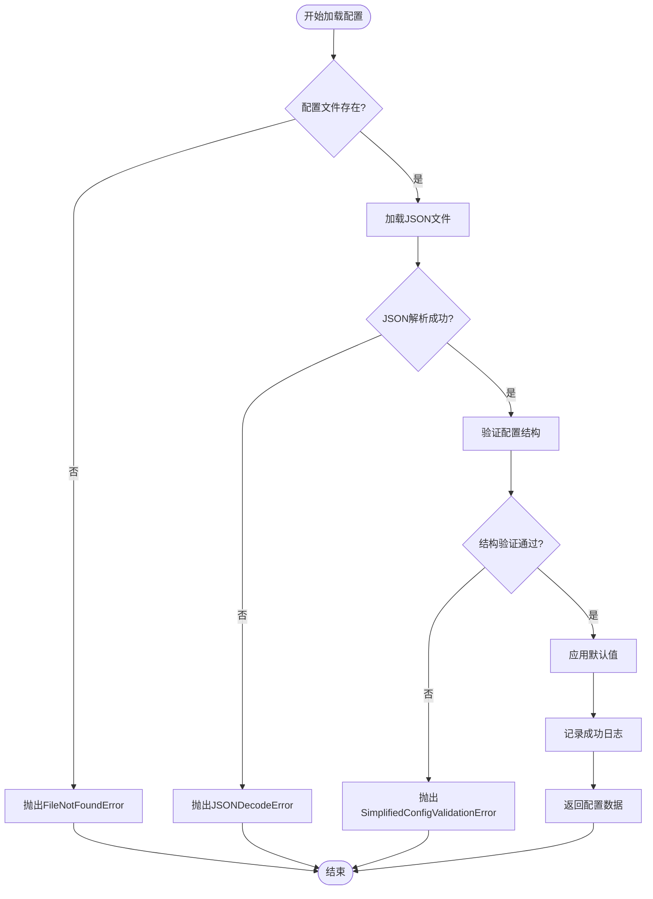

# 配置管理系统技术文档

<cite>
**本文档引用的文件**
- [config_simple.json](file://config_simple.json)
- [simplified_config_manager.py](file://src/simplified_config_manager.py)
- [README.md](file://README.md)
- [main_v2_hybrid.py](file://main_v2_hybrid.py)
</cite>

## 目录
1. [简介](#简介)
2. [项目结构](#项目结构)
3. [核心组件](#核心组件)
4. [架构概览](#架构概览)
5. [详细组件分析](#详细组件分析)
6. [依赖关系分析](#依赖关系分析)
7. [性能考虑](#性能考虑)
8. [故障排除指南](#故障排除指南)
9. [结论](#结论)

## 简介

配置管理系统是北航选课自动化工具的核心基础设施，专门设计用于简化用户的配置过程。该系统通过SimplifiedConfigManager类提供了一个高度简化的配置管理解决方案，使得用户只需提供基本的用户凭据和课程信息即可完成配置，而无需处理复杂的认证流程。

该系统采用了混合架构设计，结合了Playwright自动登录的可靠性和HTTP直接请求的高效性，实现了最佳的选课体验。配置管理系统作为整个架构的基础层，为上层的选课逻辑提供了稳定可靠的配置服务。

## 项目结构

配置管理系统的核心文件组织如下：


**图表来源**
- [config_simple.json](file://config_simple.json#L1-L26)
- [simplified_config_manager.py](file://src/simplified_config_manager.py#L1-L50)

**章节来源**
- [README.md](file://README.md#L1-L50)
- [config_simple.json](file://config_simple.json#L1-L26)

## 核心组件

### SimplifiedConfigManager类

SimplifiedConfigManager是配置管理系统的核心类，负责加载、验证和管理配置文件。该类提供了完整的配置生命周期管理，包括文件加载、结构验证、默认值应用和配置获取等功能。

主要功能特性：
- **配置文件加载**：支持JSON格式配置文件的加载和解析
- **结构验证**：严格的配置结构验证，确保所有必需字段都存在
- **数据类型检查**：对不同配置字段进行类型验证
- **默认值应用**：为可选配置项提供合理的默认值
- **异常处理**：完善的错误处理机制，提供清晰的错误信息

### 配置文件结构

配置文件采用分层结构设计，将不同的配置内容组织在独立的分区中：


**图表来源**
- [config_simple.json](file://config_simple.json#L1-L26)

**章节来源**
- [simplified_config_manager.py](file://src/simplified_config_manager.py#L25-L50)
- [config_simple.json](file://config_simple.json#L1-L26)

## 架构概览

配置管理系统采用分层架构设计，确保了良好的模块化和可维护性：


**图表来源**
- [simplified_config_manager.py](file://src/simplified_config_manager.py#L50-L100)
- [main_v2_hybrid.py](file://main_v2_hybrid.py#L50-L100)

## 详细组件分析

### 配置文件结构详解

#### 用户凭据分区 (user_credentials)

用户凭据分区包含了用户登录系统所需的基本认证信息：

```json
"user_credentials": {
  "username": "你的学号",
  "password": "你的密码"
}
```

**字段说明：**
- **username**：字符串类型，用户的学号或账号标识符
- **password**：字符串类型，用户的登录密码

**验证规则：**
- 字段不能为空
- 不允许使用占位符值（如"PLACEHOLDER_"开头）
- 必须为有效的字符串值

#### 课程信息分区 (course_info)

课程信息分区定义了选课所需的关键课程参数：

```json
"course_info": {
  "course_id": "课程ID",
  "batch_id": "选课批次ID",
  "course_name": "课程名称"
}
```

**字段说明：**
- **course_id**：字符串类型，唯一标识课程的ID
- **batch_id**：字符串类型，选课批次的唯一标识
- **course_name**：字符串类型，课程的显示名称（可选）

**验证规则：**
- course_id和batch_id为必需字段
- 字段不能为空且不能使用占位符
- course_name为可选，默认值为"未指定"

#### 浏览器配置分区 (browser_config)

浏览器配置分区控制Playwright浏览器的行为：

```json
"browser_config": {
  "headless": false,
  "timeout": 30000,
  "slow_mo": 1000,
  "viewport_width": 1280,
  "viewport_height": 720
}
```

**字段说明：**
- **headless**：布尔类型，是否以无头模式运行浏览器
- **timeout**：数值类型，超时时间（毫秒）
- **slow_mo**：数值类型，模拟人类操作的延迟（毫秒）
- **viewport_width**：数值类型，浏览器视口宽度
- **viewport_height**：数值类型，浏览器视口高度

**验证规则：**
- headless必须为布尔值
- timeout必须为正数
- slow_mo默认值为1000毫秒

#### 日志配置分区 (logging)

日志配置分区定义了应用程序的日志记录行为：

```json
"logging": {
  "level": "INFO",
  "file_path": "logs/hybrid_course_selector.log",
  "max_size_mb": 100,
  "backup_count": 5,
  "format": "%(asctime)s - %(name)s - %(levelname)s - %(message)s"
}
```

**字段说明：**
- **level**：字符串类型，日志级别（DEBUG/INFO/WARNING/ERROR/CRITICAL）
- **file_path**：字符串类型，日志文件路径
- **max_size_mb**：数值类型，单个日志文件的最大大小（MB）
- **backup_count**：数值类型，日志文件备份数量
- **format**：字符串类型，日志格式模板

**验证规则：**
- level必须为有效的日志级别
- 自动创建日志目录
- 提供合理的默认值

### SimplifiedConfigManager类详细分析

#### 类结构图


**图表来源**
- [simplified_config_manager.py](file://src/simplified_config_manager.py#L25-L100)

#### 配置加载流程



**图表来源**
- [simplified_config_manager.py](file://src/simplified_config_manager.py#L50-L100)

#### 验证机制

配置管理系统实现了多层次的验证机制：

1. **结构验证**：检查配置文件的基本结构和必需字段
2. **类型验证**：验证各字段的数据类型是否符合预期
3. **业务验证**：检查字段值是否满足业务规则
4. **默认值应用**：为可选字段提供合理的默认值

**章节来源**
- [simplified_config_manager.py](file://src/simplified_config_manager.py#L100-L200)

### 配置获取接口

SimplifiedConfigManager提供了多种配置获取接口，支持按需获取不同类型的配置信息：

#### 用户凭据获取

```python
def get_user_credentials(self) -> Dict[str, str]:
    """
    获取用户凭据
    
    Returns:
        包含用户凭据的字典
        
    Raises:
        RuntimeError: 配置未加载时抛出
    """
    if self.config_data is None:
        raise RuntimeError("配置未加载，请先调用 load_config()")
    
    return self.config_data['user_credentials'].copy()
```

#### 课程信息获取

```python
def get_course_info(self) -> Dict[str, str]:
    """
    获取课程信息
    
    Returns:
        包含课程信息的字典
        
    Raises:
        RuntimeError: 配置未加载时抛出
    """
    if self.config_data is None:
        raise RuntimeError("配置未加载，请先调用 load_config()")
    
    return self.config_data['course_info'].copy()
```

#### 浏览器配置获取

```python
def get_browser_config(self) -> Dict[str, Any]:
    """
    获取浏览器配置
    
    Returns:
        包含浏览器配置的字典
        
    Raises:
        RuntimeError: 配置未加载时抛出
    """
    if self.config_data is None:
        raise RuntimeError("配置未加载，请先调用 load_config()")
    
    return self.config_data['browser_config'].copy()
```

**章节来源**
- [simplified_config_manager.py](file://src/simplified_config_manager.py#L250-L323)

## 依赖关系分析

配置管理系统的依赖关系相对简单，主要依赖于标准库和少量外部模块：


**图表来源**
- [simplified_config_manager.py](file://src/simplified_config_manager.py#L1-L20)

**章节来源**
- [simplified_config_manager.py](file://src/simplified_config_manager.py#L1-L20)

## 性能考虑

配置管理系统在设计时充分考虑了性能因素：

### 文件I/O优化
- 使用缓存机制避免重复读取配置文件
- 异步加载配置文件（虽然当前实现为同步）
- 合理的文件句柄管理

### 内存使用优化
- 配置数据采用浅拷贝返回，避免不必要的内存占用
- 及时释放不再使用的配置数据
- 合理的默认值应用策略

### 错误处理性能
- 快速失败原则，尽早发现配置错误
- 减少不必要的计算和I/O操作
- 优化的异常处理机制

## 故障排除指南

### 常见配置错误

#### 配置文件不存在
**错误信息**：`FileNotFoundError: 简化配置文件不存在`
**解决方案**：
1. 确认config_simple.json文件存在于项目根目录
2. 检查文件名拼写是否正确
3. 确认文件权限设置正确

#### JSON格式错误
**错误信息**：`JSONDecodeError: 配置文件JSON格式错误`
**解决方案**：
1. 使用JSON验证工具检查语法
2. 确保所有字符串使用双引号
3. 检查是否有多余的逗号

#### 字段缺失错误
**错误信息**：`SimplifiedConfigValidationError: 缺少必需的配置分区`
**解决方案**：
1. 检查配置文件结构是否完整
2. 确认所有必需字段都已填写
3. 参考配置模板文件

#### 数据类型错误
**错误信息**：`SimplifiedConfigValidationError: browser_config.headless 必须是布尔值`
**解决方案**：
1. 确保布尔值使用true/false而不是True/False
2. 数值类型使用数字而非字符串
3. 检查配置值的格式

### 调试技巧

1. **启用详细日志**：设置日志级别为DEBUG
2. **配置测试模式**：使用`--test`参数测试配置
3. **手动验证**：使用JSON验证工具检查配置文件
4. **分步验证**：逐步检查各个配置分区

**章节来源**
- [main_v2_hybrid.py](file://main_v2_hybrid.py#L150-L200)

## 结论

配置管理系统作为北航选课自动化工具的基础组件，成功实现了配置的简化和标准化。通过SimplifiedConfigManager类的设计，系统达到了以下目标：

### 主要成就

1. **简化用户配置**：用户只需提供基本的用户凭据和课程信息，大大降低了使用门槛
2. **增强系统稳定性**：严格的配置验证机制确保了系统的稳定运行
3. **提高开发效率**：清晰的配置结构和完善的错误处理提高了开发和维护效率
4. **良好的扩展性**：模块化设计便于未来功能扩展

### 技术特色

- **分层架构设计**：清晰的职责分离和模块化设计
- **完善的验证机制**：多层次的配置验证确保数据完整性
- **友好的错误处理**：详细的错误信息帮助用户快速定位问题
- **灵活的配置管理**：支持动态配置获取和默认值应用

### 展望未来

配置管理系统为整个选课自动化工具奠定了坚实的基础。随着系统的发展，可以考虑以下改进方向：

1. **配置加密**：增加敏感信息的加密存储
2. **配置版本管理**：支持配置文件的版本控制
3. **远程配置**：支持从远程服务器加载配置
4. **配置热更新**：支持运行时动态更新配置

该系统的设计理念和实现方式为其他类似的自动化工具项目提供了宝贵的参考价值。