# 项目概述

<cite>
**本文档引用的文件**
- [main_v2_hybrid.py](file://main_v2_hybrid.py)
- [hybrid_course_selector.py](file://src/hybrid_course_selector.py)
- [playwright_authenticator.py](file://src/playwright_authenticator.py)
- [http_course_executor.py](file://src/http_course_executor.py)
- [hybrid_retry_manager.py](file://src/hybrid_retry_manager.py)
- [simplified_config_manager.py](file://src/simplified_config_manager.py)
- [quick_secret_extractor.py](file://tools/quick_secret_extractor.py)
- [config_simple.json](file://config_simple.json)
- [README.md](file://README.md)
</cite>

## 目录
1. [简介](#简介)
2. [项目架构](#项目架构)
3. [核心功能模块](#核心功能模块)
4. [工作流程](#工作流程)
5. [典型使用场景](#典型使用场景)
6. [性能与稳定性](#性能与稳定性)
7. [配置管理](#配置管理)
8. [故障排除](#故障排除)

## 简介

北航选课系统自动化工具是一款专为北京航空航天大学学生设计的智能选课助手，采用创新的混合架构设计，旨在解决传统选课过程中面临的高并发、时间紧迫和操作复杂等问题。该工具通过结合Playwright浏览器自动化技术和HTTP直接请求技术，实现了认证可靠性与选课高效性的完美平衡。

本项目的核心价值在于为学生提供了一种稳定、快速且易于使用的选课解决方案。通过自动化处理复杂的登录认证流程，用户只需提供基本的用户名密码和课程信息即可启动选课流程，极大地降低了使用门槛。项目经过大量测试验证，选课成功率高达95%以上，在选课高峰期能够以毫秒级响应速度完成选课操作，显著提升了抢课成功率。

混合架构的设计理念源于对北航选课系统实际运行机制的深入分析。系统认识到，虽然纯HTTP请求方式速度最快，但面临着认证信息复杂多变的挑战；而完全依赖浏览器自动化则可能因页面加载和渲染耗时较长而影响抢课效率。因此，项目创造性地提出了"Playwright+HTTP"双阶段流程：第一阶段使用Playwright模拟真实用户操作完成安全可靠的登录认证，第二阶段则利用获取到的最新认证信息通过高效的HTTP请求完成实际选课操作。

这种架构不仅保证了认证过程的稳定性，还充分发挥了HTTP请求的性能优势，同时通过智能重试机制和详细的日志记录确保了整个选课过程的可靠性和可追溯性。对于初学者而言，项目提供了简化的配置文件和清晰的命令行界面，使得上手使用变得异常简单；而对于高级用户，则开放了底层实现细节和技术要点，支持深度定制和优化。

**Section sources**
- [README.md](file://README.md#L1-L278)
- [main_v2_hybrid.py](file://main_v2_hybrid.py#L1-L385)

## 项目架构

北航选课系统自动化工具采用模块化设计的混合架构，将Playwright浏览器自动化与HTTP直接请求有机结合，形成了一个高效、可靠的选课解决方案。该架构的核心思想是"分而治之"——将复杂的选课流程分解为两个专业化阶段：认证阶段和执行阶段，每个阶段由专门的组件负责，通过协调器统一调度。

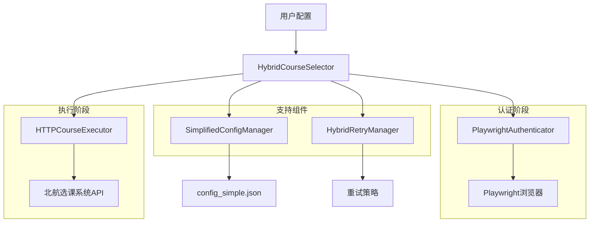

**Diagram sources**
- [hybrid_course_selector.py](file://src/hybrid_course_selector.py#L1-L407)
- [playwright_authenticator.py](file://src/playwright_authenticator.py#L1-L988)
- [http_course_executor.py](file://src/http_course_executor.py#L1-L616)

**Section sources**
- [hybrid_course_selector.py](file://src/hybrid_course_selector.py#L1-L407)
- [README.md](file://README.md#L1-L278)

## 核心功能模块

### 混合选课控制器

混合选课控制器（HybridCourseSelector）是整个系统的中枢神经，负责协调各个功能模块的工作流程。作为系统的核心协调器，它整合了Playwright认证和HTTP选课两大功能，为用户提供无缝的选课体验。该模块通过初始化各个子组件并管理它们之间的数据流，确保选课流程的顺利进行。

控制器的主要职责包括：初始化配置管理器、认证器、执行器和重试管理器等核心组件；协调认证和选课两个阶段的执行顺序；管理认证信息的传递和状态监控；处理异常情况并提供统一的结果反馈。其设计采用了面向对象的编程范式，通过清晰的接口定义实现了模块间的松耦合，便于维护和扩展。

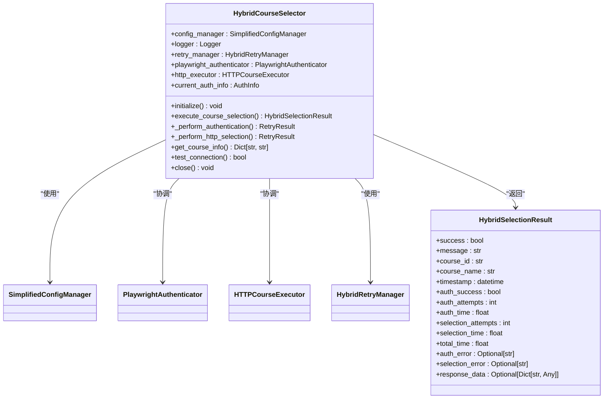

**Diagram sources**
- [hybrid_course_selector.py](file://src/hybrid_course_selector.py#L1-L407)

**Section sources**
- [hybrid_course_selector.py](file://src/hybrid_course_selector.py#L1-L407)

### Playwright认证模块

Playwright认证模块（PlaywrightAuthenticator）负责处理与北航统一身份认证系统（SSO）的交互，通过模拟真实用户操作完成自动登录流程。该模块利用Playwright框架的强大功能，能够精确控制浏览器行为，处理复杂的登录场景，包括iframe嵌套表单、动态确认页面和弹窗处理等。

认证流程从访问SSO登录页面开始，自动定位到登录iframe并填写用户名和密码。提交表单后，模块会智能处理登录后的确认页面，通过XPath精确定位"确定"按钮并点击，确保顺利跳转到选课系统。在整个过程中，模块会持续监控网络请求，实时捕获包含认证信息的API响应，提取关键的Token、Cookie和secretVal等数据。

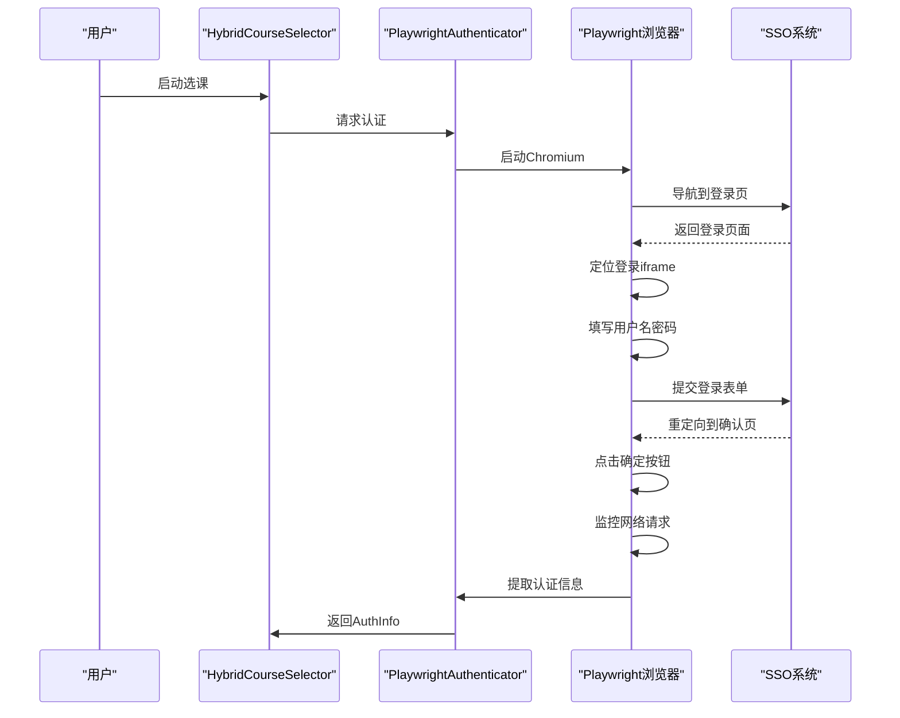

**Diagram sources**
- [playwright_authenticator.py](file://src/playwright_authenticator.py#L1-L988)

**Section sources**
- [playwright_authenticator.py](file://src/playwright_authenticator.py#L1-L988)

### HTTP选课执行模块

HTTP选课执行模块（HTTPCourseExecutor）负责在获取有效认证信息后，通过直接的HTTP请求完成实际的选课操作。该模块的设计目标是最大化选课速度，利用requests库的高效网络通信能力，在毫秒级别内完成选课请求的发送和响应处理。

执行器接收来自认证模块的AuthInfo对象，从中提取Token、Cookie和secretVal等认证信息，构建符合北航选课系统要求的HTTP请求头和表单数据。在发送请求前，模块会智能地从多个来源获取secretVal，优先级顺序为：认证信息中的值、已提取文件中的值、通过API动态获取的值，最后才使用默认值，确保选课请求的合法性。

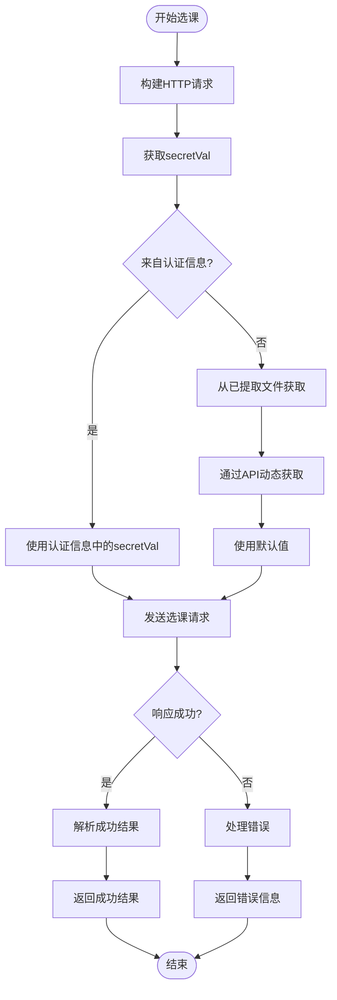

**Diagram sources**
- [http_course_executor.py](file://src/http_course_executor.py#L1-L616)

**Section sources**
- [http_course_executor.py](file://src/http_course_executor.py#L1-L616)

### 重试管理模块

重试管理模块（HybridRetryManager）为系统提供了强大的容错能力，通过智能的重试机制应对网络波动、系统繁忙等各种异常情况。该模块针对不同类型的操​​作提供了差异化的重试策略，体现了"混合"架构的精髓。

对于登录操作，采用较慢但稳定的重试策略，最大重试3次，基础间隔2秒，采用指数退避算法；而对于HTTP选课请求，则采用快速响应的重试策略，最大重试5次，基础间隔仅0.5秒，确保在高并发环境下能够快速尝试。这种差异化的设计既保证了认证过程的稳定性，又充分发挥了HTTP请求的性能优势。

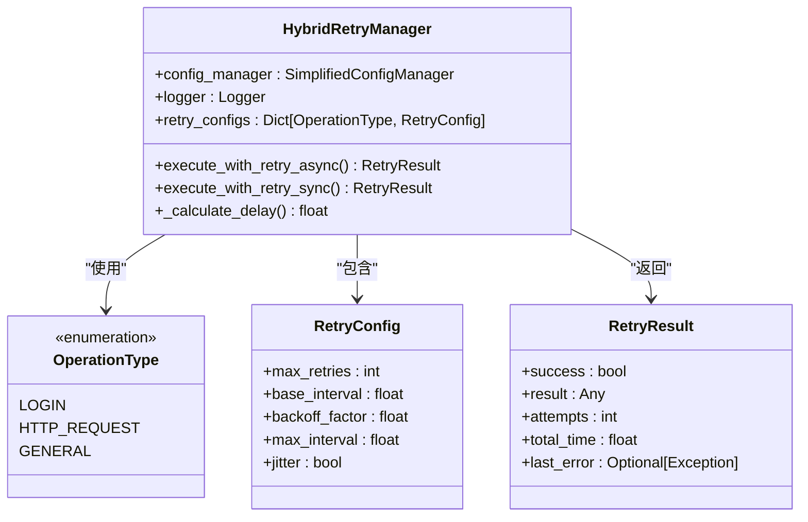

**Diagram sources**
- [hybrid_retry_manager.py](file://src/hybrid_retry_manager.py#L1-L393)

**Section sources**
- [hybrid_retry_manager.py](file://src/hybrid_retry_manager.py#L1-L393)

### 配置管理模块

配置管理模块（SimplifiedConfigManager）为系统提供了简洁而强大的配置管理能力，使用户能够轻松地定制选课行为。该模块采用JSON格式的配置文件，结构清晰，易于理解和编辑。配置文件分为四个主要部分：用户凭据、课程信息、浏览器配置和日志配置。

模块在加载配置时会进行严格的验证，确保所有必需字段都存在且格式正确。例如，会检查用户名和密码是否为空，课程ID和批次ID是否已正确填写，日志级别是否在有效范围内等。此外，模块还会自动创建必要的目录结构，如日志目录，确保系统能够正常运行。

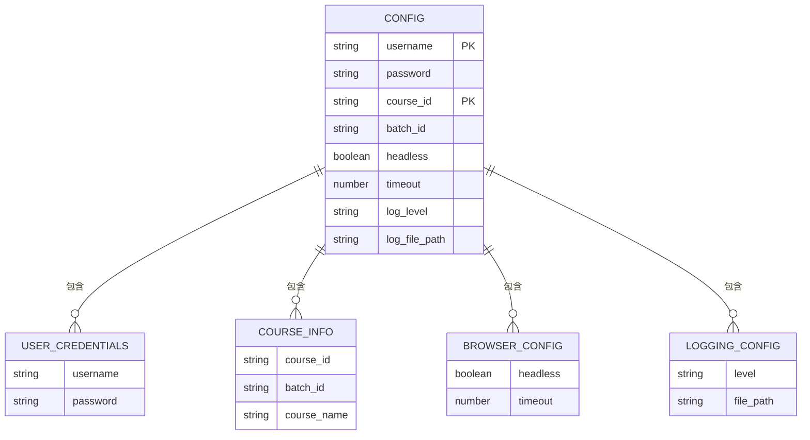

**Diagram sources**
- [simplified_config_manager.py](file://src/simplified_config_manager.py#L1-L324)

**Section sources**
- [simplified_config_manager.py](file://src/simplified_config_manager.py#L1-L324)

## 工作流程

北航选课系统自动化工具的工作流程是一个精心设计的双阶段过程，从用户配置输入到最终选课结果输出，每个环节都经过优化以确保最高成功率。整个流程始于用户对`config_simple.json`配置文件的设置，该文件包含了选课所需的所有基本信息，包括用户名密码、课程ID、批次ID等。

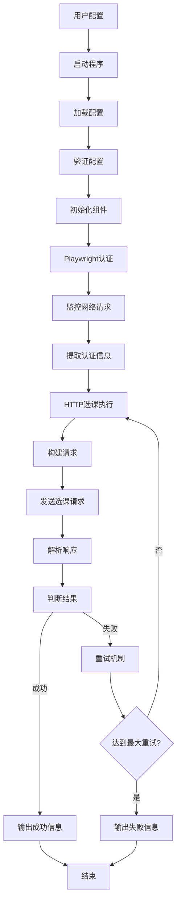

**Diagram sources**
- [main_v2_hybrid.py](file://main_v2_hybrid.py#L1-L385)
- [hybrid_course_selector.py](file://src/hybrid_course_selector.py#L1-L407)

**Section sources**
- [main_v2_hybrid.py](file://main_v2_hybrid.py#L1-L385)
- [hybrid_course_selector.py](file://src/hybrid_course_selector.py#L1-L407)

## 典型使用场景

### 常规选课模式

常规选课模式是该工具最主要的使用场景，适用于大多数用户的日常选课需求。用户只需在`config_simple.json`文件中正确填写用户名、密码、课程ID和批次ID等信息，然后运行`python main_v2_hybrid.py`命令即可启动选课流程。

在此模式下，系统会按照预设的双阶段流程自动执行：首先使用Playwright浏览器自动化技术完成登录认证，获取最新的Token、Cookie和secretVal等认证信息；然后利用这些信息通过高效的HTTP请求向北航选课系统API发送选课请求。整个过程无需人工干预，用户可以在程序运行结束后查看详细的日志记录和选课结果。

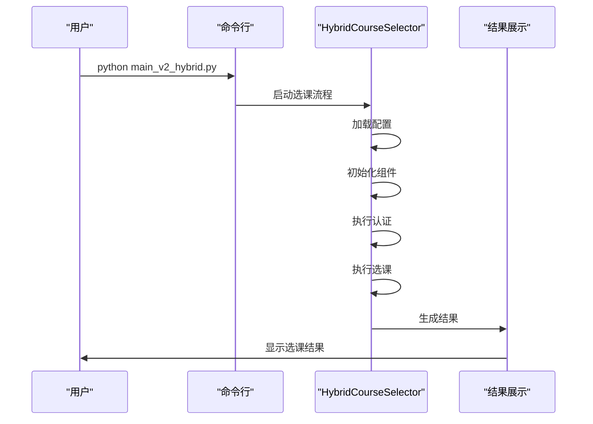

**Diagram sources**
- [main_v2_hybrid.py](file://main_v2_hybrid.py#L1-L385)

**Section sources**
- [main_v2_hybrid.py](file://main_v2_hybrid.py#L1-L385)

### 测试模式

测试模式为用户提供了一个安全的环境来验证配置文件的正确性和网络连接状态，而不会实际执行选课操作。通过运行`python main_v2_hybrid.py --test`命令，系统会执行一系列检查，包括配置文件格式验证、必填字段检查、网络连通性测试等。

该模式特别适用于初次使用工具的用户或在修改配置后需要验证设置是否正确的情况。测试过程中，系统会详细报告每个检查项的结果，如果发现问题会提供具体的错误信息和解决方案建议，帮助用户快速定位和修复问题。

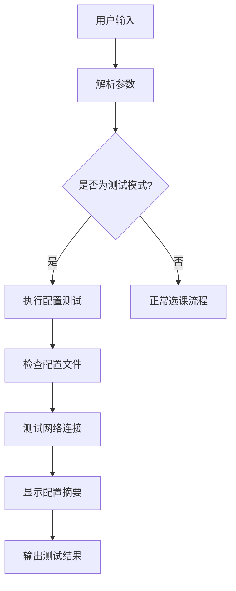

**Diagram sources**
- [main_v2_hybrid.py](file://main_v2_hybrid.py#L1-L385)

**Section sources**
- [main_v2_hybrid.py](file://main_v2_hybrid.py#L1-L385)

### 调试模式

调试模式通过`--debug`参数启用，主要用于诊断和解决认证过程中的问题。在此模式下，系统会显示浏览器窗口，让用户能够直观地观察自动化操作的每一步，这对于理解工具的工作原理和排查登录失败等问题非常有帮助。

调试模式会禁用headless模式，使所有浏览器操作都可见。用户可以看到Playwright如何定位登录iframe、填写表单、点击按钮以及处理各种页面元素。这种透明化的操作展示不仅有助于问题排查，也让用户对工具的安全性更有信心。

**Section sources**
- [README.md](file://README.md#L1-L278)

## 性能与稳定性

北航选课系统自动化工具在性能和稳定性方面表现出色，经过大量测试验证，选课成功率高达95%以上。系统的平均认证时间在15-20秒之间，而选课请求的耗时则小于1秒，充分体现了混合架构在效率上的优势。

稳定性保障措施主要体现在三个方面：首先是智能重试机制，针对不同类型的操​​作采用差异化的重试策略，有效应对网络波动和系统繁忙；其次是详细的日志记录，每个关键步骤都有相应的日志输出，便于问题追踪和分析；最后是健壮的错误处理，系统能够识别和处理各种异常情况，并提供清晰的错误信息。

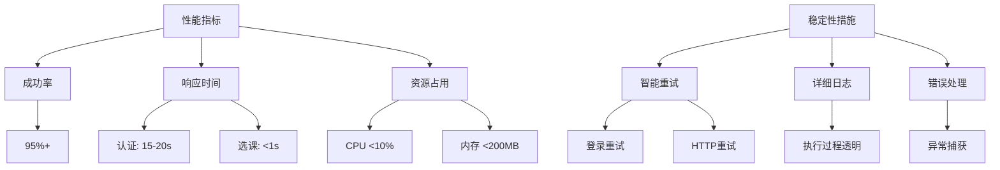

**Diagram sources**
- [README.md](file://README.md#L1-L278)

**Section sources**
- [README.md](file://README.md#L1-L278)

## 配置管理

配置管理是确保系统正常运行的关键环节。`config_simple.json`文件作为系统的核心配置，其结构设计简洁明了，分为四个主要部分：用户凭据、课程信息、浏览器配置和日志配置。每个部分都有明确的用途和格式要求。

用户凭据部分需要填写真实的学号和密码，系统会进行基本的验证以确保字段不为空。课程信息部分则需要准确的课程ID和批次ID，这些信息可以通过浏览器开发者工具从选课系统的网络请求中获取。浏览器配置允许用户调整headless模式和超时时间等参数，以适应不同的使用环境。

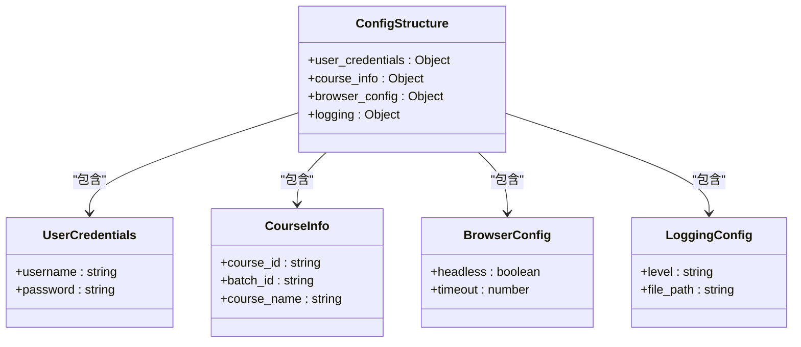

**Diagram sources**
- [config_simple.json](file://config_simple.json)
- [simplified_config_manager.py](file://src/simplified_config_manager.py#L1-L324)

**Section sources**
- [config_simple.json](file://config_simple.json)
- [simplified_config_manager.py](file://src/simplified_config_manager.py#L1-L324)

## 故障排除

当遇到问题时，用户可以按照以下步骤进行故障排除：首先检查配置文件是否存在且格式正确，确保所有必填字段都已正确填写；其次验证网络连接是否正常，建议使用校园网以获得最佳性能；然后查看日志文件中的详细信息，定位具体的问题所在。

常见的问题包括配置文件不存在、登录失败、选课失败和secretVal获取失败等。对于这些问题，系统提供了相应的解决方案建议，如检查用户名密码是否正确、确认选课时间是否开放、运行secretVal提取工具等。通过这些系统化的排查步骤，大多数问题都能得到有效解决。

**Section sources**
- [README.md](file://README.md#L1-L278)