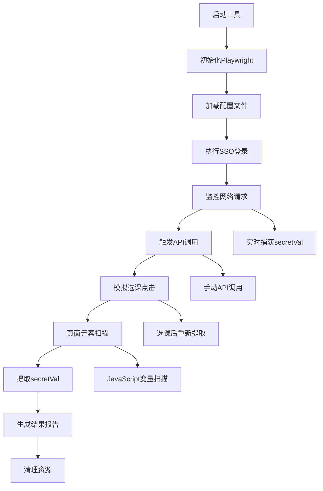
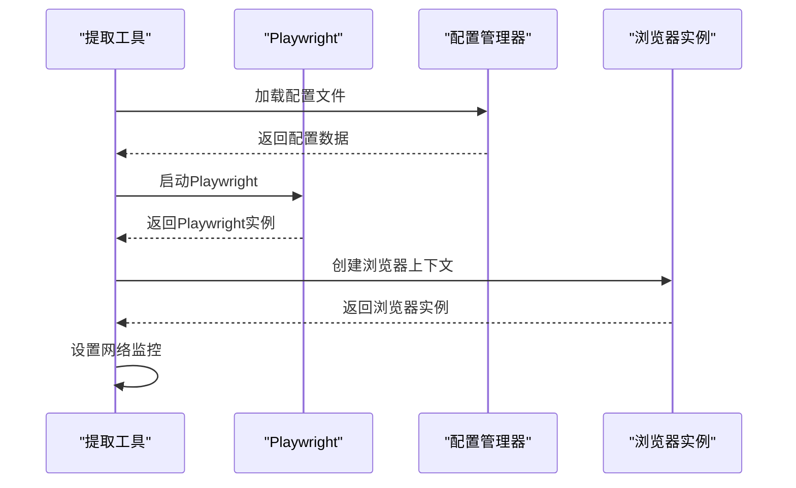
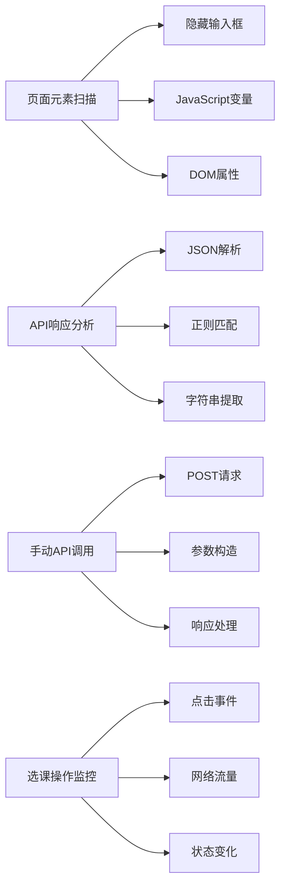

# 高级工具使用指南

<cite>
**本文档引用的文件**
- [README.md](file://README.md)
- [tools/quick_secret_extractor.py](file://tools/quick_secret_extractor.py)
- [main_v2_hybrid.py](file://main_v2_hybrid.py)
- [src/playwright_authenticator.py](file://src/playwright_authenticator.py)
- [src/simplified_config_manager.py](file://src/simplified_config_manager.py)
</cite>

## 目录
1. [简介](#简介)
2. [quick_secret_extractor.py概述](#quick_secret_extractorpy概述)
3. [secretVal的关键作用](#secretval的关键作用)
4. [工具工作原理详解](#工具工作原理详解)
5. [使用方法与命令行示例](#使用方法与命令行示例)
6. [故障排查应用场景](#故障排查应用场景)
7. [高级命令行选项](#高级命令行选项)
8. [最佳实践与注意事项](#最佳实践与注意事项)
9. [总结](#总结)

## 简介

quick_secret_extractor.py是一个专门设计的独立工具，用于从北航选课系统的认证过程中提取关键的安全令牌——secretVal。这个工具在混合架构选课系统中扮演着至关重要的角色，特别是在自动认证失败或secretVal过期的情况下，为用户提供了一种可靠的替代解决方案。

## quick_secret_extractor.py概述

### 工具定位与价值

quick_secret_extractor.py是一个独立的Python脚本，专门设计用于：
- **自动化提取**：通过Playwright模拟真实用户操作，自动提取选课过程中的secretVal
- **独立运行**：无需依赖主程序即可单独运行，提供最大的灵活性
- **多源提取**：从多个可能的位置提取secretVal，包括API响应、页面元素和JavaScript变量
- **实时监控**：在用户操作过程中实时监控网络请求，捕捉动态生成的secretVal

### 技术架构



**图表来源**
- [tools/quick_secret_extractor.py](file://tools/quick_secret_extractor.py#L40-L80)

## secretVal的关键作用

### 什么是secretVal

secretVal是北航选课系统中的一个关键安全令牌，它在每次选课请求中都扮演着核心角色：

1. **身份验证**：作为用户身份的动态标识符
2. **防重复提交**：防止同一请求被重复提交
3. **CSRF防护**：提供跨站请求伪造保护
4. **时效性控制**：具有时间限制，过期后需要重新获取

### 动态生成机制

secretVal的生成遵循以下原则：

- **实时性**：每个选课请求都需要新的secretVal
- **唯一性**：每次生成的secretVal都是唯一的
- **加密性**：采用加密算法生成，难以逆向破解
- **关联性**：与用户的当前会话状态紧密关联

### 为什么需要独立提取工具

传统的自动认证流程可能遇到以下问题：

1. **认证失败**：由于网络波动或系统维护导致认证失败
2. **secretVal过期**：认证信息过期导致后续选课失败
3. **动态变化**：secretVal在不同时间段有不同的值
4. **复杂性**：自动提取过程过于复杂，难以调试

## 工具工作原理详解

### 初始化阶段



**图表来源**
- [tools/quick_secret_extractor.py](file://tools/quick_secret_extractor.py#L40-L80)

### 网络监控机制

工具通过以下方式监控网络请求：

1. **响应拦截**：监听所有HTTP响应
2. **内容过滤**：只关注JSON格式的响应
3. **关键词检测**：搜索包含"secretVal"的响应
4. **实时捕获**：一旦发现立即存储

### 多源提取策略



**图表来源**
- [tools/quick_secret_extractor.py](file://tools/quick_secret_extractor.py#L120-L200)

### 页面元素扫描技术

工具使用JavaScript注入技术扫描页面：

```javascript
// 关键扫描逻辑
() => {
    const results = [];
    
    // 1. 搜索全局变量
    for (const key in window) {
        const value = window[key];
        if (typeof value === 'string' && value.length > 30) {
            if (key.toLowerCase().includes('secret') || 
                key.toLowerCase().includes('token')) {
                results.push({source: `window.${key}`, value: value});
            }
        }
    }
    
    // 2. 搜索隐藏输入框
    document.querySelectorAll('input[type="hidden"]').forEach(input => {
        if (input.value && input.value.length > 20) {
            results.push({source: `hidden input: ${input.name}`, value: input.value});
        }
    });
    
    return results;
}
```

**章节来源**
- [tools/quick_secret_extractor.py](file://tools/quick_secret_extractor.py#L250-L300)

## 使用方法与命令行示例

### 基本使用方法

#### 1. 准备工作

确保已完成以下准备工作：

```bash
# 1. 进入tools目录
cd tools

# 2. 确保配置文件完整
# 编辑 config_simple.json 包含正确的用户名和密码
```

#### 2. 基本命令

```bash
# 基本运行命令
python quick_secret_extractor.py

# 带详细输出的运行
python quick_secret_extractor.py --verbose

# 指定配置文件运行
python quick_secret_extractor.py --config ../config_simple.json
```

#### 3. 输出结果格式

工具运行完成后会生成两个重要文件：

**extracted_secrets.json**：
```json
[
  {
    "value": "eyJhbGciOiJIUzI1NiIsInR5cCI6IkpXVCJ9...",
    "source": "API: https://byxk.buaa.edu.cn/xsxk/elective/buaa/clazz/list",
    "timestamp": "2025-09-15T10:30:45.123456"
  },
  {
    "value": "secretVal_20250915_abc123def456",
    "source": "页面: hidden input: __RequestVerificationToken",
    "timestamp": "2025-09-15T10:30:47.654321"
  }
]
```

**manual_api_response.json**：
包含最后一次API调用的完整响应数据

#### 4. 结果解读

- **value**: 提取到的secretVal值
- **source**: secretVal的来源位置
- **timestamp**: 提取时间戳

### 高级使用场景

#### 场景1：认证失败后的补救

```bash
# 当主程序认证失败时
python main_v2_hybrid.py --test
# 如果测试失败，运行提取工具
python quick_secret_extractor.py
# 将提取到的secretVal手动添加到配置中
```

#### 场景2：定期更新secretVal

```bash
# 定期运行以获取最新的secretVal
python quick_secret_extractor.py
# 比较新旧值，判断是否需要更新
```

#### 场景3：调试认证问题

```bash
# 启用调试模式
python quick_secret_extractor.py --debug
# 观察浏览器操作过程
```

**章节来源**
- [tools/quick_secret_extractor.py](file://tools/quick_secret_extractor.py#L450-L463)

## 故障排查应用场景

### 常见问题诊断

#### 问题1：自动选课失败

**症状**：主程序执行选课时返回"secretVal无效"错误

**排查步骤**：
1. 运行提取工具观察是否有有效secretVal
2. 检查提取到的secretVal格式是否正确
3. 验证secretVal是否来自可信来源

#### 问题2：认证信息过期

**症状**：登录成功但后续操作失败

**排查步骤**：
1. 使用提取工具获取新的secretVal
2. 对比新旧secretVal的时间戳
3. 确认secretVal是否具有时效性

#### 问题3：网络请求异常

**症状**：API调用返回非200状态码

**排查步骤**：
1. 检查network_data中记录的请求
2. 分析API响应内容
3. 确认请求参数是否正确

### 实际案例分析

#### 案例1：选课高峰期失败

**背景**：在选课高峰期，主程序频繁出现认证失败

**解决方案**：
```bash
# 步骤1：运行提取工具
python quick_secret_extractor.py

# 步骤2：分析提取结果
# 发现secretVal来自课程列表API，且格式正确

# 步骤3：手动更新配置
# 将提取到的secretVal添加到主程序配置中
```

#### 案例2：系统维护期间

**背景**：学校系统维护期间，认证流程发生变化

**解决方案**：
```bash
# 步骤1：尝试自动认证
python main_v2_hybrid.py --test
# 认证失败

# 步骤2：运行提取工具
python quick_secret_extractor.py

# 步骤3：分析新出现的secretVal来源
# 发现新的API端点返回secretVal
```

### 调试技巧

#### 1. 启用详细日志

```bash
# 在配置文件中设置日志级别
{
  "logging": {
    "level": "DEBUG",
    "file_path": "logs/quick_secret_extractor.log"
  }
}
```

#### 2. 观察浏览器行为

```bash
# 设置headless为false
{
  "browser_config": {
    "headless": false,
    "timeout": 30000
  }
}
```

#### 3. 分析网络流量

检查network_data数组，重点关注：
- 请求URL和响应状态
- JSON响应内容
- 请求头和Cookie信息

**章节来源**
- [tools/quick_secret_extractor.py](file://tools/quick_secret_extractor.py#L350-L400)

## 高级命令行选项

### 主程序命令行选项

虽然主要讨论的是quick_secret_extractor.py，但了解主程序的高级选项也很重要：

#### 1. 调试模式

```bash
# 显示浏览器窗口，便于调试
python main_v2_hybrid.py --debug

# 或者在配置文件中设置
{
  "browser_config": {
    "headless": false
  }
}
```

#### 2. 测试模式

```bash
# 测试配置和网络连接
python main_v2_hybrid.py --test

# 测试仅认证流程
python main_v2_hybrid.py --test-auth
```

#### 3. 临时参数覆盖

```bash
# 临时覆盖配置文件中的参数
python main_v2_hybrid.py \
  --username 2020123456 \
  --password mypassword \
  --course-id 202520261B060032020001 \
  --batch-id d6d090c4364342bc94de17a22eaf7068
```

#### 4. 日志级别设置

```bash
# 设置不同的日志级别
python main_v2_hybrid.py --log-level DEBUG
python main_v2_hybrid.py --log-level INFO
python main_v2_hybrid.py --log-level WARNING
```

### quick_secret_extractor.py专用选项

#### 1. 配置文件指定

```bash
# 指定不同的配置文件
python quick_secret_extractor.py --config custom_config.json
```

#### 2. 输出控制

```bash
# 静默模式（减少输出）
python quick_secret_extractor.py --quiet

# 详细模式（增加输出）
python quick_secret_extractor.py --verbose
```

#### 3. 超时设置

```bash
# 设置自定义超时时间（毫秒）
python quick_secret_extractor.py --timeout 60000
```

**章节来源**
- [main_v2_hybrid.py](file://main_v2_hybrid.py#L40-L120)

## 最佳实践与注意事项

### 使用最佳实践

#### 1. 定期更新secretVal

```bash
# 建议在选课前1小时运行
python quick_secret_extractor.py
# 检查secretVal的有效性
# 如果有效，将其添加到主程序配置中
```

#### 2. 备份配置文件

```bash
# 在修改配置前备份
cp config_simple.json config_simple_backup.json
# 运行提取工具
python quick_secret_extractor.py
# 验证结果后再更新配置
```

#### 3. 网络环境要求

- **稳定网络**：确保网络连接稳定，避免认证失败
- **校园网优先**：推荐使用校园网以获得更好的性能
- **防火墙设置**：确保防火墙允许必要的网络访问

#### 4. 安全注意事项

- **密码保护**：不要在公共场合运行工具
- **配置文件安全**：不要将包含密码的配置文件分享给他人
- **日志文件清理**：定期清理包含敏感信息的日志文件

### 性能优化建议

#### 1. 浏览器配置优化

```json
{
  "browser_config": {
    "headless": true,
    "timeout": 15000,
    "slow_mo": 100
  }
}
```

#### 2. 网络请求优化

- **减少不必要的请求**：只监控关键的API端点
- **缓存机制**：利用已提取的secretVal，避免重复提取
- **并发控制**：合理设置超时时间，避免长时间等待

#### 3. 资源管理

- **及时清理**：运行结束后及时关闭浏览器实例
- **内存监控**：注意监控内存使用情况，避免内存泄漏
- **异常处理**：完善的异常处理机制，确保资源正确释放

### 常见错误及解决方案

#### 错误1：导入模块失败

**错误信息**：
```
ImportError: No module named 'playwright'
```

**解决方案**：
```bash
# 安装缺失的依赖
pip install playwright
playwright install chromium
```

#### 错误2：配置文件格式错误

**错误信息**：
```
JSONDecodeError: Expecting ',' delimiter
```

**解决方案**：
```bash
# 检查JSON格式
python -m json.tool config_simple.json
# 修复格式错误后重试
```

#### 错误3：权限不足

**错误信息**：
```
PermissionError: [Errno 13] Permission denied
```

**解决方案**：
```bash
# 检查文件权限
ls -la config_simple.json
# 修改权限或使用管理员权限运行
chmod 644 config_simple.json
sudo python quick_secret_extractor.py
```

## 总结

quick_secret_extractor.py作为一个专门设计的独立工具，在北航选课系统自动化工具中发挥着不可替代的作用。它不仅提供了可靠的secretVal提取能力，还为整个系统的稳定运行提供了重要的保障机制。

### 核心价值

1. **可靠性**：通过独立的提取机制，确保在自动认证失败时仍能获取有效的secretVal
2. **灵活性**：支持多种提取策略，适应不同的系统变化和网络环境
3. **易用性**：简洁的命令行接口，配合详细的输出信息，便于用户理解和使用
4. **调试性**：丰富的日志和监控功能，为问题诊断提供有力支持

### 应用场景

- **日常使用**：定期更新secretVal，确保选课成功率
- **故障恢复**：在认证失败时提供紧急解决方案
- **系统维护**：在系统升级期间保持功能可用性
- **性能优化**：通过分析提取过程，优化整体系统性能

### 未来发展

随着选课系统的不断演进，quick_secret_extractor.py也将持续改进：

- **智能化识别**：自动识别新的secretVal生成机制
- **多平台支持**：扩展到更多操作系统和浏览器
- **云端集成**：支持云端部署和分布式提取
- **API接口**：提供RESTful API接口，便于集成到其他系统

通过深入理解quick_secret_extractor.py的工作原理和使用方法，用户可以更好地利用这个强大的工具，确保选课过程的顺利进行，提高选课的成功率和效率。